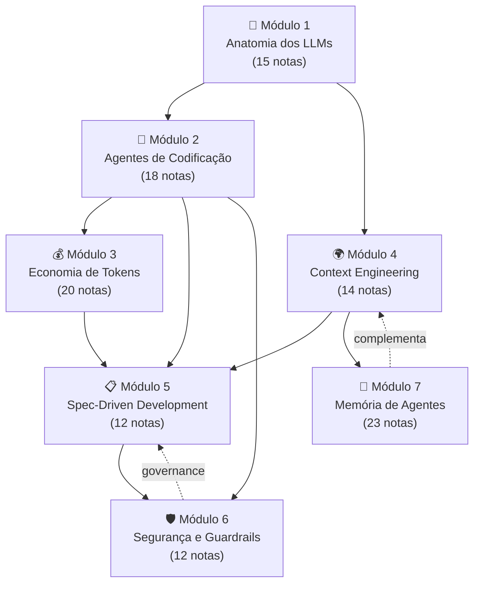

# Formação Engenheiro de IA

Programa completo de formação para engenheiros de software trabalharem efetivamente com IA em 2026 — dos fundamentos de tokens à orquestração de agentes em produção. **Não é tutorial isolado** nem hype — é mapa estruturado de **6 trilhas + 1 trilha de memória** que cobrem desde "o que é um LLM" até "como passo em auditoria de EU AI Act". Cada trilha é independente e completa; juntas, formam a stack de competências que diferencia engenheiros que **usam** IA dos que **dominam** IA.

> [!info] Como usar este MOC
> Este é o **mapa mestre** — não tem notas próprias. Use:
> - **Sequencial** se está começando do zero (segue ordem dos módulos)
> - **Por senda** se já tem base e quer foco específico (Praticante, Arquiteto, Líder Técnico, Open Source)
> - **Por tópico** se busca solução para problema concreto (consulte trilhas individuais)

> [!tip] Pré-requisitos do programa
> Engenheiro de software atuante. Não exige expertise prévia em IA — Trilha 1 começa do zero. Já trabalha com IA? Pule para a senda que melhor encaixa no seu papel.

## Visão geral — 7 módulos, 91 notas



Setas sólidas = pré-requisito recomendado. Tracejadas = relação complementar.

## Os 7 módulos

### Módulo 1 — [[Anatomia dos LLMs]]

> *"Antes de orquestrar agentes, entenda os blocos."*

15 notas: o que é um LLM, tokens, janela de contexto, atenção, modelos em produção (incluindo chineses), APIs, pricing, reasoning, fine-tuning vs RAG, futuro.

**Quando ler:** sempre. É o alicerce.

---

### Módulo 2 — [[Agentes de Codificação]]

> *"De autocomplete a agentes autônomos — o panorama das ferramentas e workflows."*

18 notas: filosofia (vibe vs disciplina, comprehension gate), os players (Cursor, Claude Code, Copilot, Windsurf, Devin, Gemini CLI), open source (OpenCode, Aider, modelos chineses), workflows (AGENTS.md, MCP, multi-agent, benchmarks).

**Quando ler:** após Módulo 1. Onde a teoria vira prática.

---

### Módulo 3 — [[Economia de Tokens]]

> *"Cada token custa dinheiro — entenda como gastar menos sem perder qualidade."*

20 notas em 5 blocos: o problema (Veracode-style stats), reduzir input (caching, pruning, compression, compaction), arquitetura econômica (routing, sub-agents, semantic cache, batch), output (concisas, thinking budget), governança (orçamento, auditoria, ROI, playbook, planos, futuro).

**Quando ler:** após Módulo 2 — para parar de queimar dinheiro.

---

### Módulo 4 — [[Context Engineering]]

> *"A disciplina que substituiu prompt engineering."*

14 notas: fundamentos (context rot, 4 pilares), arquitetura (pipelines, camadas, JIT retrieval, compressão), memória e estado (self-editing, multi-agent, structured files, AGENTS.md), produção (guardrails determinísticos, entropia, setup completo).

**Quando ler:** após Módulo 1, antes de Módulo 5. Karpathy: *"the load-bearing skill of 2026"*.

---

### Módulo 5 — [[Spec-Driven Development]]

> *"Specs como contrato executável — a resposta da indústria ao tech debt do vibe coding."*

12 notas: o problema do vibe coding (Veracode 45%), pipeline (Specify → Plan → Tasks → Implement → Validate), ferramentas (Kiro, Spec Kit, OpenSpec, Tessl), prática (multi-agent CIV, integração com context, roadmap, debates).

**Quando ler:** após Módulo 4. Spec é a camada superior do contexto.

---

### Módulo 6 — [[Segurança e Guardrails]]

> *"Código gerado por IA é untrusted por padrão. Defesa em profundidade não é opcional."*

12 notas: o problema (45% Veracode, slopsquat, alucinações), defesa (pirâmide de validação, SAST/SCA, sandboxing, prompting), processo (review, testes imutáveis, métricas), compliance (EU AI Act 2 ago 2026, GDPR, roadmap).

**Quando ler:** **antes** de levar AI agents para produção. Não depois.

---

### Módulo 7 — [[Memória de Agentes]]

> *"Como agentes lembram entre sessões — taxonomia, players, e guia de implementação."*

23 notas: fundamentos, taxonomia (episódica/semântica/procedural), RAG vs memória, panorama (Letta, Mem0, Zep, MemPalace, A-MEM), implementações (Karpathy gist, Wendel, basic-memory MCP, Generative Agents Stanford), surveys 2026, críticas, guia.

**Quando ler:** complementa Módulo 4 (Bloco 3). Específico para quem constrói agentes com estado persistente.

---

## Sendas transversais

Caminhos especializados pelos módulos, calibrados por papel/objetivo. Cada senda é **uma fração** da formação completa, suficiente para o foco específico.

### 🛠️ Senda do Praticante

> *"Sou IC, programo todo dia, quero usar IA com qualidade hoje. Sem teoria desnecessária."*

**Estimativa:** 15-20h leitura.

```
Trilha 1: 01 (LLM) → 02 (tokens) → 03 (janela)
   ↓
Trilha 2: 04 (Cursor) → 05 (Claude Code) → 06 (Copilot) → 16 (loop agentic)
   ↓
Trilha 3: 01 (problema) → 05 (prompt caching) → 13 (respostas concisas) → 18 (playbook)
   ↓
Trilha 4: 10 (structured state) → 11 (skills/AGENTS.md) → 14 (setup completo)
   ↓
Trilha 5: 02 (definição SDD) → 11 (guia adoção)
```

**Saída:** capaz de usar Cursor/Claude Code com disciplina, AGENTS.md configurado, custo controlado, sem cair em vibe coding.

---

### 🏛️ Senda do Arquiteto

> *"Sou tech lead / staff engineer. Preciso desenhar sistemas com IA, não só codar com IA."*

**Estimativa:** 30-40h leitura.

```
Trilha 1: 03 (janela) → 04 (atenção) → 07 (MoE) → 09 (APIs)
   ↓
Trilha 4: 04 (pipelines) → 05 (camadas) → 06 (JIT retrieval) → 13 (entropia)
   ↓
Trilha 3: 09 (routing) → 10 (sub-agentes) → 11 (semantic cache)
   ↓
Trilha 5: 02 (SDD) → 04 (specify) → 05 (plan) → 06 (implement) → 07 (validate)
   ↓
Trilha 6: 04 (pirâmide) → 05 (SAST/SCA) → 06 (sandboxing)
   ↓
Memória: 06 (LLM Wiki) → 08 (arquitetura memória) → 22 (guia implementação)
```

**Saída:** capaz de projetar pipeline de contexto, escolher arquitetura de memória, especificar guardrails, decompor sistemas complexos com agentes.

---

### 👔 Senda do Líder Técnico

> *"Sou tech manager / engineering manager. Preciso decidir adoção, métrica e governança."*

**Estimativa:** 20-25h leitura.

```
Trilha 1: 05 (panorama) → 10 (pricing) → 15 (futuro)
   ↓
Trilha 2: 01 (autocomplete→agentes) → 02 (vibe vs disciplina) → 03 (comprehension gate) → 18 (benchmarks)
   ↓
Trilha 3: 04 (monitoramento) → 17 (ROI) → 18 (playbook) → 19 (planos)
   ↓
Trilha 6: 08 (code review AI) → 10 (métricas) → 11 (compliance) → 12 (roadmap)
   ↓
Trilha 5: 03 (níveis de rigor) → 12 (debates honestos)
```

**Saída:** capaz de avaliar custo/benefício, definir métricas, decidir nível de rigor SDD adequado, planejar adoção de 12 semanas, defender investimento para stakeholders.

---

### 🌐 Senda Open Source / Soberania

> *"Quero independência de provider, modelos abertos, stack auto-hospedado."*

**Estimativa:** 18-25h leitura.

```
Trilha 1: 06 (modelos chineses) → 08 (modelos locais)
   ↓
Trilha 2: 09 (Aider) → 10 (OpenCode) → 11 (open source players) → 12 (coding com modelos chineses) → 13 (ecossistema OSS) → 15 (MCP)
   ↓
Trilha 3: 09 (model routing) → 11 (semantic caching self-hosted)
   ↓
Memória: 09 (panorama implementações) → 10 (Wendel gist) → 11 (graphify) → 12 (basic-memory MCP)
```

**Saída:** capaz de rodar stack 100% open source, usar DeepSeek/Qwen/GLM, integrar via MCP, manter memória local.

---

## Como medir progresso

Cada trilha tem dataview interno listando notas. Como métrica geral:

| Marco | Sinal |
|---|---|
| **Iniciante** | Acabou Trilha 1 |
| **Praticante** | Acabou Trilhas 1, 2, 3 (parcial) |
| **Engenheiro de IA** | Acabou Senda do Praticante completa |
| **Arquiteto de IA** | Acabou Senda do Arquiteto |
| **Líder Técnico** | Acabou Senda do Líder Técnico |
| **Mestre** | Acabou as 6 trilhas + Memória de Agentes |

Note: marcos são pessoais, não diplomas. **Aplicar > acumular leitura.**

## Glossário cross-trilha

Termos que aparecem em múltiplas trilhas — onde estão os "dives" definitivos:

| Termo | Onde está o dive | Aparece em |
|---|---|---|
| **Token / tokenization** | [[Anatomia dos LLMs\|02 - Tokens e tokenização]] | Todas as trilhas |
| **Context window** | [[Anatomia dos LLMs\|03 - A janela de contexto]] | Trilhas 3, 4, 6 |
| **Prompt caching** | [[Economia de Tokens\|05 - Prompt caching na prática]] | Trilhas 4, 5, 7 |
| **Context rot** | [[Context Engineering\|03 - Context rot e atenção diluída]] | Trilhas 3, 5, 7 |
| **AGENTS.md / CLAUDE.md** | [[Context Engineering\|11 - Skills e instructions como contexto]] | Trilhas 2, 5, 6 |
| **MCP** | [[Agentes de Codificação\|15 - MCP — o protocolo universal]] | Trilhas 4, 7 |
| **Multi-agent / CIV** | [[Spec-Driven Development\|09 - SDD com agentes — coordinator, implementor, validator]] | Trilhas 2, 4 |
| **Sandbox / least privilege** | [[Segurança e Guardrails\|06 - Permissões e sandboxing]] | Trilhas 2, 4, 6 |
| **Spec-as-source** | [[Spec-Driven Development\|03 - Níveis de rigor — spec-first, spec-anchored, spec-as-source]] | Trilhas 4, 6 |
| **Vibe coding** | [[Spec-Driven Development\|01 - O problema do vibe coding em produção]] | Trilhas 2, 6 |
| **Letta / MemGPT** | [[Memória de Agentes\|13 - Letta (ex-MemGPT)]] | Trilhas 4 |
| **Self-editing memory** | [[Context Engineering\|08 - Memória agentica — self-editing memory]] | Trilha 7 |

## Bibliografia mestra (top 20)

Fontes que aparecem em ≥2 trilhas — a bibliografia essencial da formação:

| Fonte | Tipo |
|---|---|
| **Anthropic — Effective context engineering for AI agents** | Artigo (Trilhas 2, 3, 4, 5) |
| **Anthropic — Best Practices for Claude Code** | Docs (Trilhas 2, 3, 5, 6) |
| **Karpathy — Vibe coding (fev 2025)** | Tweet/artigo (Trilhas 2, 5) |
| **Karpathy — Context engineering (jun 2025)** | Tweet (Trilha 4) |
| **Veracode — 2025 GenAI Code Security Report** | Relatório (Trilhas 5, 6) |
| **Chroma Research — Context Rot** | Paper (Trilhas 3, 4) |
| **GitHub Spec Kit (github/spec-kit)** | Repo (Trilhas 5) |
| **AGENTS.md spec (Linux Foundation)** | Spec (Trilhas 2, 4, 5, 6) |
| **Anthropic — MCP Specification** | Spec (Trilhas 2, 4, 7) |
| **Letta — Memory Blocks** | Doc (Trilhas 4, 7) |
| **Liu et al. — Lost in the Middle (TACL 2024)** | Paper (Trilha 4) |
| **Salesforce Ben — 2026 Year of Tech Debt** | Análise (Trilhas 5, 6) |
| **DeepLearning.AI / Andrew Ng — SDD course** | Curso (Trilha 5) |
| **Martin Fowler — Understanding SDD** | Análise (Trilha 5) |
| **Anthropic — Building effective agents** | Artigo (Trilhas 2, 3) |
| **DryRun Security — Top 10 AI SAST Tools** | Comparativo (Trilha 6) |
| **EU AI Act regulatory framework** | Legal (Trilha 6) |
| **Trend Micro — Slopsquatting** | Análise (Trilha 6) |
| **VeriMAP (EACL 2026)** | Paper (Trilha 5) |
| **Park et al. — Generative Agents (Stanford 2023)** | Paper (Trilha 7) |

## Manutenção desta formação

Esta formação reflete o estado de **maio de 2026**. Áreas que mudam mais rápido:

| Área | Cadência de revisão |
|---|---|
| Pricing de modelos | Trimestral |
| Ferramentas SAST/SCA | Trimestral |
| Compliance (EU AI Act) | Anual |
| Modelos de fronteira | Trimestral |
| Pesquisa em context rot / memória | Semestral |
| Padrões SDD | Semestral |

Notas com mais "shelf life" — fundamentos teóricos, princípios de defesa em profundidade, taxonomia de memória — duram anos.

## Veja também

- [[Anatomia dos LLMs]]
- [[Agentes de Codificação]]
- [[Economia de Tokens]]
- [[Context Engineering]]
- [[Spec-Driven Development]]
- [[Segurança e Guardrails]]
- [[Memória de Agentes]]

## Estatísticas

```dataview
TABLE
  length(rows.file.path) AS "Notas"
FROM "03-Domínios/IA"
WHERE type != "moc"
GROUP BY file.folder
SORT file.folder
```

---

> [!quote] Encerramento
> *"Engenheiros que dominam essas 7 trilhas não usam IA — eles **engenheiram com IA**. A diferença entre os dois define quem tem tech debt em 18 meses e quem tem produto em produção."*
