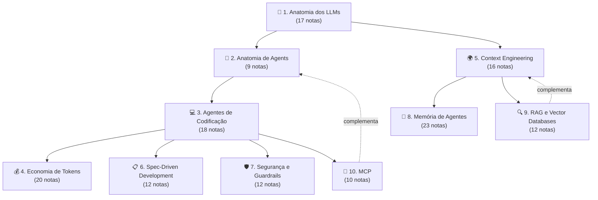

# Formação Engenheiro de IA

Programa completo de formação para engenheiros de software trabalharem efetivamente com IA em 2026. **Não é tutorial isolado** nem hype — é mapa estruturado de **10 trilhas atomizadas** que cobrem desde "o que é um LLM" até "como construir MCP server seguro e passar em auditoria de EU AI Act". Cada trilha é independente e completa; juntas, formam a stack de competências que diferencia engenheiros que **usam** IA dos que **dominam** IA.

> [!info] Como usar este MOC
> Este é o **mapa mestre** — não tem notas próprias. Use:
> - **Sequencial** se está começando do zero (segue ordem dos módulos)
> - **Por senda** se já tem base e quer foco específico (Praticante, Arquiteto, Líder Técnico, Open Source)
> - **Por tópico** se busca solução para problema concreto (consulte trilhas individuais)

> [!tip] Pré-requisitos do programa
> Engenheiro de software atuante. Não exige expertise prévia em IA — Trilha 1 começa do zero. Já trabalha com IA? Pule para a senda que melhor encaixa no seu papel.

## Visão geral — 10 módulos, ~150 notas



Setas sólidas = pré-requisito recomendado. Tracejadas = relação complementar.

## Os 10 módulos

### Módulo 1 — [[Anatomia dos LLMs]] (17 notas)

> *"Antes de orquestrar agentes, entenda os blocos."*

Tokens, atenção, modelos em produção (incluindo chineses), APIs, pricing, reasoning, treino (pretraining/SFT/RLHF), evaluation, fine-tuning vs RAG, futuro.

**Quando ler:** sempre. É o alicerce.

---

### Módulo 2 — [[Anatomia de Agents]] (9 notas)

> *"Agents são LLM + tools + loop com autonomia."*

O que define agent (vs chat, RAG, workflow), loop ReAct, native tool use, design de tools, memory, planning, multi-agent (orchestrator + sub-agents), frameworks 2026, patterns canônicos, evaluation.

**Quando ler:** após Módulo 1. Fundamentos genéricos antes de coding agents específicos.

---

### Módulo 3 — [[Agentes de Codificação]] (18 notas)

> *"De autocomplete a agentes autônomos — o panorama das ferramentas."*

Filosofia (vibe vs disciplina, comprehension gate), os players (Cursor, Claude Code, Copilot, Windsurf, Devin, Gemini CLI), open source (OpenCode, Aider, modelos chineses), workflows (AGENTS.md, MCP, multi-agent, benchmarks).

**Quando ler:** após Módulos 1-2. Onde a teoria vira prática diária.

---

### Módulo 4 — [[Economia de Tokens]] (20 notas)

> *"Cada token custa dinheiro — entenda como gastar menos sem perder qualidade."*

Em 5 blocos: o problema, reduzir input (caching, pruning, compression, compaction), arquitetura econômica (routing, sub-agents, semantic cache, batch), output (concisas, thinking budget), governança (orçamento, auditoria, ROI, playbook, planos, futuro).

**Quando ler:** após Módulo 3 — para parar de queimar dinheiro.

---

### Módulo 5 — [[Context Engineering]] (16 notas)

> *"A disciplina que substituiu prompt engineering."*

Em 5 blocos: fundamentos (context rot, 4 pilares), arquitetura (pipelines, camadas, JIT retrieval, compressão), memória e estado (self-editing, multi-agent, structured files, AGENTS.md), produção (guardrails, entropia, setup), prompting e skills (técnicas, SKILL.md marketplace).

**Quando ler:** após Módulo 1, paralelo a Módulo 2-3. Karpathy: *"the load-bearing skill of 2026"*.

---

### Módulo 6 — [[Spec-Driven Development]] (12 notas)

> *"Specs como contrato executável — resposta da indústria ao tech debt do vibe coding."*

O problema do vibe coding (Veracode 45%), pipeline (Specify → Plan → Tasks → Implement → Validate), ferramentas (Kiro, Spec Kit, OpenSpec, Tessl), prática (multi-agent CIV, integração, roadmap, debates).

**Quando ler:** após Módulo 5. Spec é a camada superior do contexto.

---

### Módulo 7 — [[Segurança e Guardrails]] (12 notas)

> *"Código gerado por IA é untrusted por padrão. Defesa em profundidade não é opcional."*

O problema (45% Veracode, slopsquat, alucinações), defesa (pirâmide de validação, SAST/SCA, sandboxing, prompting), processo (review, testes imutáveis, métricas), compliance (EU AI Act 2 ago 2026, GDPR, roadmap).

**Quando ler:** **antes** de levar AI agents para produção. Não depois.

---

### Módulo 8 — [[Memória de Agentes]] (23 notas)

> *"Como agentes lembram entre sessões — taxonomia, players, e guia de implementação."*

Fundamentos, taxonomia (episódica/semântica/procedural), RAG vs memória, panorama (Letta, Mem0, Zep, MemPalace, A-MEM), implementações (Karpathy gist, basic-memory MCP, Generative Agents Stanford), surveys 2026, críticas, guia.

**Quando ler:** complementa Módulo 5. Específico para agentes com estado persistente.

---

### Módulo 9 — [[RAG e Vector Databases]] (12 notas)

> *"Quase toda aplicação séria com LLM em 2026 tem RAG no caminho."*

O que é RAG e quando usar, anatomia do pipeline, embeddings, chunking (50% da qualidade), vector databases (pgvector/Pinecone/Qdrant), retrieval (hybrid + BM25 + query rewriting), reranking, generation com citação, evaluation (Ragas), RAG vs long context vs fine-tuning, padrões avançados (Graph RAG, Agentic RAG), setup completo.

**Quando ler:** quando precisa que LLM use **conhecimento específico** que não cabe no prompt. Conecta com Módulos 1, 5 e 8.

---

### Módulo 10 — [[MCP]] (10 notas)

> *"USB-C para agents de IA."*

O que é MCP, primitivos (Tools/Resources/Prompts), arquitetura cliente-servidor, servers oficiais, construindo MCP server local, MCP remoto (HTTP+SSE), segurança, ecossistema 2026, casos comuns, setup + best practices.

**Quando ler:** depois do Módulo 2. Crucial para integrar agents com sistemas externos de forma padronizada.

---

## Sendas transversais

Caminhos especializados pelos módulos, calibrados por papel/objetivo.

### 🛠️ Senda do Praticante (15-20h)

> *"Sou IC, programo todo dia, quero usar IA com qualidade hoje."*

```
Trilha 1: 01-03 (LLM, tokens, janela)
Trilha 2: 01-02 (agent, loop ReAct)
Trilha 3: 04-05 (Cursor, Claude Code), 16 (loop agentic)
Trilha 4: 01, 05 (problema, caching), 13 (respostas concisas), 18 (playbook)
Trilha 5: 11 (skills/AGENTS.md), 14 (setup completo), 15-16 (prompting + skills)
```

**Saída:** Cursor/Claude Code com disciplina, AGENTS.md configurado, custo controlado.

---

### 🏛️ Senda do Arquiteto (30-40h)

> *"Sou tech lead / staff. Preciso desenhar sistemas com IA."*

```
Trilha 1: 03-04, 07, 09 (janela, atenção, MoE, APIs)
Trilha 2: 04-06 (memory, planning, multi-agent)
Trilha 5: 04-06, 13 (pipelines, camadas, JIT, entropia)
Trilha 4: 09-11 (routing, sub-agents, semantic cache)
Trilha 9: 02, 06-07, 11 (anatomia, retrieval, rerank, padrões avançados)
Trilha 10: 03, 06 (arquitetura, HTTP+SSE)
Trilha 6: 02, 04-07 (SDD pipeline)
Trilha 7: 04-06 (pirâmide, SAST, sandbox)
Trilha 8: 06, 08, 22 (LLM Wiki, arquitetura, guia)
```

**Saída:** capaz de projetar pipeline de contexto, escolher arquitetura de memória, especificar guardrails, decompor sistemas complexos com agentes.

---

### 👔 Senda do Líder Técnico (20-25h)

> *"Sou eng manager. Preciso decidir adoção, métricas e governança."*

```
Trilha 1: 05, 10, 15 (panorama, pricing, futuro)
Trilha 2: 01, 08-09 (definição, patterns, evaluation)
Trilha 3: 01-03, 18 (autocomplete→agentes, vibe vs disciplina, comprehension gate, benchmarks)
Trilha 4: 04, 17-19 (monitoramento, ROI, playbook, planos)
Trilha 7: 08, 10-12 (code review, métricas, compliance, roadmap)
Trilha 6: 03, 12 (níveis de rigor, debates honestos)
```

**Saída:** capaz de avaliar custo/benefício, definir métricas, decidir nível de rigor SDD, planejar adoção de 12 semanas, defender investimento para stakeholders.

---

### 🌐 Senda Open Source / Soberania (18-25h)

> *"Quero independência de provider, modelos abertos, stack auto-hospedado."*

```
Trilha 1: 06, 08 (modelos chineses, modelos locais)
Trilha 2: 07 (frameworks 2026)
Trilha 3: 09-13, 15 (Aider, OpenCode, modelos chineses, MCP)
Trilha 4: 09, 11 (model routing, semantic caching)
Trilha 9: 05 (pgvector, Qdrant self-hosted)
Trilha 10: 04-06 (servers oficiais, construir local, HTTP+SSE)
Trilha 8: 09-12 (panorama, Wendel gist, graphify, basic-memory MCP)
```

**Saída:** stack 100% open source, DeepSeek/Qwen/GLM, MCP integrations, memória local.

---

## Como medir progresso

| Marco | Sinal |
|---|---|
| **Iniciante** | Acabou Trilha 1 |
| **Praticante** | Acabou Senda do Praticante completa |
| **Engenheiro de IA** | Acabou Trilhas 1-5 |
| **Arquiteto de IA** | Acabou Senda do Arquiteto |
| **Líder Técnico** | Acabou Senda do Líder Técnico |
| **Mestre** | Acabou as 10 trilhas |

Marcos são pessoais, não diplomas. **Aplicar > acumular leitura.**

## Glossário cross-trilha

Termos que aparecem em múltiplas trilhas — onde estão os "dives" definitivos:

| Termo | Onde está o dive | Aparece em |
|---|---|---|
| **Token / tokenization** | [[Anatomia dos LLMs\|02 - Tokens e tokenização]] | Todas |
| **Context window** | [[Anatomia dos LLMs\|03 - A janela de contexto]] | Trilhas 4, 5, 7 |
| **Prompt caching** | [[Economia de Tokens\|05 - Prompt caching na prática]] | Trilhas 5, 6, 8 |
| **Context rot** | [[Context Engineering\|03 - Context rot e atenção diluída]] | Trilhas 4, 6, 8, 9 |
| **AGENTS.md / CLAUDE.md** | [[Context Engineering\|11 - Skills e instructions como contexto]] | Trilhas 3, 6, 7 |
| **MCP** | [[MCP\|01 - O que é MCP e por que importa]] | Trilhas 2, 5, 8, 9 |
| **Multi-agent / CIV** | [[Spec-Driven Development\|09 - SDD com agentes — coordinator, implementor, validator]] | Trilhas 2, 3, 5 |
| **Sandbox / least privilege** | [[Segurança e Guardrails\|06 - Permissões e sandboxing]] | Trilhas 2, 3, 5, 7 |
| **Spec-as-source** | [[Spec-Driven Development\|03 - Níveis de rigor — spec-first, spec-anchored, spec-as-source]] | Trilhas 5, 7 |
| **Vibe coding** | [[Spec-Driven Development\|01 - O problema do vibe coding em produção]] | Trilhas 3, 7 |
| **Letta / MemGPT** | [[Memória de Agentes\|13 - Letta (ex-MemGPT)]] | Trilhas 2, 5, 8 |
| **Self-editing memory** | [[Context Engineering\|08 - Memória agentica — self-editing memory]] | Trilha 8 |
| **Embeddings** | [[RAG e Vector Databases\|03 - Embeddings — representação semântica]] | Trilhas 5, 8, 9 |
| **Chunking** | [[RAG e Vector Databases\|04 - Chunking — onde 50% da qualidade vive]] | Trilha 9 |
| **Hybrid search** | [[RAG e Vector Databases\|06 - Retrieval — hybrid search, BM25, query rewriting]] | Trilha 9 |
| **MCP primitivos** | [[MCP\|02 - Os três primitivos — Tools, Resources, Prompts]] | Trilha 10 |
| **SKILL.md** | [[Context Engineering\|16 - Agent skills marketplace e SKILL.md]] | Trilhas 3, 5 |
| **Slopsquatting** | [[Segurança e Guardrails\|02 - Slopsquatting — o ataque via alucinação]] | Trilhas 7, 10 |

## Bibliografia mestra (top 25)

Fontes que aparecem em ≥2 trilhas — bibliografia essencial:

- **Anthropic — Effective context engineering for AI agents** (Trilhas 2, 3, 5, 6, 9)
- **Anthropic — Best Practices for Claude Code** (Trilhas 3, 5, 7)
- **Anthropic — Building Effective Agents** (Trilhas 2, 3, 4)
- **Anthropic — Contextual Retrieval** (Trilhas 5, 9)
- **Anthropic — MCP announcement + spec** (Trilha 10)
- **Karpathy — Vibe coding** (Trilhas 3, 6)
- **Karpathy — Context engineering tweet** (Trilha 5)
- **Veracode — 2025 GenAI Code Security Report** (Trilhas 6, 7)
- **Chroma Research — Context Rot** (Trilhas 4, 5)
- **Liu et al. — Lost in the Middle (TACL 2024)** (Trilhas 5, 9)
- **GitHub Spec Kit (github/spec-kit)** (Trilha 6)
- **AGENTS.md spec (Linux Foundation)** (Trilhas 3, 5, 6, 7)
- **Letta — Memory Blocks** (Trilhas 5, 8)
- **Lewis et al. — RAG paper original (2020)** (Trilha 9)
- **Wei et al. — Chain-of-Thought** (Trilha 5)
- **Yao et al. — ReAct** (Trilha 2)
- **Schick et al. — Toolformer** (Trilha 2)
- **Packer et al. — MemGPT (arxiv:2310.08560)** (Trilhas 5, 8)
- **DeepLearning.AI / Andrew Ng — SDD course** (Trilha 6)
- **Awesome MCP Servers** (Trilha 10)
- **OWASP Top 10 for LLMs** (Trilhas 7, 10)
- **Eugene Yan — Patterns for LLM Systems** (Trilhas 1, 5, 9)
- **Chip Huyen — AI Engineering** (Trilhas 1, 9)
- **Salesforce Ben — 2026 Year of Tech Debt** (Trilhas 6, 7)
- **EU AI Act regulatory framework** (Trilha 7)

## Manutenção desta formação

Esta formação reflete o estado de **maio de 2026**. Áreas que mudam mais rápido:

| Área | Cadência de revisão |
|---|---|
| Pricing de modelos | Trimestral |
| Ferramentas SAST/SCA | Trimestral |
| Compliance (EU AI Act) | Anual |
| Modelos de fronteira | Trimestral |
| Pesquisa em context rot / memória | Semestral |
| Padrões SDD | Semestral |
| MCP ecosystem | Trimestral |

Notas com mais "shelf life" — fundamentos teóricos, princípios de defesa em profundidade, taxonomia de memória — duram anos.

## Veja também

- [[Anatomia dos LLMs]]
- [[Anatomia de Agents]]
- [[Agentes de Codificação]]
- [[Economia de Tokens]]
- [[Context Engineering]]
- [[Spec-Driven Development]]
- [[Segurança e Guardrails]]
- [[Memória de Agentes]]
- [[RAG e Vector Databases]]
- [[MCP]]
- [[03-Domínios/IA/index|IA — portal do domínio]]

---

> [!quote] Encerramento
> *"Engenheiros que dominam essas 10 trilhas não usam IA — eles **engenheiram com IA**. A diferença entre os dois define quem tem tech debt em 18 meses e quem tem produto em produção."*
