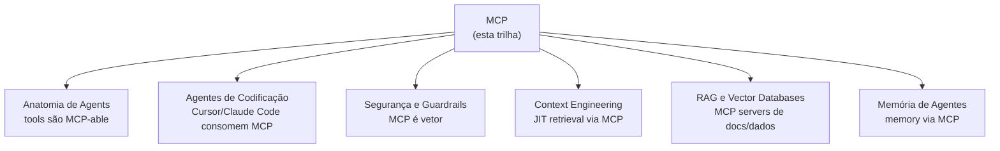

# MCP — Model Context Protocol

**MCP** é o "USB-C para agents de IA": padrão aberto para conectar LLMs a sistemas externos. Lançado pela Anthropic em novembro de 2024, virou padrão de facto em 2025-2026 com adoção de OpenAI, Google, Microsoft, Cursor, Windsurf, e ecossistema de **3000+ servers** em Awesome MCP Servers. Em 2026, **MCP é infrastructure-grade** — não experimento. Se você está construindo aplicação com agents, MCP é tão essencial quanto HTTP.

> [!info] Pré-requisitos
> Recomendado ter passado por [[Anatomia de Agents]] (Trilha 2 — fundamentos de tools) e [[Agentes de Codificação]] (visão prática). Para construção de servers, helps ter Python ou TypeScript.

> [!tip] A premissa central
> N clients × M sistemas = N×M integrações custom (era pré-MCP).
> Com MCP: N clients + M servers = N+M conexões padronizadas.
> Quando N e M crescem, a diferença é gigante.

## Comece por aqui

Trilha sequencial recomendada — fundamentos → arquitetura → construção → operação.

### Bloco 1 — Fundamentos (3 notas)

O quê, por quê, e como funciona.

- [[01 - O que é MCP e por que importa]] — definição, lifecycle, quando usar
- [[02 - Os três primitivos — Tools, Resources, Prompts]] — diferenças e quando usar cada
- [[03 - Arquitetura cliente-servidor]] — stdio vs HTTP+SSE, JSON-RPC, lifecycle

### Bloco 2 — Servers (2 notas)

Reusar antes de construir; construir quando necessário.

- [[04 - MCP servers oficiais e populares]] — catálogo, decision criteria, defaults sensatos
- [[05 - Construindo um MCP server local]] — Python SDK, FastMCP, schemas, MCP Inspector

### Bloco 3 — Produção (2 notas)

De server local a server compartilhado seguro.

- [[06 - MCP remoto — HTTP + SSE para times]] — auth, deploy, observabilidade
- [[07 - Segurança em MCP]] — prompt injection, supply chain, defense in depth

### Bloco 4 — Ecossistema e Casos (3 notas)

Visão de mercado e patterns reusáveis.

- [[08 - Ecossistema 2026 — clients e integrações]] — clients, marketplaces, hosting managed
- [[09 - Casos comuns no mercado]] — 5 categorias de uso com exemplos
- [[10 - Setup completo + best practices]] — checklist 4 fases, distilled best practices

## Rotas alternativas

### Rota prática (vou usar MCP hoje)
*"Quero plugar Claude Code com Postgres + GitHub"*

[[01 - O que é MCP e por que importa]] → [[04 - MCP servers oficiais e populares]] → [[03 - Arquitetura cliente-servidor]] → [[07 - Segurança em MCP]]

### Rota construtor (vou criar MCP server)
*"Tenho API/sistema interno e quero expor como MCP"*

[[02 - Os três primitivos — Tools, Resources, Prompts]] → [[05 - Construindo um MCP server local]] → [[10 - Setup completo + best practices]] → [[Anatomia de Agents|03 - Tool design — princípios e categorias]]

### Rota arquiteto (deploy team-wide)
*"Servidor compartilhado para equipe, com compliance"*

[[03 - Arquitetura cliente-servidor]] → [[06 - MCP remoto — HTTP + SSE para times]] → [[07 - Segurança em MCP]] → [[09 - Casos comuns no mercado]] → [[Segurança e Guardrails|11 - Governance as architecture]]

### Rota cético (vale a pena adotar?)
*"Por que MCP em vez de function calling?"*

[[01 - O que é MCP e por que importa]] → [[08 - Ecossistema 2026 — clients e integrações]] → [[09 - Casos comuns no mercado]]

### Rota security (red team posture)
*"MCP é vetor de ataque — preciso entender riscos"*

[[07 - Segurança em MCP]] → [[Segurança e Guardrails|02 - Slopsquatting — o ataque via alucinação]] → [[Segurança e Guardrails|06 - Permissões e sandboxing]] → [[10 - Setup completo + best practices]]

## Como esta trilha se conecta



MCP é **camada de infraestrutura** que toca quase tudo no stack de agentes.

## Leituras recomendadas

| Fonte | Tipo | Cobertura |
|---|---|---|
| **Anthropic — MCP announcement** | Blog (nov 2024) | Nota 01 |
| **MCP Specification** | Spec oficial (modelcontextprotocol.io) | Trilha inteira |
| **MCP Python SDK** | github.com/modelcontextprotocol/python-sdk | Notas 05, 10 |
| **MCP TypeScript SDK** | github.com/modelcontextprotocol/typescript-sdk | Nota 05 |
| **Awesome MCP Servers** | github.com/punkpeye/awesome-mcp-servers | Nota 04 |
| **MCP Inspector** | github.com/modelcontextprotocol/inspector | Notas 05, 10 |
| **OWASP Top 10 for LLMs** | owasp.org | Nota 07 |
| **Anthropic — MCP best practices** | docs.anthropic.com | Nota 10 |
| **Cloudflare — MCP on Workers** | developers.cloudflare.com | Notas 06, 08 |
| **Claude Course** | YouTube (Anthropic) | Visão geral |

## Veja também

- [[Anatomia de Agents]] — fundamentos genéricos
- [[Agentes de Codificação]] — coding agents (todos suportam MCP)
- [[Context Engineering]] — JIT retrieval via MCP
- [[Segurança e Guardrails]] — defesa contra MCP malicioso
- [[Memória de Agentes]] — memória via MCP servers
- [[RAG e Vector Databases]] — alternativa quando MCP não cabe
- [[03-Domínios/IA/index|Formação Engenheiro de IA]]

## Todas as notas

```dataview
TABLE
  title AS "Título",
  status AS "Status",
  join(tags, ", ") AS "Tags"
FROM "03-Domínios/IA/MCP"
WHERE type != "moc"
SORT file.name ASC
```
