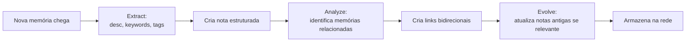

# A-MEM — Zettelkasten dinâmico

> [!abstract] TL;DR
> A-MEM (Agentic Memory) aplica princípios do **Zettelkasten** de Niklas Luhmann a sistemas de memória para LLM agents. Cada nova memória vira uma "nota" com atributos estruturados (contextual description, keywords, tags); o sistema **automaticamente identifica conexões com memórias anteriores e pode atualizar notas antigas** — *memory evolution* — quando um contexto novo chega. A proposta deixa de tratar memória como pilha que cresce e passa a tratá-la como rede que se reorganiza. Aceito em **NeurIPS 2025**.

## Metadados

- **Autores:** Wujiang Xu, Zujie Liang, Kai Mei, Hang Gao, Juntao Tan, Yongfeng Zhang
- **Afiliação:** Rutgers University (o e-mail de contato do primeiro autor é `wujiang.xu@rutgers.edu`; o grupo é frequentemente associado ao laboratório AGI Research, da própria Rutgers)
- **Venue:** NeurIPS 2025 — *Advances in Neural Information Processing Systems*
- **arXiv:** [2502.12110](https://arxiv.org/abs/2502.12110)
- **Código (sistema de memória):** [github.com/agiresearch/A-mem](https://github.com/agiresearch/A-mem)
- **Código (reprodução dos experimentos do paper):** [github.com/WujiangXu/AgenticMemory](https://github.com/WujiangXu/AgenticMemory) — apontado pelo próprio README do agiresearch como o repositório canônico para reproduzir os resultados

## Problema

Sistemas de memória anteriores tratam o histórico do agente de duas formas dominantes, e ambas têm limites claros. A primeira é o *memory stream* descrito em [[17 - Generative Agents (Park, Stanford 2023)|17 - Generative Agents]]: memórias são adicionadas em sequência, recuperadas por uma combinação de *recency*, importância e similarity, e nunca se reorganizam. A segunda é o RAG vetorial puro discutido em [[04 - RAG vs memória de longo prazo]] e em [[05 - Beyond RAG - quando RAG não basta]]: cada memória vira um vetor isolado em um índice, e a relação entre elas só existe implicitamente, no espaço de embeddings.

O que falta nas duas abordagens é **organização emergente**. Não há mecanismo para que duas memórias reconheçam uma à outra como parte de um mesmo tópico, nem para que uma memória antiga seja *atualizada* quando uma observação posterior muda o que ela significa. A-MEM ataca exatamente esse vácuo.

## Contribuição

O paper propõe um sistema que combina três ideias:

1. **Estrutura Zettelkasten para cada memória.** Em vez de armazenar o conteúdo bruto, o sistema gera, via LLM, uma nota estruturada com atributos: *contextual description*, *keywords*, *tags*, *category* e *timestamp*. Isso é diretamente análogo ao formato fichado que Luhmann usava em suas caixas de fichas (*Zettelkästen*).
2. **Linkagem dinâmica baseada em similarity semântica.** Ao inserir uma nota nova, o sistema analisa o conjunto existente, identifica notas relacionadas e cria links explícitos entre elas. A rede de memória cresce como um grafo, não como uma lista.
3. ***Memory evolution*.** Esta é a contribuição mais distinta. Inserir uma nota nova pode disparar **atualização das representações de notas antigas** — descrição, keywords ou tags são reescritas à luz do novo contexto. A memória deixa de ser *append-only* e passa a ser *revisable*.

A combinação dos três permite chamar A-MEM, no vocabulário do paper, de "agentic memory": uma memória que não só registra, mas se organiza ativamente.

## Como funciona



Cada nota segue, segundo o repositório de referência, um schema próximo de:

```text
(content, contextual_description, keywords, tags, category,
 timestamp, links_to_other_notes, last_evolved_at)
```

O fluxo de inserção tem quatro etapas, todas mediadas por LLM:

- **Extract** — a partir do conteúdo bruto, o modelo gera descrição contextual, keywords e tags.
- **Analyze** — o sistema busca, no índice existente, memórias semanticamente próximas e identifica candidatas a link.
- **Link** — links bidirecionais são materializados entre a nova nota e as candidatas selecionadas.
- **Evolve** — para cada nota antiga ligada, o modelo decide se há razão para reescrever campos da nota antiga (por exemplo, expandir a descrição ou refinar as tags). É aqui que A-MEM se distingue de tudo que existia antes.

A recuperação, na hora da consulta, combina similarity de embeddings com travessia dos links — semelhante ao que se faz em grafos de conhecimento, mas com a estrutura sendo construída pelo próprio agente em runtime.

**Inspiração explícita em Luhmann.** O paper cita Niklas Luhmann e o Zettelkasten como referência central. A novidade declarada não é o formato fichado em si — Luhmann já usava algo equivalente em papel —, mas **automatizar via LLM o trabalho de linkagem e revisão** que ele fazia manualmente, fichinha por fichinha, ao longo de décadas.

## Resultados

- Avaliação em **seis foundation models** (segundo o paper; a lista exata varia entre famílias open e closed source).
- Benchmark principal: **LoCoMo**, com cinco categorias de pergunta — *multi-hop*, *temporal*, *open-domain*, *single-hop* e *adversarial*.
- Os autores reportam ganhos sobre baselines SOTA de memória de agentes nos seis modelos, com vantagem particularmente clara em tarefas de **multi-hop reasoning** — exatamente o regime em que a estrutura de links bidirecionais ajuda.
- Números específicos por categoria devem ser consultados diretamente na tabela do paper; aqui mantenho o resumo qualitativo para evitar afirmações que não consegui verificar linha a linha.

## Limitações reconhecidas pelos autores

- **Custo de LLM call por inserção.** Cada nova memória dispara, no mínimo, três chamadas (extract, analyze, evolve). Em produção isso multiplica custo e latência por turno de conversação.
- **Qualidade dos links depende do modelo de embeddings.** Modelos fracos produzem links ruins, e links ruins propagam ruído via *evolve*.
- **Não trata *forgetting* explicitamente.** O ciclo é *add* + *evolve*; não há mecanismo formal para descartar memórias obsoletas, o que pode levar a inchaço da rede em horizontes longos.

## Crítica externa

A análise da QvickRead no Medium ("A-MEM: Pros and Cons of a New Memory System for LLM Agents") sintetiza bem o consenso informal da comunidade:

- ***Memory evolution* é genuinamente nova.** É a peça que faltava na literatura; outros sistemas pré-A-MEM tratavam memória como log imutável.
- **O custo é a maior crítica em produção.** Cada interação multiplica chamadas a LLM, e o trade-off "qualidade de organização vs. latência/preço" não é trivial.
- **A inspiração em Luhmann é também um *marketing point*.** Zettelkasten é tema querido em comunidades de PKM (Personal Knowledge Management), o que ajudou o paper a circular muito além do circuito acadêmico estrito.

## Por que importa para a trilha

- A-MEM representa a **ala acadêmica** do mesmo problema que o LLM Wiki Pattern resolve pragmaticamente. Ambos perguntam "como organizar memória que evolui", mas chegam por caminhos opostos: research-led, com taxonomia formal e benchmarks, no caso do A-MEM; engineering-led, com arquivos markdown e wikilinks, no caso do gist do Karpathy ([[06 - O LLM Wiki Pattern (gist do Karpathy)]]).
- **Linkagem dinâmica** e ***memory evolution*** já aparecem como ideias emprestadas em sistemas de produção como Mem0 ([[14 - Mem0 — vetorial + grafo]]) — o vocabulário do paper rapidamente virou linguagem comum no campo.
- Para o vault em si, a coincidência com Zettelkasten é instrutiva: a [[03-Domínios/IA/Memória de Agentes/index]] inteira é construída como um Zettelkasten humano, e A-MEM mostra como esse mesmo padrão pode ser delegado, em parte, a um agente.

## Veja também

- [[06 - O LLM Wiki Pattern (gist do Karpathy)]] — abordagem pragmática complementar ao mesmo problema
- [[17 - Generative Agents (Park, Stanford 2023)|17 - Generative Agents]] — antecedente direto, com memory stream sem evolução
- [[19 - Surveys e estado da arte 2026]] — onde o campo é formalizado como subárea
- [[14 - Mem0 — vetorial + grafo]] — sistema de produção que toma ideias emprestado
- [[20 - Comparativo crítico (LongMemEval)|20 - Comparativo crítico]] — onde A-MEM aparece em benchmark cruzado
- [[03 - Taxonomia da memória (episódica, semântica, procedural)]] — A-MEM atua principalmente sobre memória episódica/semântica, com o *evolve* aproximando-se de consolidação semântica

## Referências

- Xu, W., Liang, Z., Mei, K., Gao, H., Tan, J., Zhang, Y. (2025). *A-MEM: Agentic Memory for LLM Agents*. arXiv preprint — `https://arxiv.org/abs/2502.12110`
- Repositório do sistema de memória — `https://github.com/agiresearch/A-mem`
- Repositório de reprodução dos experimentos — `https://github.com/WujiangXu/AgenticMemory` (apontado como canônico pelo README do agiresearch)
- QvickRead, *A-MEM: Pros and Cons of a New Memory System for LLM Agents* (AdvancedAI, Medium) — análise crítica externa
- Luhmann, N. — referência conceitual ao método Zettelkasten, citada explicitamente pelos autores
