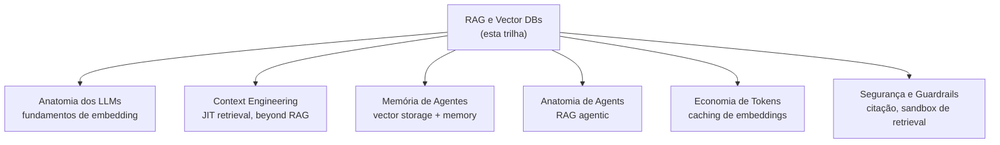

# RAG e Vector Databases

Em 2026, quase toda aplicação séria com LLM tem **RAG no meio do caminho**. LLMs conhecem muita coisa, mas não conhecem **seus dados** — docs internas, políticas, base de clientes, histórico do paciente. RAG resolve isso injetando dados específicos no contexto em runtime, com **citação de fonte** como capacidade-chave. Esta trilha cobre o ciclo completo: do conceito ao setup de produção, passando por embeddings, chunking, vector DBs, retrieval, reranking, evaluation e padrões avançados (Graph RAG, Agentic RAG).

> [!info] Pré-requisitos
> Recomendado ter lido [[Anatomia dos LLMs]] (Trilha 1) — especialmente sobre context window e API. [[Context Engineering]] complementa fortemente (Bloco 2 de retrieval). Para RAG agentic avançado, ver [[Anatomia de Agents]].

> [!tip] A regra de ouro
> RAG **não é sobre vector database** — é sobre **retrieval quality**. Vector DB é commodity. Onde a qualidade vive: chunking, hybrid search, reranking. Pure vector em produção perde para hybrid+rerank em ~95% dos casos.

## Comece por aqui

Trilha sequencial recomendada — fundamentos → pipeline → componentes → evaluation → produção.

### Bloco 1 — Fundamentos (2 notas)

O que é, anatomia do pipeline.

- [[01 - O que é RAG e quando usar]] — definição, decision tree, capacidade-chave (citação)
- [[02 - Anatomia do pipeline RAG]] — indexing + query, onde cada problema vive

### Bloco 2 — Componentes Essenciais (5 notas)

Os pilares que sustentam qualidade.

- [[03 - Embeddings — representação semântica]] — modelos, dimensões, matryoshka, custo
- [[04 - Chunking — onde 50% da qualidade vive]] — 5 estratégias, quando usar cada
- [[05 - Vector databases — pgvector, Pinecone, Qdrant]] — comparativo, decision tree
- [[06 - Retrieval — hybrid search, BM25, query rewriting]] — RRF, HyDE, multi-query
- [[07 - Reranking — Cohere, Voyage, cross-encoders]] — bi vs cross-encoder, ganho real

### Bloco 3 — Generation e Avaliação (2 notas)

Como passar contexto e como medir qualidade.

- [[08 - Generation — passar contexto ao LLM com citação]] — prompts, faithfulness, structured output
- [[09 - Evaluation de RAG]] — Ragas, golden set, eval em CI

### Bloco 4 — Decisão e Avançado (3 notas)

Quando RAG é a escolha certa, padrões avançados, setup completo.

- [[10 - RAG vs long context vs fine-tuning]] — decision tree, hibridos
- [[11 - Padrões avançados — Graph RAG, Agentic RAG, multi-hop]] — quando RAG vanilla falha
- [[12 - Setup completo — checklist de produção]] — roadmap 8 semanas, stack recomendada

## Rotas alternativas

### Rota prática (vou construir um RAG agora)
*"Tenho corpus, preciso de RAG funcional rapidamente"*

[[01 - O que é RAG e quando usar]] → [[02 - Anatomia do pipeline RAG]] → [[04 - Chunking — onde 50% da qualidade vive]] → [[06 - Retrieval — hybrid search, BM25, query rewriting]] → [[12 - Setup completo — checklist de produção]]

### Rota qualidade (já tenho RAG mas funciona mal)
*"RAG existe mas top-k traz lixo / faithfulness baixa"*

[[09 - Evaluation de RAG]] → [[04 - Chunking — onde 50% da qualidade vive]] → [[06 - Retrieval — hybrid search, BM25, query rewriting]] → [[07 - Reranking — Cohere, Voyage, cross-encoders]]

### Rota arquiteto (qual approach escolher)
*"Devo usar RAG, long context ou fine-tuning?"*

[[01 - O que é RAG e quando usar]] → [[10 - RAG vs long context vs fine-tuning]] → [[Anatomia dos LLMs|14 - Fine-tuning vs prompting vs RAG]]

### Rota produção (RAG em escala)
*"Time pequeno mas precisamos rodar RAG confiável"*

[[12 - Setup completo — checklist de produção]] → [[09 - Evaluation de RAG]] → [[Economia de Tokens|18 - Playbook de economia — checklist completo]] → [[Segurança e Guardrails|07 - Security-focused prompting]]

### Rota avançada (multi-hop, knowledge graphs)
*"RAG vanilla não resolve, preciso patterns mais sofisticados"*

[[11 - Padrões avançados — Graph RAG, Agentic RAG, multi-hop]] → [[Anatomia de Agents]] → [[Memória de Agentes|15 - Zep e Graphiti — knowledge graph temporal]]

## Como esta trilha se conecta



## Leituras recomendadas

| Fonte | Tipo | Cobertura |
|---|---|---|
| **Anthropic — Contextual Retrieval** | Artigo (2024) | Notas 02, 04, 06, 07 |
| **Pinecone — Learn RAG** | Curso | Trilha inteira |
| **Lewis et al. — RAG paper original** | Paper (2020) | Nota 01 |
| **Karpukhin et al. — Dense Passage Retrieval** | Paper DPR (2020) | Nota 03 |
| **Gao et al. — HyDE** | Paper (2022) | Nota 06 |
| **Es et al. — RAGAS paper** | Paper (2023) | Nota 09 |
| **Edge et al. — GraphRAG paper** | Paper Microsoft (2024) | Nota 11 |
| **Chip Huyen — AI Engineering** | Livro (2025) | Notas 09, 10, 12 |
| **Eugene Yan — Patterns for LLM systems** | Artigo | Trilha inteira |
| **Lost in the Middle (Liu et al.)** | Paper | Nota 02 |

## Veja também

- [[Anatomia dos LLMs]] — fundamentos teóricos
- [[Context Engineering]] — disciplina mais ampla (RAG é caso particular)
- [[Memória de Agentes]] — vector stores em memória persistente
- [[Anatomia de Agents]] — Agentic RAG
- [[Economia de Tokens]] — custo de embeddings + queries
- [[MCP]] — alternativa via tools quando RAG não cabe
- [[03-Domínios/IA/index|Formação Engenheiro de IA]]

## Todas as notas

```dataview
TABLE
  title AS "Título",
  status AS "Status",
  join(tags, ", ") AS "Tags"
FROM "03-Domínios/IA/RAG e Vector Databases"
WHERE type != "moc"
SORT file.name ASC
```
