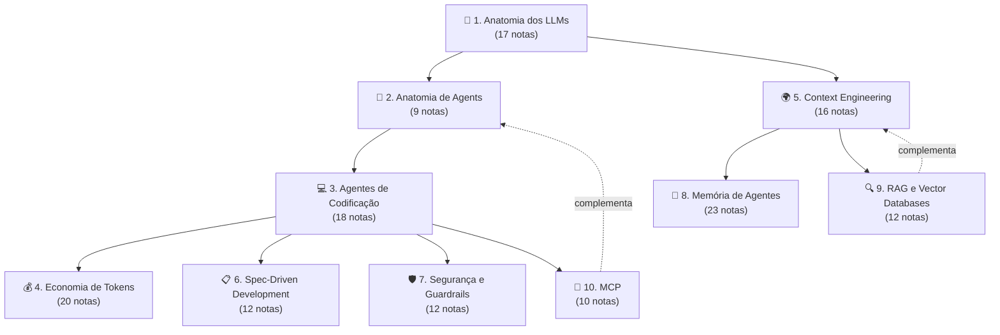
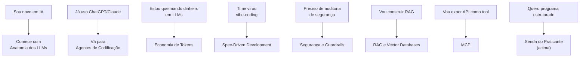

# IA — Formação Engenheiro de IA

Em 2026, IA deixou de ser especialização e virou **literacia básica** para qualquer senior dev. Coding agents fazem parte do dia a dia em times sérios; features de IA aparecem em praticamente todo projeto novo. Este domínio **é a formação completa** — programa estruturado de **10 trilhas atomizadas** + 4 sendas transversais que cobrem desde "o que é um LLM" até "como construir MCP server seguro e passar em auditoria de EU AI Act". Cada trilha é independente e completa; juntas, formam a stack de competências que diferencia engenheiros que **usam** IA dos que **dominam** IA.

> [!info] Como usar este portal
>
> - **Sequencial** se está começando do zero — segue ordem dos módulos
> - **Por senda** se já tem base — Praticante / Arquiteto / Líder Técnico / Open Source
> - **Por tópico** se busca solução concreta — pule para a trilha relevante
> - **Por overview** se quer panorâmica — leia este index inteiro (~30 min)

> [!tip] Pré-requisitos
> Engenheiro de software atuante. Não exige expertise prévia em IA — Trilha 1 começa do zero. Já trabalha com IA? Pule para a senda que melhor encaixa no seu papel.

## O que é IA — overview

Inteligência Artificial é o campo que desenvolve sistemas capazes de realizar tarefas que historicamente requeriam inteligência humana. Em 2026, quando alguém diz "IA", normalmente está falando de **Generative AI baseada em Large Language Models** — mas isso é a ponta de um iceberg.

Para um senior fullstack, IA atua em **três eixos**:

1. **IA como ferramenta de produtividade** — Usar ferramentas como Copilot, Claude Code, Cursor, ChatGPT e Gemini para desenvolver software mais rápido e com qualidade. Coding agents, autocomplete, code review, geração de testes — tudo isso é parte do kit básico.
2. **IA como feature de produto** — integrar LLMs via API em aplicações: chatbots, classificadores, RAG, agents especializados. Quase todo projeto novo sério tem alguma feature de IA, e o engenheiro de IA é quem projeta a arquitetura dessa integração, escolhe modelos, define o pipeline de contexto, e garante que a feature seja robusta e escalável.
3. **IA como infraestrutura** — escolher modelos, gerenciar custos, observabilidade, evaluation, segurança, governance. LLMs são dependências estocásticas com saídas não tipadas — sem disciplina operacional, o risco de falhas catastróficas é alto.

Você não precisa ser ML engineer. Precisa ser **fluente o suficiente** para conversar com data scientists, tomar decisões de arquitetura em features com IA, e não ser enganado por buzzwords.

> [!info]- O que significa "dependências estocásticas com saídas não tipadas"
> A frase condensa duas propriedades incômodas dos LLMs quando você os trata como componentes de software.
>
> **"Dependências estocásticas"**
>
> - *Dependência*: seu código depende do LLM como dependeria de um banco, uma API externa, uma lib — é parte do sistema, não mágica.
> - *Estocástica*: a saída é probabilística, não determinística. Mesma entrada, temperatura > 0, dá saídas diferentes. Mesmo com `temperature=0`, mudanças mínimas no prompt, no modelo, ou na infra do provider podem alterar o output. Diferente de uma função pura `f(x) = y`, o LLM é mais como `f(x) ≈ y` com uma distribuição em volta.
>
> **"Saídas não tipadas"**
>
> - O retorno é texto livre. Não há um contrato de tipo garantido como em `function getUser(id: string): User`.
> - Você *pede* JSON, mas pode vir markdown com ```` ```json ```` em volta, campo faltando, vírgula sobrando, alucinação de chave. Mesmo com structured outputs / JSON mode, o conteúdo dos campos não é validado semanticamente — o modelo pode preencher um `email` com algo que não é email.
>
> **Por que importa (a parte do "sem disciplina operacional")**
>
> Em código tradicional, o compilador/runtime te protege: tipos, exceções, contratos. Com LLM, *você* precisa recriar essas garantias na borda:
>
> - Validação de schema (Pydantic, Zod) em todo output
> - Retries com backoff quando a saída não parsa
> - Fallbacks quando o modelo "viaja"
> - Golden sets / evals para detectar regressão
> - Testes que toleram variação semântica (não string-matching exato)
>
> É a mesma disciplina que você aplica a inputs de usuário ou respostas de API externa — só que aqui o "componente não confiável" está no meio do seu fluxo de negócio, não na borda. É isso que justifica as Trilhas 4 (custo), 5 (contexto), 7 (segurança) e 8-9 (memória/RAG): toda a engenharia ao redor do LLM existe para domar essas duas propriedades.

## Hierarquia dos conceitos

```text
Inteligência Artificial (campo amplo, 1950+)
│
├── Rule-Based Systems (IA simbólica clássica)
│   └── Expert Systems, lógica formal
│
└── Machine Learning (aprender com dados, anos 80+)
    │
    ├── Supervised Learning (entrada + label)
    │   ├── Classification: spam, imagem, sentimento
    │   └── Regression: prever preço, idade, demanda
    │
    ├── Unsupervised Learning (sem labels)
    │   ├── Clustering: segmentação de usuários
    │   ├── Dimensionality reduction: PCA, t-SNE
    │   └── Anomaly detection: fraude
    │
    ├── Reinforcement Learning (recompensa via ação)
    │   └── AlphaGo, robótica, RLHF em LLMs
    │
    └── Deep Learning (redes neurais profundas, 2012+)
        │
        ├── CNNs — visão computacional
        ├── RNNs/LSTMs — sequências (obsoletos p/ texto)
        ├── Transformers (2017) — revolução
        │   │
        │   └── Generative AI (2020+)
        │       ├── LLMs — GPT, Claude, Gemini, Llama
        │       ├── Diffusion — DALL-E, Stable Diffusion, Sora
        │       └── Multimodal — GPT-4o, Claude 4, Gemini 2.5
        │
        └── Embeddings — representação vetorial
```

> [!note] Conceitos fundamentais cobertos em deep dive
> Tipos de aprendizado, training/validation/test, overfitting, métricas (precision, recall, F1), tokens e embeddings, context window, temperature/sampling, pretraining→SFT→RLHF, fine-tuning vs RAG vs prompting, transformer e attention — **tudo coberto em [[Anatomia dos LLMs]]** (Trilha 1).

>[!info] Glossário
> Você poderá usar op [[Dicionário de IA]] para adicionar items ao glossário e para referenciar esses items: Ex: [[Dicionário de IA#LSTM (Long Short-Term Memory)|LSTM]]
## O que diferencia um senior em IA

> [!tip] As 10 marcas de senioridade
>
> 1. **Entende a hierarquia IA → ML → DL → GenAI → LLMs** e sabe em qual nível um problema vive. Nem tudo que parece "IA" precisa de LLM.
> 2. **Pensa em economia de tokens e latência como pensa em queries SQL.** Prompt eficiente, caching, modelo certo, batch vs streaming.
> 3. **Sabe quando NÃO usar LLM.** Classificação simples com regex, regras de negócio determinísticas, validação — LLM é overkill.
> 4. **Distingue prompt engineering, context engineering, RAG e fine-tuning** — escolhe a ferramenta certa antes de escrever código.
> 5. **Trata outputs de LLM como input não confiável** — valida, testa, tem fallback, não confia em JSON "parece certo".
> 6. **Entende limitações reais** — alucinação, knowledge cutoff, context rot, não-determinismo — e desenha sistemas que sobrevivem a elas.
> 7. **Pratica evaluation sistemática.** Golden sets, regression tests, métricas — não "rodei 5 testes manuais".
> 8. **Pensa em segurança:** prompt injection, data leakage, PII em logs, jailbreaks, supply chain (slopsquatting).
> 9. **Domina pelo menos uma stack a fundo** (Claude Code + MCP + skills) em vez de ser "ok em tudo, expert em nada".
> 10. **Sabe explicar em inglês claro** para stakeholders: trade-offs de custo, risco, acurácia, latência.

## Visão geral — 10 trilhas



Setas sólidas = pré-requisito recomendado. Tracejadas = relação complementar. **10 módulos formam o programa completo.**

## Os 10 módulos

### Núcleo da formação (sequencial)

#### Trilha 1 — [[Anatomia dos LLMs]] (17 notas)

> *"Antes de orquestrar agentes, entenda os blocos."*

Tokens, atenção, modelos em produção (incluindo chineses), APIs, pricing, reasoning, treino (pretraining/SFT/RLHF), evaluation, fine-tuning vs RAG, futuro.

**Quando ler:** sempre. É o alicerce.

#### Trilha 2 — [[Anatomia de Agents]] (9 notas)

> *"Agents são LLM + tools + loop com autonomia."*

O que define agent (vs chat, RAG, workflow), loop ReAct, native tool use, design de tools, memory, planning, multi-agent, frameworks 2026, patterns canônicos, evaluation.

**Quando ler:** após Trilha 1. Fundamentos genéricos antes de coding agents específicos.

#### Trilha 3 — [[Agentes de Codificação]] (18 notas)

> *"De autocomplete a agentes autônomos — o panorama das ferramentas."*

Filosofia (vibe vs disciplina, comprehension gate), os players (Cursor, Claude Code, Copilot, Windsurf, Devin, Gemini CLI), open source (OpenCode, Aider, modelos chineses), workflows (AGENTS.md, MCP, multi-agent, benchmarks).

**Quando ler:** após Trilhas 1-2. Onde a teoria vira prática diária.

#### Trilha 4 — [[Economia de Tokens]] (20 notas)

> *"Cada token custa dinheiro — entenda como gastar menos sem perder qualidade."*

Em 5 blocos: o problema, reduzir input (caching, pruning, compression, compaction), arquitetura econômica (routing, sub-agents, semantic cache, batch), output (concisas, thinking budget), governança (orçamento, auditoria, ROI, playbook, planos, futuro).

**Quando ler:** após Trilha 3 — para parar de queimar dinheiro.

#### Trilha 5 — [[Context Engineering]] (16 notas)

> *"A disciplina que substituiu prompt engineering."*

Em 5 blocos: fundamentos (context rot, 4 pilares), arquitetura (pipelines, camadas, JIT retrieval, compressão), memória e estado (self-editing, multi-agent, structured files, AGENTS.md), produção (guardrails, entropia, setup), prompting e skills (técnicas, SKILL.md marketplace).

**Quando ler:** após Trilha 1, paralelo a Trilhas 2-3. Karpathy: *"the load-bearing skill of 2026"*.

#### Trilha 6 — [[Spec-Driven Development]] (12 notas)

> *"Specs como contrato executável — resposta da indústria ao tech debt do vibe coding."*

O problema do vibe coding (Veracode 45%), pipeline (Specify → Plan → Tasks → Implement → Validate), ferramentas (Kiro, Spec Kit, OpenSpec, Tessl), prática (multi-agent CIV, integração, roadmap, debates).

**Quando ler:** após Trilha 5. Spec é a camada superior do contexto.

#### Trilha 7 — [[Segurança e Guardrails]] (12 notas)

> *"Código gerado por IA é untrusted por padrão. Defesa em profundidade não é opcional."*

O problema (45% Veracode, slopsquat, alucinações), defesa (pirâmide de validação, SAST/SCA, sandboxing, prompting), processo (review, testes imutáveis, métricas), compliance (EU AI Act 2 ago 2026, GDPR, roadmap).

**Quando ler:** **antes** de levar AI agents para produção. Não depois.

### Trilhas especializadas (paralelas)

#### Trilha 8 — [[Memória de Agentes]] (23 notas)

> *"Como agentes lembram entre sessões — taxonomia, players, e guia de implementação."*

Fundamentos, taxonomia (episódica/semântica/procedural), RAG vs memória, panorama (Letta, Mem0, Zep, MemPalace, A-MEM), implementações (Karpathy gist, basic-memory MCP, Generative Agents Stanford), surveys 2026, críticas, guia.

**Quando ler:** complementa Trilha 5. Específico para agentes com estado persistente.

#### Trilha 9 — [[RAG e Vector Databases]] (12 notas)

> *"Quase toda aplicação séria com LLM em 2026 tem RAG no caminho."*

O que é RAG e quando usar, anatomia do pipeline, embeddings, chunking (50% da qualidade), vector databases (pgvector/Pinecone/Qdrant), retrieval (hybrid + BM25 + query rewriting), reranking, generation com citação, evaluation (Ragas), RAG vs long context vs fine-tuning, padrões avançados (Graph RAG, Agentic RAG), setup completo.

**Quando ler:** quando precisa que LLM use **conhecimento específico** que não cabe no prompt.

#### Trilha 10 — [[MCP]] (10 notas)

> *"USB-C para agents de IA."*

O que é MCP, primitivos (Tools/Resources/Prompts), arquitetura cliente-servidor, servers oficiais, construindo MCP server local, MCP remoto (HTTP+SSE), segurança, ecossistema 2026, casos comuns, setup + best practices.

**Quando ler:** depois da Trilha 2. Crucial para integrar agents com sistemas externos de forma padronizada.

## Sendas transversais

Caminhos especializados pelos módulos, calibrados por papel/objetivo. Cada senda é **uma fração** da formação completa, suficiente para o foco específico.

### 🛠️ Senda do Praticante (15-20h)

> *"Sou IC, programo todo dia, quero usar IA com qualidade hoje."*

```
Trilha 1: 01-03 (LLM, tokens, janela)
Trilha 2: 01-02 (agent, loop ReAct)
Trilha 3: 04-05 (Cursor, Claude Code), 16 (loop agentic)
Trilha 4: 01, 05 (problema, caching), 13 (respostas concisas), 18 (playbook)
Trilha 5: 11 (skills/AGENTS.md), 14 (setup completo), 15-16 (prompting + skills)
```

**Saída:** Cursor/Claude Code com disciplina, AGENTS.md configurado, custo controlado.

### 🏛️ Senda do Arquiteto (30-40h)

> *"Sou tech lead / staff. Preciso desenhar sistemas com IA."*

```
Trilha 1: 03-04, 07, 09 (janela, atenção, MoE, APIs)
Trilha 2: 04-06 (memory, planning, multi-agent)
Trilha 5: 04-06, 13 (pipelines, camadas, JIT, entropia)
Trilha 4: 09-11 (routing, sub-agents, semantic cache)
Trilha 9: 02, 06-07, 11 (anatomia, retrieval, rerank, padrões avançados)
Trilha 10: 03, 06 (arquitetura, HTTP+SSE)
Trilha 6: 02, 04-07 (SDD pipeline)
Trilha 7: 04-06 (pirâmide, SAST, sandbox)
Trilha 8: 06, 08, 22 (LLM Wiki, arquitetura, guia)
```

**Saída:** capaz de projetar pipeline de contexto, escolher arquitetura de memória, especificar guardrails, decompor sistemas complexos com agentes.

### 👔 Senda do Líder Técnico (20-25h)

> *"Sou eng manager. Preciso decidir adoção, métricas e governança."*

```
Trilha 1: 05, 10, 15 (panorama, pricing, futuro)
Trilha 2: 01, 08-09 (definição, patterns, evaluation)
Trilha 3: 01-03, 18 (autocomplete→agentes, vibe vs disciplina, comprehension gate, benchmarks)
Trilha 4: 04, 17-19 (monitoramento, ROI, playbook, planos)
Trilha 7: 08, 10-12 (code review, métricas, compliance, roadmap)
Trilha 6: 03, 12 (níveis de rigor, debates honestos)
```

**Saída:** capaz de avaliar custo/benefício, definir métricas, decidir nível de rigor SDD, planejar adoção de 12 semanas, defender investimento para stakeholders.

### 🌐 Senda Open Source / Soberania (18-25h)

> *"Quero independência de provider, modelos abertos, stack auto-hospedado."*

```
Trilha 1: 06, 08 (modelos chineses, modelos locais)
Trilha 2: 07 (frameworks 2026)
Trilha 3: 09-13, 15 (Aider, OpenCode, modelos chineses, MCP)
Trilha 4: 09, 11 (model routing, semantic caching)
Trilha 9: 05 (pgvector, Qdrant self-hosted)
Trilha 10: 04-06 (servers oficiais, construir local, HTTP+SSE)
Trilha 8: 09-12 (panorama, Wendel gist, graphify, basic-memory MCP)
```

**Saída:** stack 100% open source, DeepSeek/Qwen/GLM, MCP integrations, memória local.

## Como começar — heurística rápida



## Como medir progresso

| Marco                | Sinal                               |
| -------------------- | ----------------------------------- |
| **Iniciante**        | Acabou Trilha 1                     |
| **Praticante**       | Acabou Senda do Praticante completa |
| **Engenheiro de IA** | Acabou Trilhas 1-5                  |
| **Arquiteto de IA**  | Acabou Senda do Arquiteto           |
| **Líder Técnico**    | Acabou Senda do Líder Técnico       |
| **Mestre**           | Acabou as 10 trilhas                |

Marcos são pessoais, não diplomas. **Aplicar > acumular leitura.**

## Áreas de aplicação em software

| Área                   | O que IA resolve                                 | Trilha relevante                                                      |
| ---------------------- | ------------------------------------------------ | --------------------------------------------------------------------- |
| **Code assistants**    | Completions, refactor, code review, gerar testes | [[Agentes de Codificação]]                                            |
| **Chatbots e suporte** | Atender cliente, responder FAQ, triar tickets    | [[RAG e Vector Databases]] + [[Anatomia de Agents]]                   |
| **Search e knowledge** | Busca semântica, QA sobre documentos             | [[RAG e Vector Databases]]                                            |
| **Content generation** | Texto, tradução, sumarização, emails             | [[Anatomia dos LLMs]]                                                 |
| **Classification**     | Triar tickets, detectar sentimento, moderar      | [[Anatomia dos LLMs\|17 - Evaluation de LLMs em produção]]            |
| **Extraction**         | Parsear PDF, faturas em JSON                     | [[Context Engineering\|16 - Agent skills marketplace e SKILL.md]]     |
| **Agents automation**  | Workflows multi-step, integrações, pesquisa      | [[Anatomia de Agents]] + [[MCP]]                                      |
| **Personalization**    | Recomendações, ranking, feed                     | [[RAG e Vector Databases\|03 - Embeddings — representação semântica]] |
| **Voice e multimodal** | Transcrição, TTS, análise de imagem              | [[Anatomia dos LLMs\|05 - Panorama de modelos 2026]]                  |

## Armadilhas comuns

> [!warning] Os 8 erros recorrentes
>
> 1. **Tratar LLM como função determinística** — temperature 0 + structured outputs + validação são obrigatórios
> 2. **Context window infinito resolve tudo** — context rot real, custo + latência crescem; RAG-filtered 8K bate dump de 1M
> 3. **Confiar em output sem validar** — sandbox em código gerado, citar fonte em fatos
> 4. **Prompt que funciona em 3 testes** — golden set de 30-100 ou superstição
> 5. **Fine-tuning como primeira solução** — ordem é prompting → few-shot → RAG → structured outputs → fine-tune (último recurso)
> 6. **Ignorar custo** — tiering de modelos, prompt caching, observability, max_steps
> 7. **Prompt injection ignorado** — separar system de user, sanitize externo, OWASP Top 10 LLMs
> 8. **Esquecer determinismo onde importa** — testes com fixtures + evaluation semântica

Detalhes em [[Spec-Driven Development|01 - O problema do vibe coding em produção]] e [[Segurança e Guardrails]].

## Glossário cross-trilha

Termos que aparecem em múltiplas trilhas — onde estão os "dives" definitivos:

| Termo                         | Onde está o dive                                                                              | Aparece em         |
| ----------------------------- | --------------------------------------------------------------------------------------------- | ------------------ |
| **Token / tokenization**      | [[Anatomia dos LLMs\|02 - Tokens e tokenização]]                                              | Todas              |
| **Context window**            | [[Anatomia dos LLMs\|03 - A janela de contexto]]                                              | Trilhas 4, 5, 7    |
| **Prompt caching**            | [[Economia de Tokens\|05 - Prompt caching na prática]]                                        | Trilhas 5, 6, 8    |
| **Context rot**               | [[Context Engineering\|03 - Context rot e atenção diluída]]                                   | Trilhas 4, 6, 8, 9 |
| **AGENTS.md / CLAUDE.md**     | [[Context Engineering\|11 - Skills e instructions como contexto]]                             | Trilhas 3, 6, 7    |
| **MCP**                       | [[MCP\|01 - O que é MCP e por que importa]]                                                   | Trilhas 2, 5, 8, 9 |
| **Multi-agent / CIV**         | [[Spec-Driven Development\|09 - SDD com agentes — coordinator, implementor, validator]]       | Trilhas 2, 3, 5    |
| **Sandbox / least privilege** | [[Segurança e Guardrails\|06 - Permissões e sandboxing]]                                      | Trilhas 2, 3, 5, 7 |
| **Spec-as-source**            | [[Spec-Driven Development\|03 - Níveis de rigor — spec-first, spec-anchored, spec-as-source]] | Trilhas 5, 7       |
| **Vibe coding**               | [[Spec-Driven Development\|01 - O problema do vibe coding em produção]]                       | Trilhas 3, 7       |
| **Letta / MemGPT**            | [[Memória de Agentes\|13 - Letta (ex-MemGPT)]]                                                | Trilhas 2, 5, 8    |
| **Self-editing memory**       | [[Context Engineering\|08 - Memória agentica — self-editing memory]]                          | Trilha 8           |
| **Embeddings**                | [[RAG e Vector Databases\|03 - Embeddings — representação semântica]]                         | Trilhas 5, 8, 9    |
| **Chunking**                  | [[RAG e Vector Databases\|04 - Chunking — onde 50% da qualidade vive]]                        | Trilha 9           |
| **Hybrid search**             | [[RAG e Vector Databases\|06 - Retrieval — hybrid search, BM25, query rewriting]]             | Trilha 9           |
| **MCP primitivos**            | [[MCP\|02 - Os três primitivos — Tools, Resources, Prompts]]                                  | Trilha 10          |
| **SKILL.md**                  | [[Context Engineering\|16 - Agent skills marketplace e SKILL.md]]                             | Trilhas 3, 5       |
| **Slopsquatting**             | [[Segurança e Guardrails\|02 - Slopsquatting — o ataque via alucinação]]                      | Trilhas 7, 10      |
| **RLHF / Constitutional AI**  | [[Anatomia dos LLMs\|16 - Como LLMs são treinados — pretraining, SFT, RLHF]]                  | Trilha 1           |

## Bibliografia mestra

Fontes que aparecem em ≥2 trilhas — biblioteca essencial:

- **Anthropic — Effective context engineering for AI agents** (Trilhas 2, 3, 5, 6, 9)
- **Anthropic — Best Practices for Claude Code** (Trilhas 3, 5, 7)
- **Anthropic — Building Effective Agents** (Trilhas 2, 3, 4)
- **Anthropic — Contextual Retrieval** (Trilhas 5, 9)
- **Anthropic — MCP announcement + spec** (Trilha 10)
- **Karpathy — Vibe coding** (Trilhas 3, 6)
- **Karpathy — Context engineering tweet** (Trilha 5)
- **Veracode — 2025 GenAI Code Security Report** (Trilhas 6, 7)
- **Chroma Research — Context Rot** (Trilhas 4, 5)
- **Liu et al. — Lost in the Middle (TACL 2024)** (Trilhas 5, 9)
- **GitHub Spec Kit (github/spec-kit)** (Trilha 6)
- **AGENTS.md spec (Linux Foundation)** (Trilhas 3, 5, 6, 7)
- **Letta — Memory Blocks** (Trilhas 5, 8)
- **Lewis et al. — RAG paper original (2020)** (Trilha 9)
- **Wei et al. — Chain-of-Thought** (Trilha 5)
- **Yao et al. — ReAct** (Trilha 2)
- **Schick et al. — Toolformer** (Trilha 2)
- **Packer et al. — MemGPT (arxiv:2310.08560)** (Trilhas 5, 8)
- **DeepLearning.AI / Andrew Ng — SDD course** (Trilha 6)
- **Awesome MCP Servers** (Trilha 10)
- **OWASP Top 10 for LLMs** (Trilhas 7, 10)
- **Eugene Yan — Patterns for LLM Systems** (Trilhas 1, 5, 9)
- **Chip Huyen — AI Engineering** (Trilhas 1, 9)
- **Salesforce Ben — 2026 Year of Tech Debt** (Trilhas 6, 7)
- **EU AI Act regulatory framework** (Trilha 7)

## Ferramentas

[[Ferramentas de IA/index|Ferramentas de IA]] — catálogo de ferramentas com comparativos detalhados:

- [[Claude]] · [[GitHub Copilot]] · [[Codex]] · [[Gemini]] · [[Comparativo de LLMs]]

## How to explain in English

> [!quote] Short pitch (30s)
> *"For a senior fullstack role in 2026, AI is core toolkit, not specialty. Three layers: coding agents like Claude Code, Copilot, Codex for productivity; LLM APIs (Claude, OpenAI, Gemini) integrated into product features; and operational discipline — cost, latency, evaluation, safety — needed to run AI in production. The bar for senior is treating LLMs as **stochastic dependencies with untyped outputs**: structured outputs, validation, retries, fallbacks, and golden sets are not optional."*

### Phrases to use in interviews

- *"LLMs are stochastic functions with untyped outputs — treat them accordingly."*
- *"Prompting is necessary but not sufficient; evaluation is what makes LLM features production-ready."*
- *"RAG before fine-tuning, almost always."*
- *"The bottleneck isn't the model anymore — it's context engineering."*
- *"Non-determinism is the new concurrency: a cross-cutting concern you have to design for."*
- *"Workflows when you can, agents when you must."*
- *"A tool without a clear description is worse than no tool at all."*
- *"Code generated by AI is untrusted by default. Defense in depth is non-negotiable."*

### Vocabulário-chave

| PT-BR                             | EN                                   |
| --------------------------------- | ------------------------------------ |
| inteligência artificial           | artificial intelligence (AI)         |
| aprendizado de máquina            | machine learning (ML)                |
| aprendizado profundo              | deep learning (DL)                   |
| IA generativa                     | generative AI (GenAI)                |
| modelo de linguagem grande        | large language model (LLM)           |
| janela de contexto                | context window                       |
| ajuste fino                       | fine-tuning                          |
| geração aumentada por recuperação | retrieval-augmented generation (RAG) |
| engenharia de contexto            | context engineering                  |
| alucinação                        | hallucination                        |
| representação vetorial            | embedding                            |
| chamada de ferramenta             | tool use / function calling          |
| saída estruturada                 | structured output                    |
| tiering de modelos                | model tiering                        |
| injeção de prompt                 | prompt injection                     |
| conjunto dourado                  | golden set                           |
| rastreamento                      | tracing                              |
| observabilidade                   | observability                        |

## Deep dives — papers e marcos históricos

Não precisa ler todos em profundidade. Precisa saber **o que são, por que importam, e o que destravaram**.

### Os fundamentais

- **Attention is All You Need** (Vaswani et al., 2017) — Transformer. [arxiv](https://arxiv.org/abs/1706.03762) · [Illustrated](https://jalammar.github.io/illustrated-transformer/)
- **Language Models are Few-Shot Learners** (Brown et al., 2020) — GPT-3, in-context learning. [arxiv](https://arxiv.org/abs/2005.14165)
- **Training LMs to Follow Instructions** (Ouyang et al., 2022) — InstructGPT, RLHF. [arxiv](https://arxiv.org/abs/2203.02155)
- **Chain-of-Thought Prompting** (Wei et al., 2022). [arxiv](https://arxiv.org/abs/2201.11903)
- **Scaling Laws / Chinchilla** (Hoffmann et al., 2022). [arxiv](https://arxiv.org/abs/2203.15556)
- **Constitutional AI** (Bai et al., 2022, Anthropic). [arxiv](https://arxiv.org/abs/2212.08073)

### Agents e Tool Use

- **Toolformer** (Schick et al., 2023). [arxiv](https://arxiv.org/abs/2302.04761)
- **ReAct** (Yao et al., 2022). [arxiv](https://arxiv.org/abs/2210.03629)
- **Building Effective Agents** (Anthropic, 2024). [Blog](https://www.anthropic.com/research/building-effective-agents)

### RAG e Memory

- **RAG paper original** (Lewis et al., 2020). [arxiv](https://arxiv.org/abs/2005.11401)
- **MemGPT** (Packer et al., 2023). [arxiv](https://arxiv.org/abs/2310.08560)
- **Lost in the Middle** (Liu et al., 2023). [arxiv](https://arxiv.org/abs/2307.03172)

### Práticos recentes (2024-2026)

- **Contextual Retrieval** (Anthropic, 2024). [Blog](https://www.anthropic.com/news/contextual-retrieval)
- **The Prompt Report** (Schulhoff et al., 2024) — survey de 58 técnicas. [arxiv](https://arxiv.org/abs/2406.06608)
- **Context Rot** (Chroma Research, 2025).
- **GraphRAG** (Edge et al., Microsoft, 2024).
- **VeriMAP** (EACL 2026) — multi-agent SDD peer-reviewed.

## Recursos curados

### Livros

- *AI Engineering* — Chip Huyen (2025)
- *Hands-On Large Language Models* — Jay Alammar, Maarten Grootendorst
- *Designing Machine Learning Systems* — Chip Huyen
- *Building LLMs for Production* — Bouchard, Peters

### Cursos

- [Andrew Ng — ML Specialization](https://www.coursera.org/specializations/machine-learning-introduction)
- [fast.ai — Practical Deep Learning](https://course.fast.ai/)
- [DeepLearning.AI short courses](https://www.deeplearning.ai/short-courses/)
- [Anthropic Academy](https://www.anthropic.com/learn)
- [DeepLearning.AI / JetBrains — SDD with Coding Agents](https://www.deeplearning.ai/short-courses/spec-driven-development-with-coding-agents/) (Andrew Ng + Paul Everitt, 2026)

### Blogs e newsletters

- [Simon Willison's Weblog](https://simonwillison.net/) — referência
- [Jay Alammar](https://jalammar.github.io/) — visualizações
- [Karpathy — YouTube](https://www.youtube.com/@AndrejKarpathy) — building LLMs from scratch
- [Latent Space Podcast](https://www.latent.space/)
- [The Pragmatic Engineer — AI section](https://newsletter.pragmaticengineer.com/)

### Práticas

- [Claude.ai](https://claude.ai/) · [Anthropic Console](https://console.anthropic.com/)
- [OpenAI Playground](https://platform.openai.com/playground) · [Google AI Studio](https://aistudio.google.com/)
- [Hugging Face Spaces](https://huggingface.co/spaces) · [LM Studio](https://lmstudio.ai/)

## Manutenção desta formação

Esta formação reflete o estado de **maio de 2026**. Áreas que mudam mais rápido:

| Área                              | Cadência de revisão |
| --------------------------------- | ------------------- |
| Pricing de modelos                | Trimestral          |
| Ferramentas SAST/SCA              | Trimestral          |
| Compliance (EU AI Act)            | Anual               |
| Modelos de fronteira              | Trimestral          |
| Pesquisa em context rot / memória | Semestral           |
| Padrões SDD                       | Semestral           |
| MCP ecosystem                     | Trimestral          |

Notas com mais "shelf life" — fundamentos teóricos, princípios de defesa em profundidade, taxonomia de memória — duram anos.

## Veja também

- **Trilhas:** [[Anatomia dos LLMs]] · [[Anatomia de Agents]] · [[Agentes de Codificação]] · [[Economia de Tokens]] · [[Context Engineering]] · [[Spec-Driven Development]] · [[Segurança e Guardrails]] · [[Memória de Agentes]] · [[RAG e Vector Databases]] · [[MCP]]
- **Ferramentas:** [[Ferramentas de IA/index|Ferramentas de IA]]
- **Sendas relacionadas:** [[Senda IA]] · [[Senda Entrevistas]]

## Estatísticas

```dataview
TABLE
  length(rows.file.path) AS "Notas"
FROM "03-Domínios/IA"
WHERE type != "moc"
GROUP BY file.folder
SORT file.folder
```

---

> [!quote] Encerramento
> *"Engenheiros que dominam essas 10 trilhas não usam IA — eles **engenheiram com IA**. A diferença entre os dois define quem tem tech debt em 18 meses e quem tem produto em produção."*
