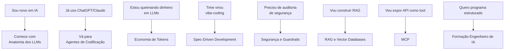

# Inteligência Artificial

IA virou literacia básica para qualquer senior dev em 2026. Coding agents fazem parte do dia a dia em times sérios, features de IA aparecem em praticamente todo projeto novo, e a stack de competências que separa devs que **usam** de devs que **dominam** IA é específica e mapeável. Este domínio é o portal de entrada — organizado em **uma formação completa** ([[Formação Engenheiro de IA|Formação Engenheiro de IA]]) com 8 trilhas atomizadas + notas conceituais + ferramentas. Comece pelo MOC da formação se quer um caminho estruturado, ou pule direto para a trilha que resolve seu problema atual.

> [!tip] Como navegar
>
> - **Quer um programa estruturado do zero ao domínio?** Vá para [[Formação Engenheiro de IA]].
> - **Tem um problema concreto?** Pule direto para a trilha relevante (ex: custo → [[Economia de Tokens]]).
> - **Quer overview rápido sobre um tópico?** Use as notas conceituais (Inteligência Artificial, RAG, MCP, Skills e Prompting).

## A Formação Engenheiro de IA

> [!info] Programa completo
> [[Formação Engenheiro de IA]] — MOC mestre que organiza as 8 trilhas em um caminho estruturado. Inclui sendas transversais (Praticante, Arquiteto, Líder Técnico, Open Source) com sequências exatas de notas. **Comece aqui se quer um roadmap.**

## As 10 trilhas atomizadas

Cada trilha tem `index.md` próprio com pré-requisitos, blocos sequenciais, rotas alternativas, e leituras recomendadas.

### Núcleo da formação (sequencial)

1. **[[Anatomia dos LLMs]]** (17 notas) — fundamentos: tokens, atenção, modelos, APIs, treino, evaluation
2. **[[Anatomia de Agents]]** (9 notas) — fundamentos genéricos: ciclo, tools, memory, planning, multi-agent
3. **[[Agentes de Codificação]]** (18 notas) — coding agents: Cursor, Claude Code, Copilot, Aider, MCP, multi-agent
4. **[[Economia de Tokens]]** (20 notas) — custo: prompt caching, pruning, sub-agents, governança, ROI
5. **[[Context Engineering]]** (16 notas) — disciplina: pipelines, camadas, JIT, prompting, skills
6. **[[Spec-Driven Development]]** (12 notas) — metodologia: Specify→Plan→Tasks→Implement, Kiro, Spec Kit
7. **[[Segurança e Guardrails]]** (12 notas) — defesa: SAST, sandbox, slopsquat, EU AI Act

### Trilhas especializadas (paralelas)

8. **[[Memória de Agentes]]** (23 notas) — memory systems: MemGPT/Letta, Mem0, Zep, Generative Agents Stanford, A-MEM
9. **[[RAG e Vector Databases]]** (12 notas) — embeddings, chunking, vector DBs, retrieval, reranking, evaluation
10. **[[MCP]]** (10 notas) — Model Context Protocol: servers, primitivos, segurança, ecossistema 2026

## Notas conceituais (overview)

Notas que servem como **portal panorâmico** sobre o campo. Para deep dive em tópicos específicos, siga para as trilhas atomizadas.

- **[[Inteligência Artificial]]** — overview do campo IA para devs (ML, DL, GenAI), com pointers para todas as trilhas

## Ferramentas de IA

> [!info] Catálogo de ferramentas
> [[Ferramentas de IA/index|Ferramentas de IA]] — comparativos detalhados de Claude, GitHub Copilot, Codex, Gemini, e tabela de qual usar quando.

## Sendas relacionadas

- **[[Senda IA]]** — roadmap pessoal estruturado zero → domínio em 9-12 meses (em `04-Sendas/`)
- **[[Senda Entrevistas]]** — preparação para entrevistas internacionais (toca IA também)

## Por onde começar — heurística rápida



## Estatísticas do domínio

```dataview
TABLE
  length(rows.file.path) AS "Notas"
FROM "03-Domínios/IA"
WHERE type != "moc"
GROUP BY file.folder
SORT file.folder
```

## Cadência de manutenção

| Área | Revisão |
|---|---|
| Pricing de modelos (Trilha 1, 4) | Trimestral |
| Ferramentas SAST/SCA (Trilha 7) | Trimestral |
| Compliance EU AI Act (Trilha 7) | Anual |
| Modelos de fronteira (Trilha 1, 3) | Trimestral |
| Pesquisa em context rot / memória (Trilhas 5, 8) | Semestral |
| Padrões SDD (Trilha 6) | Semestral |
| Fundamentos teóricos | Pereniza-se |

---

> [!quote] *"Engenheiros que dominam essas trilhas não usam IA — eles **engenheiram com IA**. A diferença entre os dois define quem tem tech debt em 18 meses e quem tem produto em produção."*
