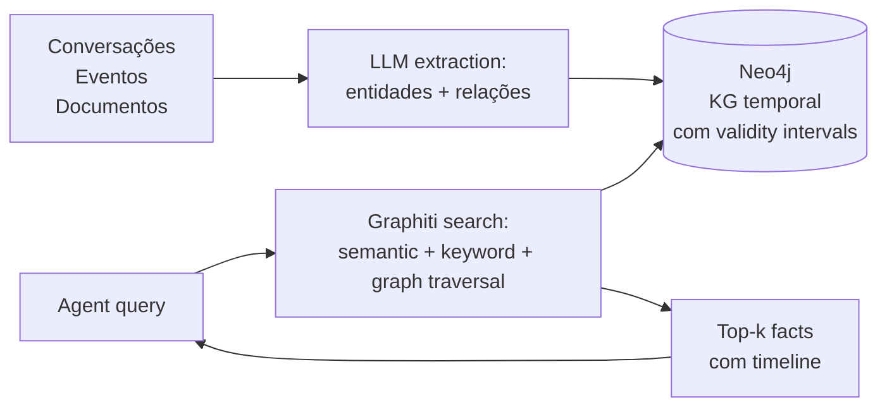

# Zep e Graphiti

> [!abstract] TL;DR
> **Graphiti** (`github.com/getzep/graphiti`) é a engine open-source para **knowledge graph temporal** mantida pela getzep — Apache-2.0, Python, backed por Neo4j (e outros backends como FalkorDB, Kuzu e Neptune). **Zep** (`getzep.com`) é o produto comercial construído em cima do Graphiti: managed service com governança, SDKs em Python/TypeScript/Go, dashboard e SLAs enterprise. Diferencial central: **bi-temporal model** — o grafo guarda tanto quando um fato passou a ser verdade no mundo quanto quando o sistema soube dele, com **validity intervals** em cada edge. Paper de fundação (Rasmussen et al., arxiv 2501.13956, janeiro/2025) reporta **94,8% no DMR** (vs 93,4% do MemGPT) e **+18,5% sobre baseline full-context no LongMemEval com GPT-4o** (Zep 71,2% vs full-context 60,2%), com tokens caindo de **115k → 1,6k** e latência média de **28,9s → 2,58s** no mesmo cenário.

## O que é

**Graphiti** é um framework para construir e consultar **temporal context graphs** para agents — grafos onde entidades, relações e fatos têm janelas de validade explícitas e onde cada item derivado mantém *provenance* até a episódio (raw data) que o produziu. O posicionamento do README oficial é direto: diferentemente de RAG tradicional, que retorna chunks estáticos, Graphiti integra continuamente conversas, dados estruturados e não estruturados em um grafo único, atualizado de forma **incremental** (sem recompilar o grafo inteiro a cada ingestão).

**Zep** é a camada comercial em cima do Graphiti: a empresa **getzep** mantém Graphiti como engine open-source e oferece o Zep como managed service com governança enterprise (audit trail, SLAs, dashboards, performance sub-200ms reportada em escala). O paper de fundação — *Zep: A Temporal Knowledge Graph Architecture for Agent Memory*, Rasmussen, Paliychuk, Beauvais, Ryan e Chalef (arxiv:2501.13956, janeiro de 2025) — descreve Graphiti como o **componente central** do Zep. A distinção é importante: **Graphiti é a engine, Zep é o produto**.

O diferencial estrutural está no **modelo bi-temporal**, herdado da literatura de databases temporais: cada fato tem dois eixos de tempo — *event time* (quando o fato passou a ser verdade no mundo) e *ingestion time* (quando o sistema o aprendeu) — e cada edge carrega um **validity interval** que delimita até quando aquele fato vale. Quando uma nova informação contradiz a anterior, Graphiti **invalida** o fato antigo em vez de apagar; o histórico permanece consultável por timeline.

## Por que importa

- **Casos enterprise exigem audit trail temporal.** Compliance, regulatory e qualquer cenário onde "qual era o estado em t1?" é pergunta legítima — diagnóstico médico, contrato em vigor, política aplicada — pedem exatamente o que o modelo bi-temporal entrega.
- **Conhecimento real evolui.** Endereços mudam, contratos são renovados, preferências são corrigidas. KG temporal trata mudança como sinal de primeira classe, sem perder histórico — diferente de vector stores, onde upsert sobre o mesmo embedding apaga o passado.
- **Multi-hop reasoning é o que graphs habilitam.** Travessia "entidade → relação → entidade → relação" é cara ou impossível de representar em vector store puro; em grafos é o caminho natural. Quando a query é "quais clientes do produto X foram afetados pela mudança Y entre março e abril?", graph traversal é a forma econômica de responder.
- **Reduções reportadas são argumentos concretos para escala.** No paper, Zep reduziu o contexto enviado ao LLM de **115k tokens para 1,6k** (cerca de 1,4% do baseline) com **18,5 pontos de ganho de acurácia** sobre full-context com GPT-4o no LongMemEval. Para casos enterprise rodando milhões de queries, a economia composta é material.
- **Open-core com adoção crescente.** Graphiti é Apache-2.0; quem não quer cloud paga rebaixa para self-host, ainda que assumindo o custo operacional do Neo4j (ou outro backend).

## Como funciona

O fluxo divide-se em duas fases:

1. **Ingestion.** Conversas, mensagens estruturadas (JSON) ou documentos chegam como **episodes** — a unidade de raw data que Graphiti preserva como provenance. Um LLM (por padrão OpenAI; suporta também Gemini, Anthropic e Groq) extrai entidades e relações tipadas dessa entrada e produz triplets *(entidade → relação → entidade)*. Graphiti faz **incremental update** sobre o grafo existente: novas afirmações são integradas; afirmações que contradizem fatos anteriores **invalidam** o fato antigo (marca o `valid_to` do edge antigo) e criam um novo edge com `valid_from` no presente. O grafo nunca é recompilado por inteiro.
2. **Retrieval.** Quando o agent consulta, Graphiti executa **hybrid search** combinando três sinais: **semantic** (embeddings sobre nodes e edges), **keyword** (BM25 sobre texto literal) e **graph traversal** (caminhos no grafo a partir dos nodes mais relevantes). O resultado é uma lista de fatos ranqueados, cada um com seu validity interval — o agent recebe não só "o que vale", mas "desde quando" e "até quando".

A escolha de combinar três sinais é deliberada: semantic captura paráfrase, BM25 ancora termos exatos (nomes próprios, códigos), e graph traversal expande para fatos relacionados que isoladamente não casariam com a query. O paper documenta essa hibridização como parte do desempenho reportado.

## Anatomia técnica

Os itens abaixo foram verificados em `github.com/getzep/graphiti` (README e LICENSE), no paper arxiv 2501.13956 e no blog *State of the Art Agent Memory* da getzep, em abril de 2026.

- **Componentes da família:**
  - **Graphiti** — engine open-source de context graph temporal (Apache-2.0).
  - **Zep Cloud** — managed service comercial em cima do Graphiti, com governança e SLAs.
  - **MCP server para Graphiti** — exposto pelo próprio repositório (`mcp_server/`), permite que clientes MCP (Claude, Cursor) consumam o grafo como memória.
- **Linguagem da engine:** Python 3.10+ (`pip install graphiti-core`). Zep oferece SDKs adicionais em Python, TypeScript e Go.
- **Backends de grafo suportados pelo Graphiti:** Neo4j 5.26+, FalkorDB 1.1.2, Kuzu 0.11.2, Amazon Neptune (Database Cluster ou Analytics Graph) com OpenSearch Serverless como full-text backend. Padrão recomendado é Neo4j; FalkorDB tem quickstart via Docker.
- **Modelo bi-temporal:** cada edge carrega *event time* (quando o fato passou a ser verdade) e *ingestion time* (quando o sistema soube), com **validity windows** explícitos. Mudanças invalidam fatos antigos em vez de apagar — histórico permanece consultável.
- **Estrutura do context graph:** **entities** (nodes com summaries que evoluem), **facts/relationships** (edges triplet com validity windows), **episodes** (raw data com provenance até a fonte) e **custom types** (entity e edge types definidos pelo desenvolvedor via Pydantic).
- **Search:** híbrido — semantic embeddings (BGE-m3 no paper; configurável) + keyword BM25 + graph traversal. Sem dependência de LLM-summarization para retrieval, ao contrário de GraphRAG.
- **Ingestão incremental:** novos episodes integram em tempo real; sem recomputação do grafo. Provenance até o episode é mantida em cada derived fact.
- **Performance reportada (paper, LongMemEval$_s$, ~115k tokens por conversa):**
  - **DMR:** Zep **94,8%** (gpt-4-turbo) e **98,2%** (gpt-4o-mini), vs **MemGPT 93,4%** e full-conversation 94,4% / 98,0%.
  - **LongMemEval com gpt-4o-mini:** Zep **63,8%** vs full-context 55,4% (**+15,2 pontos**); latência mediana 3,20s vs 31,3s; tokens 1,6k vs 115k.
  - **LongMemEval com gpt-4o:** Zep **71,2%** vs full-context 60,2% (**+18,5 pontos**, +11 pontos absolutos sobre o baseline maior); latência mediana 2,58s vs 28,9s; tokens 1,6k vs 115k.
  - **Performance enterprise reportada (site):** sub-200ms de latência de retrieval em escala (claim de produto, separado do paper).
- **Licença Graphiti:** Apache-2.0 (verificado no LICENSE do repositório).
- **API:** REST (Zep Cloud), Python SDK, TypeScript SDK, Go SDK (Zep). Graphiti core é Python-only.
- **Pricing Zep Cloud:** modelo comercial publicado em `getzep.com` — verificar a página oficial para faixas atualizadas. Self-host de Graphiti é gratuito sempre.
- **LLM requirements:** o paper e o README recomendam modelos com **Structured Output** confiável (OpenAI, Gemini); modelos menores costumam falhar na extração de schema.

## Quando usar / quando não usar

**Quando vale:**

- Caso **enterprise com requisito de audit trail temporal** — compliance, regulatory, cenários "qual era o estado em t1?".
- Conhecimento que **evolui temporalmente** — relações que mudam, fatos que são corrigidos, contratos que são renovados.
- **Multi-hop reasoning** é central — raciocínio que atravessa rede de entidades em vez de match isolado.
- Há **capacidade operacional para Neo4j** (ou FalkorDB, Kuzu, Neptune) — DBA, backup, replicação, monitoramento.
- Quando a comparação relevante é "full-context vs memory layer" e a economia de tokens em escala importa — o paper documenta 1,6k vs 115k tokens com ganho de acurácia.

**Quando NÃO vale:**

- **Q&A simples sobre docs estáticos** — RAG tradicional basta e custa muito menos.
- **Workflow Obsidian-first / markdown-first** — Zep não persiste em markdown legível por humano; quem precisa de revisão manual da memória deve preferir [[12 - basic-memory — MCP nativo Obsidian|basic-memory]] ou seguir o [[06 - O LLM Wiki Pattern (gist do Karpathy)|gist do Karpathy]].
- **Volume baixo demais** para justificar Neo4j em produção — cluster, replicação e backup têm custo fixo que só se amortiza em escala.
- **Self-host caseiro sem time de DBA** — Neo4j em produção é compromisso operacional sério; a alternativa é assumir o Zep Cloud (e o vendor lock-in que vem junto).
- Caso onde **transparência total da extração** é requisito — a etapa de LLM-extraction é parcialmente opaca, e mudanças no modelo subjacente alteram resultados sem aviso.
- Quando o time **não vai consultar o grafo por timeline** — pagar o custo de bi-temporal sem usar a vantagem é overengineering.

## Armadilhas comuns

- **Confundir Graphiti com Zep.** Graphiti é open-source (Apache-2.0); Zep é o produto comercial em cima dele. Em discussões técnicas a confusão produz expectativas erradas — alguém pede "Graphiti com SLA" sem perceber que SLA é Zep.
- **Bi-temporal não é mágica.** Para o eixo *event time* funcionar, é preciso convenção rigorosa de "quando o fato passou a ser verdade" no input. Se a entrada não traz essa marca, Graphiti usa o tempo de ingestão como aproximação — e a vantagem temporal degrada para timestamp simples.
- **+18,5 pontos sobre baseline é métrica única (GPT-4o no LongMemEval).** O ganho com gpt-4o-mini é menor (+15,2 pontos), e o paper observa que a performance escala com a capacidade do modelo. Outros modelos podem variar — não generalizar para "+18,5% sempre".
- **Neo4j em produção custa caro.** Cluster, replicação, backup, monitoramento, eventualmente licença Enterprise para features avançadas. ROI exige volume; para cenário pequeno, FalkorDB ou Zep Cloud são caminhos mais leves.
- **Extração via LLM é não-determinística.** A construção do grafo depende da extração de entidades e relações; o paper usa gpt-4o-mini para isso. Mudar o modelo de extração muda o grafo. Auditar amostras é prática recomendada antes de confiar para decisão crítica.
- **Score em DMR (94,8%) e score em LongMemEval (71,2% com GPT-4o) são benchmarks diferentes.** Confundir os dois — citar "Zep = 94,8% no LongMemEval" — é erro frequente. DMR é mais simples (60 mensagens por conversa); LongMemEval$_s$ tem ~115k tokens por conversa e é o benchmark mais relevante para casos enterprise.
- **MCP server muda a fronteira do produto.** O `mcp_server/` no repositório expõe Graphiti como memória para clientes MCP (Claude, Cursor). Esse é caminho recente — tratá-lo como API estável sem ler o estado atual do código pode surpreender.

## Veja também

- [[06 - O LLM Wiki Pattern (gist do Karpathy)]] — abordagem alternativa, markdown-led, sem grafo formal
- [[08 - Arquitetura de um sistema de memória]] — KG temporal como um dos padrões arquiteturais
- [[09 - Panorama de implementações (abril 2026)|09 - Panorama]] — onde Zep/Graphiti se posicionam
- [[11 - graphify — knowledge graph de raw|11 - graphify]] — outro KG, mas sem dimensão temporal
- [[13 - Letta (ex-MemGPT)]] — alternativa hierarchical, stateful agent
- [[14 - Mem0 — vetorial + grafo|14 - Mem0]] — alternativa vector + entity linking
- [[20 - Comparativo crítico (LongMemEval)|20 - Comparativo crítico]] — onde os scores aparecem em contexto comparado

## Referências

- Rasmussen, P.; Paliychuk, P.; Beauvais, T.; Ryan, J.; Chalef, D. *Zep: A Temporal Knowledge Graph Architecture for Agent Memory*. arXiv:2501.13956, janeiro de 2025. `https://arxiv.org/abs/2501.13956`
- Repositório oficial Graphiti — `https://github.com/getzep/graphiti` (Apache-2.0).
- Site Zep — `https://www.getzep.com/`
- Blog oficial — *State of the Art Agent Memory* (getzep, janeiro de 2025): `https://blog.getzep.com/state-of-the-art-agent-memory/`
- README do Graphiti — descrição de context graph, ontologia prescribed/learned, comparativo Graphiti vs GraphRAG e Zep vs Graphiti.
- Documentação Zep — `https://help.getzep.com/concepts` (Context field, retrieval API).
