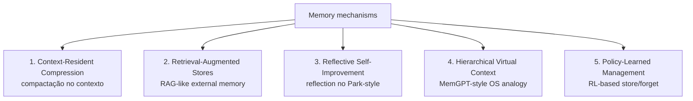

# Surveys e estado da arte 2026

> [!abstract] TL;DR
> O campo de memória de agentes está suficientemente maduro em 2026 para ter **surveys formais, workshop dedicado no ICLR 2026 ("MemAgents") e taxonomias consolidadas**. Esta nota organiza os principais surveys publicados entre 2024 e o início de 2026, extrai os frameworks teóricos que eles compartilham — em especial os **cinco mecanismos arquiteturais** que aparecem como consenso emergente — e separa o que é "agent memory" do que é "LLM memorization", confusão recorrente em discussões fora da academia. Material essencial para discurso público fundamentado e para localizar criticamente qualquer implementação concreta dentro do campo.

## Os principais surveys

A literatura de memória de agentes saiu, entre 2024 e início de 2026, de um conjunto disperso de papers para um corpo organizado, com surveys que se complementam mais do que competem. Cinco trabalhos cobrem hoje o grosso do campo.

### 1. Du (2026) — *Memory for Autonomous LLM Agents: Mechanisms, Evaluation, and Emerging Frontiers*

Survey de autor único (Pengfei Du), publicado em arXiv em março de 2026 sob o identificador `arXiv:2603.07670`. Cobre o intervalo de 2022 ao início de 2026. O formalismo central é tratar memória como um **write–manage–read loop tightly coupled with perception and action** — um ciclo de escrita, gerenciamento e leitura acoplado ao laço sensoriomotor do agente. A partir desse formalismo, o autor identifica **cinco famílias de mecanismos** (detalhadas mais adiante) e propõe uma taxonomia tridimensional para classificar implementações. O paper discute também desafios de engenharia (filtragem de write-path, tratamento de contradições, restrições de latência, privacidade) e questões abertas (consolidação contínua, retrieval causalmente fundamentado, mecanismos de esquecimento aprendido). É a referência mais conveniente quando o objetivo é citar um único trabalho que cubra tanto os mecanismos quanto a avaliação do campo.

### 2. *Memory in the Age of AI Agents: A Survey* — paper list mantido por Shichun Liu

Survey associada ao paper `arXiv:2512.13564`, com lista de papers comunitária mantida em `github.com/Shichun-Liu/Agent-Memory-Paper-List`. O framework analítico tem três dimensões: **Forms** (token-level, parametric, latent), **Functions** (factual, experiential, contextual) e **Dynamics** (formação, consolidação, retrieval). O repositório, frequentemente atualizado e com tração visível na comunidade, funciona na prática como o índice mais útil do campo — quando uma referência é citada num paper recente, costuma estar listada lá com link direto. Vale acompanhar como termômetro do que circula em arXiv.

### 3. *From Storage to Experience: A Survey on the Evolution of LLM Agent Memory Mechanisms*

Disponível em OpenReview (`openreview.net/forum?id=l9Ly41xxPb`) e como preprint em Preprints.org, com versão pública em março de 2026. A contribuição distintiva é um **framework evolutivo em três estágios**: *Storage* (preservação de trajetórias), *Reflection* (refinamento de trajetórias) e *Experience* (abstração de trajetórias). A leitura proposta é diacrônica — sistemas mais antigos seriam Storage-bound, sistemas como Generative Agents introduziram Reflection, e a frontier (em 2026) está em Experience, com mecanismos de *proactive exploration* e *cross-trajectory abstraction*. É útil para classificar maturidade de implementações concretas: dada uma framework qualquer, em que estágio ela opera?

### 4. *LLM Agent Memory: A Survey from a Unified Representation–Management Perspective*

Survey em OpenReview (`openreview.net/forum?id=KPs1EgGKcT`), publicada em março de 2026. A proposta é uma taxonomia bidimensional que separa **representação** de **management**. Em representação, organiza memórias em três paradigmas: *natural language tokens*, *intermediate representations* e *parameters*. Em management, identifica três estágios operacionais: *construction*, *update* e *query*. O framework é avaliado aplicando-se a treze agents state-of-the-art e mostrando que a maior parte dos sistemas se encaixa cleanly numa célula da matriz representação × management — um teste de adequação razoavelmente bem-sucedido. É a referência preferida quando o ponto é discutir **operações** sobre memória, não conteúdo.

### 5. ACM TOIS — *A Survey on the Memory Mechanism of LLM-based Agents*

Versão journal (ACM Transactions on Information Systems, DOI `10.1145/3748302`), de Zhang et al., evoluída a partir do preprint `arXiv:2404.13501` e com repositório companheiro em `github.com/nuster1128/LLM_Agent_Memory_Survey`. É a primeira survey peer-reviewed em journal de prestígio dedicada exclusivamente ao tópico. O escopo é mais sistemático: define formalmente o módulo de memória, justifica sua necessidade, taxonomiza desenhos e avaliações, exibe aplicações típicas e discute limitações e direções futuras. Por estar em venue tradicional e ter passado por revisão formal, é a referência preferida em contextos acadêmicos e em qualquer texto que precise de rigor citacional.

> [!note] Outros materiais úteis (não-survey)
> Além das cinco surveys acima, dois recursos complementam o mapa: o **Awesome-GraphMemory** (`github.com/DEEP-PolyU/Awesome-GraphMemory`), que cataloga sistemas, benchmarks e papers especificamente da família grafo-de-conhecimento; e o **Awesome-Agent-Memory** (`github.com/TeleAI-UAGI/Awesome-Agent-Memory`), com escopo mais largo. Não são surveys formais, mas funcionam como índices curados.

## Os 5 mecanismos arquiteturais (consenso emergente)

A taxonomia mais útil para navegar o campo é a de **cinco famílias de mecanismos**, formalizada por Du (2026) e parcialmente recoberta pelos demais surveys com nomes diferentes. Toda implementação concreta cabe em uma ou mais dessas famílias.

1. **Context-Resident Compression.** A memória vive *dentro* do context window, mas comprimida — sumarizações, ablações, soft prompts ou tokens latentes que condensam histórico em menos tokens. Útil em horizontes médios; falha quando o histórico cresce muito ou quando precisão semântica importa.
2. **Retrieval-Augmented Stores.** Memória externa indexada (vetorial, lexical, grafo ou híbrida) consultada a cada turno via retrieval. É a família dominante em produção — RAG aplicado a histórico do agente, com ou sem preprocessing. Cobre desde o RAG ingênuo até sistemas como [[14 - Mem0 — vetorial + grafo|Mem0]] e [[15 - Zep e Graphiti — knowledge graph temporal|Zep/Graphiti]].
3. **Reflective Self-Improvement.** O agente periodicamente reflete sobre memórias recentes e gera abstrações de mais alto nível, que viram novas entradas no próprio store. É o padrão inaugurado por [[17 - Generative Agents (Park, Stanford 2023)|Generative Agents]] e refinado em sistemas como [[18 - A-MEM — Zettelkasten dinâmico|A-MEM]].
4. **Hierarchical Virtual Context.** Analogia de sistema operacional: memória organizada em níveis (RAM rápida, disco lento) com paginação explícita gerenciada pelo próprio LLM. Inaugurada pelo MemGPT e continuada em [[13 - Letta (ex-MemGPT)|Letta]]. O agente decide ativamente o que paginar para dentro e fora do contexto.
5. **Policy-Learned Management.** Em vez de regras fixas para escrever/atualizar/esquecer, treina-se uma policy (geralmente via RL) que aprende quando registrar, sumarizar ou descartar. É a família mais frontier — apareceu em força em 2025-2026 com trabalhos como Agentic Memory e propostas de *learned forgetting*.

Sistemas reais combinam famílias. [[16 - MemPalace (Milla Jovovich)|MemPalace]], por exemplo, mistura retrieval-augmented com hierarchical virtual context. A taxonomia é descritiva, não prescritiva — serve para localizar e comparar, não para forçar implementações em caixinhas exclusivas.

## ICLR 2026 Workshop "MemAgents"

O sinal mais claro de maturidade institucional do campo é o primeiro workshop dedicado em venue top-tier: **Workshop on Memory for LLM-Based Agentic Systems** (URL: `sites.google.com/view/memagent-iclr26/`).

- **Por que importa.** Workshops em conferências como ICLR são o ritual pelo qual subáreas emergentes ganham reconhecimento como linha de pesquisa autônoma. A existência do MemAgents marca o momento em que "memória de agentes" deixa de ser um tema lateral em workshops de agents-em-geral e passa a ter espaço próprio.
- **Topics oficiais.** Memory architectures (episódica, semântica, working, parametric); systems & evaluation (estruturas de dados, retrieval pipelines, benchmarks); abordagens neuroscience-inspired (complementary learning systems, consolidação hipocampo-cortical); lifelong learning e consolidação; abordagens human-centric; explicit vs. parametric memory.
- **Data e local.** Acontece em **27 de abril de 2026**, em **Rio de Janeiro**, em formato híbrido (sede da ICLR 2026 brasileira). Tracks de submissão incluem full papers (9 páginas), short papers (4 páginas) e tiny papers (2 páginas), com revisão duplo-cego via OpenReview e *acceptance notifications* anunciadas em março de 2026.

## Distinção crítica do campo (consensual)

Um ponto que **todos os cinco surveys reforçam**, com variações de vocabulário, é que **agent memory ≠ LLM memorization**. A confusão é recorrente em discussões públicas e até em artigos divulgativos: "o LLM já tem memória, é só a gente fazer fine-tuning". Os surveys deixam claro que se trata de coisas operacionalmente distintas, em três dimensões.

| Dimensão | Agent memory | LLM memorization |
|---|---|---|
| Quando aprende | Online, durante interação | Pretraining (offline) |
| Onde vive | Híbrido externo + parametric | Primarily parametric |
| Como é gerida | Explicit write/forget policies | Opaque parametric retention |

Em outras palavras: *agent memory* é uma camada de runtime, observável, auditável e gerenciada por políticas explícitas; *LLM memorization* é o que ficou nos pesos depois do treinamento, opaco e dificilmente revisável sem retraining. Um agente que precisa lembrar do que o usuário falou ontem **não consegue** resolver isso via memorização — porque "ontem" não existia no pretraining. Confundir os dois leva a soluções erradas: tentar resolver problemas de memória episódica com fine-tuning, ou esperar que prompt engineering substitua um store externo.

## Tendências emergentes em 2026

A interseção entre os cinco surveys aponta cinco tendências que dominam a frontier do campo em 2026:

1. **Continual learning sem catastrophic forgetting.** Como atualizar memória a longo prazo sem que adições novas degradem o que já foi consolidado? Aparece em todos os surveys como questão aberta; soluções em circulação envolvem consolidação seletiva e *learned forgetting*.
2. **Multi-agent shared memory.** Memória compartilhada entre múltiplos agents que cooperam — protocolos de leitura/escrita, controle de acesso, resolução de contradições. Crescente em 2025-2026 com o avanço de orquestração multi-agent.
3. **Memória multimodal.** Texto, imagem e áudio coexistindo num único store. Mais difícil que parece: representações unificadas, retrieval cross-modal, evolução temporal de mídias diferentes. Du (2026) destaca como uma das frontiers menos consolidadas.
4. **Privacy-preserving memory.** Encryption, federated learning e differential privacy aplicados a stores de memória. Particularmente relevante quando memória pessoal é armazenada por longos períodos — questão regulatória e ética, não só técnica.
5. **Avaliação rigorosa.** **LongMemEval**, **LoCoMo**, **MemBench**, **MemoryAgentBench** e **MemoryArena** apareceram em rápida sucessão em 2025-2026. O campo passou de "olhar exemplos qualitativos" para benchmarks com métricas comparáveis. Discussão detalhada em [[20 - Comparativo crítico (LongMemEval)|20 - Comparativo crítico]].

## Por que importa para a trilha

- Esta nota é **a fundamentação acadêmica** que sustenta o resto da trilha. Quando notas anteriores afirmam que A-MEM é "estado da arte" ou que o LLM Wiki Pattern "se alinha com a literatura recente", são estes os surveys que justificam tais afirmações.
- Fornece **vocabulário rigoroso** para discutir o campo sem cair em hype: termos como *write-manage-read loop*, *context-resident compression*, *policy-learned management* têm significado técnico preciso e vêm direto da literatura. Discurso público mal calibrado tende a usar "memória" como guarda-chuva sem distinguir os mecanismos por baixo.
- É **material de apoio para discurso profissional**: entrevistas técnicas, conversas com stakeholders, posicionamento em projetos. Saber citar Du (2026) ou o ACM TOIS para fundamentar uma decisão arquitetural sinaliza maturidade no campo. Separa quem leu sobre o tema na semana passada de quem acompanha a literatura.

## Veja também

- [[03 - Taxonomia da memória (episódica, semântica, procedural)|03 - Taxonomia]] — vocabulário fundamental, cognitivo, anterior aos surveys
- [[08 - Arquitetura de um sistema de memória]] — onde os 5 mecanismos encaixam num desenho concreto
- [[17 - Generative Agents (Park, Stanford 2023)|17 - Generative Agents]] — paper foundational citado por todos os surveys
- [[18 - A-MEM — Zettelkasten dinâmico]] — paper recente, instância de Reflective Self-Improvement
- [[20 - Comparativo crítico (LongMemEval)|20 - Comparativo crítico]] — onde os benchmarks da tendência (5) aparecem em ação
- [[21 - Críticas, limitações e armadilhas]] — auditoria honesta do campo, complemento crítico desta nota

## Referências

- Du, P. (2026). *Memory for Autonomous LLM Agents: Mechanisms, Evaluation, and Emerging Frontiers*. arXiv preprint — `https://arxiv.org/abs/2603.07670`
- Zhang, Z., Bo, X., Ma, C., Li, R., Chen, X., Dai, Q., Zhu, J., Dong, Z., Wen, J.-R. *A Survey on the Memory Mechanism of Large Language Model-based Agents*. ACM Transactions on Information Systems — `https://dl.acm.org/doi/10.1145/3748302` (preprint em `https://arxiv.org/abs/2404.13501`; repositório em `https://github.com/nuster1128/LLM_Agent_Memory_Survey`)
- *From Storage to Experience: A Survey on the Evolution of LLM Agent Memory Mechanisms*. OpenReview — `https://openreview.net/forum?id=l9Ly41xxPb`
- *LLM Agent Memory: A Survey from a Unified Representation–Management Perspective*. OpenReview — `https://openreview.net/forum?id=KPs1EgGKcT`
- *Memory in the Age of AI Agents: A Survey* (Liu et al.). arXiv `2512.13564`; paper list mantida em `https://github.com/Shichun-Liu/Agent-Memory-Paper-List`
- ICLR 2026 Workshop on Memory for LLM-Based Agentic Systems ("MemAgents") — `https://sites.google.com/view/memagent-iclr26/`
- *Awesome-GraphMemory* — `https://github.com/DEEP-PolyU/Awesome-GraphMemory` (catálogo curado de sistemas grafo-baseados)
- *Awesome-Agent-Memory* (TeleAI-UAGI) — `https://github.com/TeleAI-UAGI/Awesome-Agent-Memory` (catálogo curado complementar)
