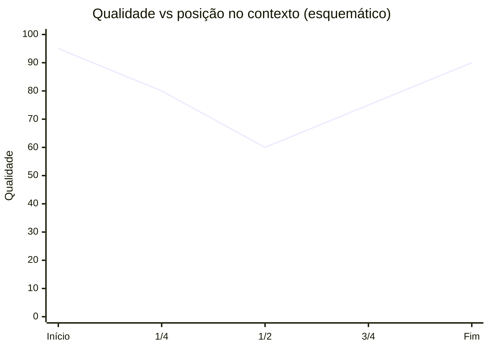
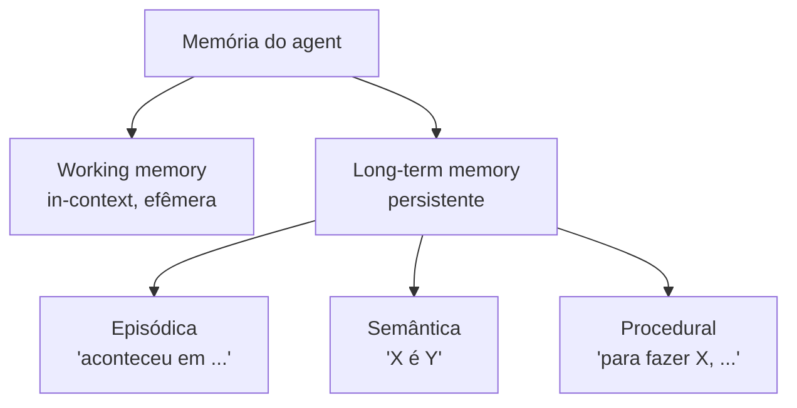
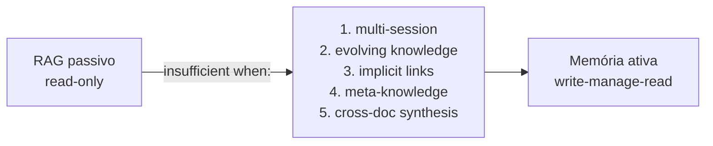
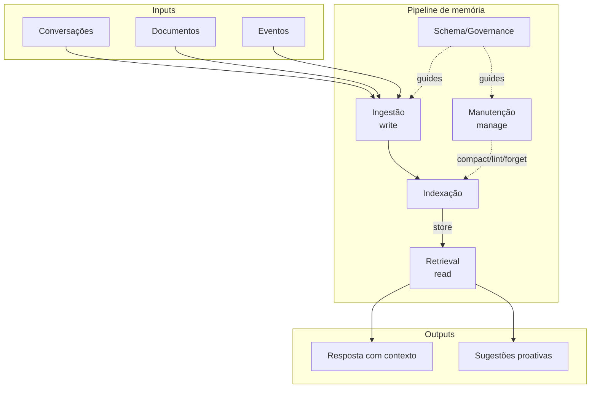
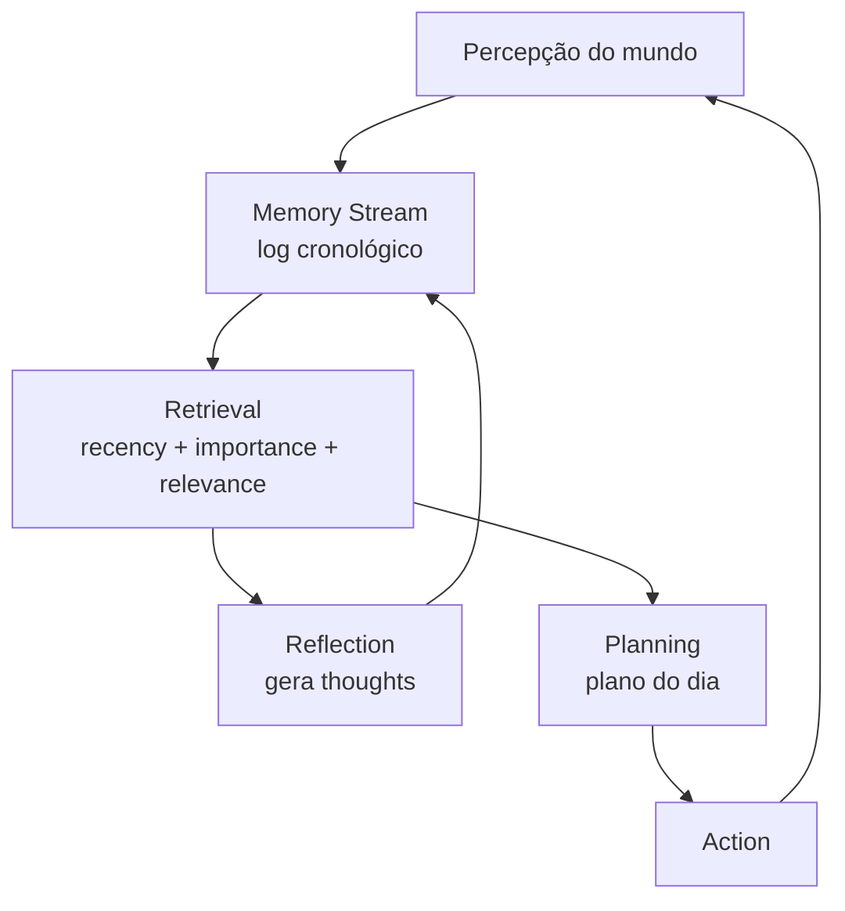
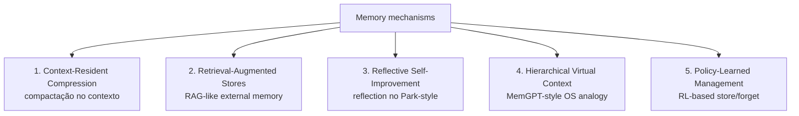
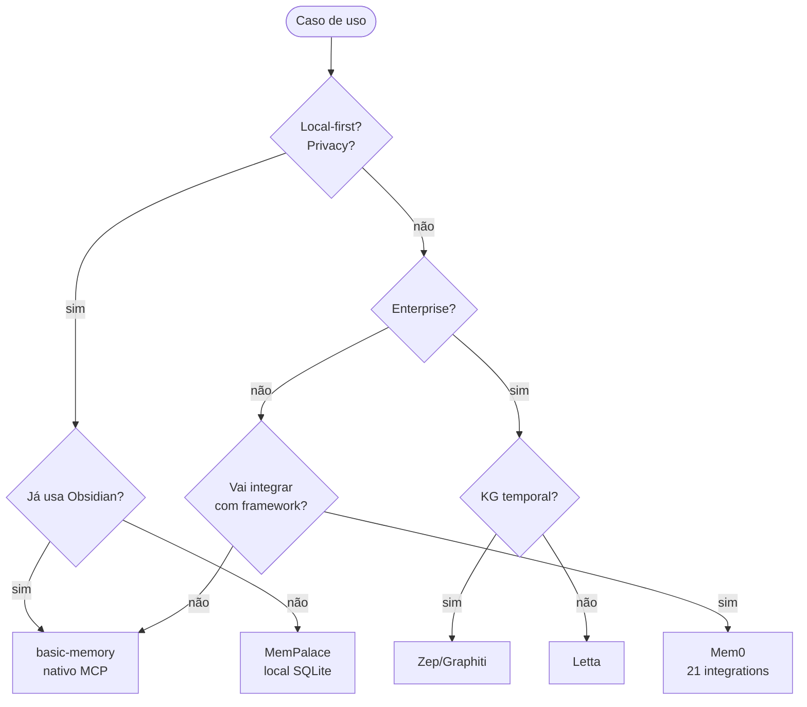

# Trilha Memória de Agentes — Implementation Plan

> **For agentic workers:** REQUIRED SUB-SKILL: Use superpowers:subagent-driven-development (recommended) or superpowers:executing-plans to implement this plan task-by-task. Steps use checkbox (`- [ ]`) syntax for tracking.

**Goal:** Produzir 23 notas atômicas + 1 MOC em `IA/Memória de Agentes/`, em PT-BR, todas `publish: true`, cobrindo o campo de memória de agentes (com o LLM Wiki Pattern do Karpathy como peça central da nota 06), de forma que um leitor leigo saia entendendo o tema o suficiente para falar publicamente e implementar.

**Architecture:** Trilha sequencial em 5 sessões (Fundamentos → O insight do Karpathy → Implementações → Acadêmica → Síntese e aplicação) + 1 MOC central com 4 rotas alternativas. Cada nota é atômica e linkável, segue estrutura híbrida em camadas (TL;DR leigo + aprofundamento técnico), com fontes citadas, callouts e Mermaid quando aplicável. Pesquisa abrangente de campo (Abordagem C aprovada) com leitura de papers acadêmicos primários, análise de código de repos GitHub e busca complementar.

**Tech Stack:** Markdown + Obsidian Flavored Markdown (wikilinks, callouts, dataview, Mermaid), Quartz para publicação no site público. Sem código a executar — task é de pesquisa e escrita.

---

## ⚠️ Restrição absoluta — fabricação

A memória [Nunca inventar dados sobre o usuário](/home/josenaldo/.claude/projects/-home-josenaldo-repos-personal-codex-technomanticus/memory/feedback_no_fabrication.md) é regra inegociável neste plano. **Nenhuma nota pode atribuir ao autor experiências profissionais, projetos, clientes, métricas ou casos não-vividos.** Todas as notas são curadoria/análise/explicação do campo, não relato autobiográfico. Se uma seção genuinamente precisa de exemplo concreto, usar:

- "Padrão observado no mercado", "Caso típico", "Armadilha comum"
- Citações com fonte verificável (paper, post, repo)
- Hipotéticos explícitos ("Imagine uma equipe que...")

Quando faltar contexto, **PERGUNTAR antes de escrever** — nunca preencher com plausibilidade.

---

## File Structure

24 arquivos em `IA/Memória de Agentes/`:

```
IA/Memória de Agentes/
├── Memória de Agentes.md                                      # MOC (Task 1)
├── 01 - O que é memória em IA.md                              # Task 3
├── 02 - O problema das janelas de contexto.md                 # Task 4
├── 03 - Taxonomia da memória (episódica, semântica, procedural).md  # Task 5
├── 04 - RAG vs memória de longo prazo.md                      # Task 6
├── 05 - Beyond RAG - quando RAG não basta.md                  # Task 7
├── 06 - O LLM Wiki Pattern (gist do Karpathy).md              # Task 2
├── 07 - Por que Obsidian e markdown como substrato.md         # Task 8
├── 08 - Arquitetura de um sistema de memória.md               # Task 9
├── 09 - Panorama de implementações (abril 2026).md            # Task 13
├── 10 - LLM-knowledge-base (Wendel) — direto do gist.md       # Task 14
├── 11 - graphify — knowledge graph de raw.md                  # Task 15
├── 12 - basic-memory — MCP nativo Obsidian.md                 # Task 16
├── 13 - Letta (ex-MemGPT).md                                  # Task 17
├── 14 - Mem0 — vetorial + grafo.md                            # Task 18
├── 15 - Zep e Graphiti — knowledge graph temporal.md          # Task 19
├── 16 - MemPalace (Milla Jovovich).md                         # Task 20
├── 17 - Generative Agents (Park, Stanford 2023).md            # Task 10
├── 18 - A-MEM — Zettelkasten dinâmico.md                      # Task 11
├── 19 - Surveys e estado da arte 2026.md                      # Task 12
├── 20 - Comparativo crítico (LongMemEval).md                  # Task 21
├── 21 - Críticas, limitações e armadilhas.md                  # Task 22
├── 22 - Guia de implementação do zero.md                      # Task 23
└── 23 - Aplicações comerciais e modelo de negócio.md          # Task 24
```

Final integration (Task 25): revisão de wikilinks cruzados + atualização do MOC pai `IA/IA.md` para incluir entrada para a nova trilha.

---

## Templates a aplicar (definidos uma vez)

### Template A — `type: concept` (notas 01-08, 22, 23)

```markdown
---
title: "<título sem prefixo numérico>"
created: 2026-04-25
updated: 2026-04-25
type: concept
status: seedling
publish: true
tags:
  - memoria-agentes
  - ia
  - <tags específicas>
aliases:
  - <opcional>
---

# <Título>

> [!abstract] TL;DR
> <3-5 linhas em PT-BR claro que um leigo entende; é a "versão executiva" extraível para posts>

## O que é

<1-3 parágrafos. Definição clara e objetiva.>

## Por que importa

<O problema que isso resolve, valor concreto. Esta é a "abertura de venda" para a versão gerencial.>

## Como funciona

<Aprofundamento técnico. Diagrama Mermaid quando aplicável. Esta é a "versão técnica".>

## Quando usar / quando não usar

<Critérios de aplicação, casos limite.>

## Armadilhas comuns

<Erros frequentes, mal-entendidos, hype vs realidade.>

## Veja também

- [[Wikilinks para outras notas da trilha]]

## Referências

- [Fonte 1](url) — anotação curta
- [Fonte 2](url) — anotação curta
```

### Template B — `type: review` (notas 17, 18, 19 — papers/surveys)

```markdown
---
title: "<nome do paper>"
created: 2026-04-25
updated: 2026-04-25
type: review
status: seedling
publish: true
tags:
  - memoria-agentes
  - ia
  - paper
  - <tags específicas>
---

# <Nome do paper>

> [!abstract] TL;DR
> <O que o paper propõe e por que importa para a trilha>

## Metadados

- **Autores:** ...
- **Venue:** ...
- **Ano:** ...
- **arXiv / DOI:** ...
- **Código:** ...

## Problema

<O que o paper tenta resolver.>

## Contribuição

<A inovação técnica.>

## Como funciona

<Explicação da arquitetura/método com Mermaid se aplicável.>

## Resultados

<Métricas reportadas, com leitura crítica.>

## Limitações reconhecidas pelos autores

<Conforme paper.>

## Crítica externa

<Recepção, follow-ups, papers de crítica se houver.>

## Por que importa para a trilha

<Conexão com [[06 - O LLM Wiki Pattern]] e implementações.>

## Veja também
## Referências
```

### Template C — `type: comparison` / outros casos especiais

Notas 09 (panorama), 16 (MemPalace), 20 (comparativo), 21 (críticas) podem ter pequenas adaptações sobre o Template A. Notas de implementação (10-16) seguem o Template A com seção extra **Anatomia técnica** (instalação, principais comandos, integração com outros). MOC (Task 1) usa template MOC do vault (`type: moc`).

### Critérios de qualidade (rubrica aplicada por nota)

- [ ] TL;DR existe e leigo entende em <30 segundos
- [ ] 3+ fontes citadas (mín: 1 primária + 1 acadêmica/repo + 1 editorial)
- [ ] Nenhuma alegação técnica sem fonte
- [ ] 2+ wikilinks para outras notas da trilha
- [ ] 1+ callout (`> [!warning|tip|info|example|quote]`)
- [ ] Mermaid se descreve arquitetura
- [ ] Frontmatter completo (tags, type, status, publish)
- [ ] Seção "Quando NÃO usar" ou equivalente
- [ ] PT-BR natural; termos técnicos em inglês mantidos (RAG, embedding, Zettelkasten, etc)
- [ ] **Zero atribuição de experiência pessoal ao autor** (regra absoluta)

---

## Bibliografia centralizada (para referência rápida durante a escrita)

### Primárias

- **Karpathy gist:** `https://gist.github.com/karpathy/442a6bf555914893e9891c11519de94f`
- **Tweet Karpathy:** `https://x.com/karpathy/status/2040470801506541998` (3/abril/2026)

### Papers (ordenados por relevância)

- Park et al. **Generative Agents** (UIST 2023) — `arxiv.org/abs/2304.03442`
- Packer et al. **MemGPT** (2023) — `arxiv.org/abs/2310.08560`
- Xu et al. **A-MEM** (NeurIPS 2025) — `arxiv.org/abs/2502.12110`
- **Mem0** paper (2025) — `arxiv.org/abs/2504.19413`
- **Zep** paper (2025) — `arxiv.org/abs/2501.13956`
- **Memory for Autonomous LLM Agents (Survey 2026)** — `arxiv.org/abs/2603.07670`
- **Spatial Metaphors for LLM Memory: A Critical Analysis of MemPalace** (2026) — `arxiv.org/abs/2604.21284`

### Repositórios (para análise de código)

- `github.com/wendeus0/LLM-knowledge-base` — nota 10
- `github.com/safishamsi/graphify` — nota 11
- `github.com/basicmachines-co/basic-memory` — nota 12
- `github.com/letta-ai/letta` — nota 13
- `github.com/mem0ai/mem0` — nota 14
- `github.com/getzep/graphiti` — nota 15
- `github.com/milla-jovovich/mempalace` — nota 16 ⚠️ (impostor `mempalace.tech` tem malware)
- `github.com/joonspk-research/generative_agents` — nota 17
- `github.com/agiresearch/A-mem` ou `github.com/WujiangXu/A-mem` — nota 18
- `github.com/xiaowu0162/LongMemEval` — nota 20
- `github.com/Shichun-Liu/Agent-Memory-Paper-List` — nota 19

### Editorial de qualidade (secundárias)

- VentureBeat: "Karpathy shares 'LLM Knowledge Base' architecture that bypasses RAG"
- Level Up Coding (Plaban Nayak): "Beyond RAG: How Andrej Karpathy's LLM Wiki Pattern Builds Knowledge That Actually Compounds"
- The New Stack: "Memory for AI Agents: A New Paradigm of Context Engineering"
- LangChain blog: "Context Engineering for Agents"
- Mem0 official: "State of AI Agent Memory 2026"
- MindStudio: "Karpathy's LLM Knowledge Base Architecture: The Compiler Analogy"
- HPCwire/BigDATAwire: "Letta Emerges from Stealth with $10M"

---

## Task 0: Pré-flight

**Files:**
- Create: `IA/Memória de Agentes/` (diretório)

- [ ] **Step 1: Criar o diretório**

```bash
mkdir -p "IA/Memória de Agentes"
```

- [ ] **Step 2: Verificar que a memória de no-fabrication está carregada**

Confirmar que `MEMORY.md` lista `feedback_no_fabrication.md`. Se não estiver carregada, abortar e pedir reload da memória.

- [ ] **Step 3: Sanity check de fontes-chave**

Disparar WebFetch em paralelo para 3 fontes-âncora pra confirmar que continuam acessíveis (campo se move rápido):

```
WebFetch: https://gist.github.com/karpathy/442a6bf555914893e9891c11519de94f
WebFetch: https://arxiv.org/abs/2304.03442
WebFetch: https://github.com/milla-jovovich/mempalace
```

Se alguma fonte estiver fora do ar, registrar e ajustar plano (ex: usar fonte alternativa).

- [ ] **Step 4: Commit do diretório vazio (placeholder)**

```bash
git add "IA/Memória de Agentes/"
git commit -m "feat(memoria-agentes): criar diretório da trilha"
```

(Diretório vazio não é commitado pelo git; este step só formaliza o pontapé. Pode ser pulado.)

---

## Wave 1 — Esqueleto (Tasks 1-2)

Definem o vocabulário do resto da trilha. **Bloqueante** para todas as outras Tasks.

### Task 1: MOC central — `Memória de Agentes.md`

**Files:**
- Create: `IA/Memória de Agentes/Memória de Agentes.md`

**Sources:**
- Spec da trilha: `docs/superpowers/specs/2026-04-25-memoria-agentes-design.md` (seção 7)

- [ ] **Step 1: Frontmatter**

```yaml
---
title: "Memória de Agentes"
type: moc
publish: true
tags: [memoria-agentes, ia, moc]
created: 2026-04-25
updated: 2026-04-25
---
```

- [ ] **Step 2: Abertura (3-4 frases)**

Conteúdo:
- Frase 1: o que é o campo de "memória de agentes" e por que existe
- Frase 2: por que é tema relevante em 2026 (surveys consolidados, ICLR workshop, frameworks múltiplos)
- Frase 3: o gancho do Karpathy (3/abril/2026) como entrada de relevância contemporânea
- Frase 4: o que esta trilha entrega (do conceito ao guia de implementação)

- [ ] **Step 3: Callouts de aviso**

```markdown
> [!warning] Avisos importantes
> - O domínio `mempalace.tech` é impostor com malware. Apenas `github.com/milla-jovovich/mempalace` e `github.com/MemPalace/mempalace` são oficiais.
> - Dois links que apareceram nas pesquisas iniciais NÃO são sobre memória de agentes apesar do nome: `Mattbusel/srfm-lab` (lab de trading quantitativo) e `forrestchang/andrej-karpathy-skills` (princípios de coding do Karpathy). Ficam fora desta trilha.

> [!info] Pré-leitura sugerida
> Esta trilha menciona "RAG" como termo de referência. Se você nunca leu sobre RAG, dê uma passada nos níveis 1-2 de [[RAG e Vector Databases]] antes de começar — ou siga direto, porque a nota 04 traz um primer rápido com o necessário.
```

- [ ] **Step 4: Seção "Comece por aqui" (trilha sequencial recomendada)**

Lista linear das 23 notas (01 → 23) com 1 linha de descrição para cada. Ordem: 01, 02, 03, 04, 05, 06, 07, 08, 09, 10, 11, 12, 13, 14, 15, 16, 17, 18, 19, 20, 21, 22, 23.

- [ ] **Step 5: Seção "Rotas alternativas"**

```markdown
## Rotas alternativas

### Rota gerencial (entender e vender)
[[01 - O que é memória em IA]] → [[02 - O problema das janelas de contexto]] → [[06 - O LLM Wiki Pattern (gist do Karpathy)|06 - O LLM Wiki Pattern]] → [[09 - Panorama de implementações (abril 2026)|09 - Panorama]] → [[23 - Aplicações comerciais e modelo de negócio|23 - Aplicações comerciais]]

### Rota técnica (implementar)
[[04 - RAG vs memória de longo prazo]] → [[06 - O LLM Wiki Pattern (gist do Karpathy)|06 - O LLM Wiki Pattern]] → [[08 - Arquitetura de um sistema de memória]] → [[09 - Panorama de implementações (abril 2026)|09 - Panorama]] → [[22 - Guia de implementação do zero]]

### Rota acadêmica (fundamentar discurso)
[[03 - Taxonomia da memória (episódica, semântica, procedural)|03 - Taxonomia]] → [[17 - Generative Agents (Park, Stanford 2023)|17 - Generative Agents]] → [[18 - A-MEM — Zettelkasten dinâmico|18 - A-MEM]] → [[19 - Surveys e estado da arte 2026|19 - Surveys]] → [[21 - Críticas, limitações e armadilhas]]

### Rota implementador (mão na massa rápida)
[[06 - O LLM Wiki Pattern (gist do Karpathy)|06 - O LLM Wiki Pattern]] → [[12 - basic-memory — MCP nativo Obsidian|12 - basic-memory]] → [[22 - Guia de implementação do zero]]
```

- [ ] **Step 6: Seção "Notas" com dataview**

````markdown
## Notas

```dataview
LIST file.frontmatter.title
FROM "IA/Memória de Agentes"
WHERE type != "moc"
SORT file.name ASC
```
````

- [ ] **Step 7: Quality check — rodar checklist da rubrica**

Verificar todos os 10 critérios. MOC é exceção em "3+ fontes" (MOC linka pra notas, não cita fontes diretas).

- [ ] **Step 8: Commit**

```bash
git add "IA/Memória de Agentes/Memória de Agentes.md"
git commit -m "feat(memoria-agentes): MOC central da trilha"
```

---

### Task 2: Nota 06 — `06 - O LLM Wiki Pattern (gist do Karpathy).md`

**Por que é Wave 1:** define o vocabulário central que toda a trilha usa (LLM Wiki, 3-layer architecture, Ingest/Query/Lint, schema). Outras notas referenciam.

**Files:**
- Create: `IA/Memória de Agentes/06 - O LLM Wiki Pattern (gist do Karpathy).md`

**Sources principais:**
- Gist oficial: `https://gist.github.com/karpathy/442a6bf555914893e9891c11519de94f`
- Tweet: `https://x.com/karpathy/status/2040470801506541998`
- VentureBeat: "Karpathy shares LLM Knowledge Base architecture that bypasses RAG"
- Level Up Coding: "Beyond RAG: How Andrej Karpathy's LLM Wiki Pattern..."
- MindStudio: "Karpathy's LLM Knowledge Base Architecture: The Compiler Analogy"

- [ ] **Step 1: Pré-research — refresh do gist e fontes editoriais**

WebFetch das 5 fontes acima para confirmar conteúdo atual. Se o gist tiver evoluído desde abril/2026 (atualizações, comentários adicionais), incorporar.

- [ ] **Step 2: Aplicar Template A**

Frontmatter:
```yaml
tags: [memoria-agentes, ia, llm-wiki, karpathy, knowledge-base]
aliases:
  - LLM Wiki
  - LLM Wiki Pattern
  - Karpathy LLM Wiki
```

- [ ] **Step 3: Conteúdo das seções**

**TL;DR (3-5 linhas):**
"Em abril/2026, Andrej Karpathy publicou o **'LLM Wiki' pattern**: em vez de o LLM consultar documentos via RAG, **um LLM constrói e mantém ativamente uma wiki interlinkada em markdown** a partir de fontes brutas. Arquitetura simples (3 camadas), operações claras (ingest/query/lint), substrato textual durável. A wiki pessoal do Karpathy num único tópico tem ~100 artigos e 400.000 palavras."

**O que é:** O insight original (compiler analogy: raw articles como source code, compiled em wiki queryable). Diferença vs RAG (que retrieva de docs estáticos): aqui o LLM **escreve a wiki**, não só lê.

**Por que importa:** A bypass de RAG em casos onde conhecimento precisa compor (metaknowledge, conexões implícitas, evolução). Estabelece padrão para construção de "second brain" assistido por IA.

**Como funciona:**
- 3-layer architecture com diagrama Mermaid:
  ```mermaid
  graph LR
      A[Raw Sources<br/>imutável] -->|ingest| B[Wiki<br/>markdown interlinkado<br/>mantido pelo LLM]
      C[Schema<br/>CLAUDE.md] -.->|guia| B
      B -->|query| D[Resposta com citações]
      B -->|lint| B
  ```
- Operações: **Ingest** (LLM lê fontes, escreve summary pages, atualiza index), **Query** (LLM busca na wiki, sintetiza, gera novas páginas), **Lint** (health check periódico — contradições, páginas órfãs, links quebrados)
- Arquivos especiais: `index.md` (catálogo), `log.md` (chronological log)
- Schema document é "the real product" — encoda as regras

**Quando usar:** conhecimento que evolui, multi-session continuity, exploração de domínio novo, quando metaknowledge importa. **Quando NÃO usar:** Q&A simples sobre docs fixos (RAG basta), tasks one-shot, baixo orçamento de manutenção.

**Armadilhas comuns:** wiki rot sem lint regular, schema mal escrito gera caos, confiança cega em LLM-generated content sem revisão humana, esperar que funcione "out of the box" sem iteração de schema.

**Veja também:** `[[05 - Beyond RAG - quando RAG não basta]]`, `[[07 - Por que Obsidian e markdown como substrato]]`, `[[08 - Arquitetura de um sistema de memória]]`, `[[10 - LLM-knowledge-base (Wendel) — direto do gist]]`, `[[22 - Guia de implementação do zero]]`

- [ ] **Step 4: Quality check — rubrica + zero fabricação**

- [ ] **Step 5: Commit**

```bash
git add "IA/Memória de Agentes/06 - O LLM Wiki Pattern (gist do Karpathy).md"
git commit -m "feat(memoria-agentes): nota 06 - O LLM Wiki Pattern"
```

---

## Wave 2 — Fundamentos (Tasks 3-7)

Notas 01-05. Base conceitual para leitor leigo. Podem ser feitas em paralelo (sub-agentes), mas têm dependências leves: 03 cita 17, 05 cita 06, etc. Se executar sequencial, ordem: 01 → 02 → 03 → 04 → 05.

### Task 3: Nota 01 — `01 - O que é memória em IA.md`

**Files:**
- Create: `IA/Memória de Agentes/01 - O que é memória em IA.md`

**Sources:**
- Survey 2026 (arxiv 2603.07670) — definições básicas
- Park et al. (2304.03442) — memory stream (mas referência para nota 17)
- The New Stack: "Memory for AI Agents: A New Paradigm"

- [ ] **Step 1: Pré-research das fontes acima**

- [ ] **Step 2: Template A**

Frontmatter `tags: [memoria-agentes, ia, fundamentos]`, `aliases: [Memória em IA, Agent Memory, Agentic Memory]`

- [ ] **Step 3: Conteúdo das seções**

**TL;DR:** "Memória em IA é a capacidade de um sistema com LLM **lembrar de informação além da janela de contexto atual** — entre sessões, entre tarefas, ao longo do tempo. Por padrão, LLMs **não têm memória**: cada conversa começa do zero. Memória de agentes é o conjunto de técnicas que resolvem isso."

**O que é:** distinção fundamental entre (1) memória in-context (no prompt da chamada atual), (2) memória persistente (entre sessões), (3) memória parametrizada (no peso do modelo, via fine-tuning). Esta trilha foca em (2).

**Por que importa:** sem memória persistente, agents são "amnésicos" — repetem perguntas, não evoluem, não acumulam contexto sobre usuário/projeto. Em 2026, tornar agents memoriosos é precondição para casos de uso reais (assistentes, automação de longa duração, parceria contínua humano-IA).

**Como funciona (visão geral):**
- Memória externalizada (substratos: arquivo, vector DB, grafo, markdown)
- Loop write-manage-read: agent decide o que guardar, como organizar, quando recuperar
- Diagrama Mermaid mostrando ciclo:
  ```mermaid
  flowchart LR
      A[Interação] -->|write| B[Memória externa]
      B -->|read| C[Próxima interação]
      B -->|manage<br/>compact/forget/link| B
  ```

**Quando usar / não usar:** sempre que tarefa atravessa sessões, ou quando contexto compartilhado entre usuários precisa persistir. Não usar para tasks one-shot, dados sensíveis sem proteção, ou quando RAG sobre docs fixos resolve.

**Armadilhas:** confundir RAG com memória, "memorizar tudo" sem políticas de forget, supor que LLM "lembra" coisas que estavam no prompt da sessão passada.

**Veja também:** `[[02 - O problema das janelas de contexto]]`, `[[03 - Taxonomia da memória (episódica, semântica, procedural)]]`, `[[04 - RAG vs memória de longo prazo]]`

**Referências:** survey 2026 + The New Stack + (citar paper de Park como "ver nota 17")

- [ ] **Step 4: Quality check**

- [ ] **Step 5: Commit**

```bash
git add "IA/Memória de Agentes/01 - O que é memória em IA.md"
git commit -m "feat(memoria-agentes): nota 01 - O que é memória em IA"
```

---

### Task 4: Nota 02 — `02 - O problema das janelas de contexto.md`

**Files:**
- Create: `IA/Memória de Agentes/02 - O problema das janelas de contexto.md`

**Sources:**
- Liu et al. **Lost in the Middle** (`arxiv.org/abs/2307.03172`)
- Anthropic Contextual Retrieval blog
- Documentação atual de modelos (Claude Opus 4.7 1M, GPT-5, Gemini 2.5 Pro 2M)

- [ ] **Step 1: Pré-research**

- [ ] **Step 2: Template A** com `tags: [memoria-agentes, ia, contexto, fundamentos]`

- [ ] **Step 3: Conteúdo**

**TL;DR:** "Mesmo com janelas de contexto de 1M-2M tokens em 2026, há limites práticos: custo cresce linearmente, latência também, e o problema **'lost in the middle'** faz informação no meio do contexto ser usada pior que nas bordas. Janela grande ≠ memória resolvida."

**O que é:** janela de contexto = quantos tokens o modelo processa em uma chamada. Inclui input + output. Limites atuais (citar valores 2026: Claude 4.7 1M, GPT-5, Gemini 2.5 Pro 2M).

**Por que importa:** muita gente assume "modelo grande resolve tudo, joga histórico inteiro no prompt". Não funciona: quatro problemas concretos abaixo.

**Como funciona (anatomia do problema):**
1. **Custo linear em tokens** — 1M tokens em Opus = ~$15/request. Para apps com muitos usuários, inviável.
2. **Latência** — TTFT (time to first token) cresce com prefill (O(n²) em attention tradicional). 1M tokens = dezenas de segundos antes do primeiro caractere.
3. **Lost in the middle (paper Liu et al. 2023)** — modelos usam pior info no meio. Em 32K+, degradação significativa. Em 200K+, dramática em tasks difíceis.
4. **Context rot** — repetições, redundância, ruído acumulado pioram a qualidade ao longo da sessão.

Mermaid mostrando degradação:


**Quando usar contexto longo / quando não:** boa ideia para single-doc analysis estável e curto. Má ideia para histórico cumulativo, multi-session, dados dinâmicos.

**Armadilhas:** confiar em "1M tokens" sem benchmark próprio, esquecer que cada token custa, ignorar lost-in-the-middle.

**Veja também:** `[[01 - O que é memória em IA]]`, `[[04 - RAG vs memória de longo prazo]]`

- [ ] **Step 4: Quality check**

- [ ] **Step 5: Commit**

---

### Task 5: Nota 03 — `03 - Taxonomia da memória (episódica, semântica, procedural).md`

**Files:**
- Create: `IA/Memória de Agentes/03 - Taxonomia da memória (episódica, semântica, procedural).md`

**Sources:**
- Tulving (1972, 1985) — taxonomia clássica de memória humana (referência conceitual)
- Park et al. **Generative Agents** — adaptação para IA (memory stream)
- Survey 2026 (arxiv 2603.07670) — taxonomias modernas
- "From Storage to Experience" (OpenReview) — framework Storage/Reflection/Experience

- [ ] **Step 1: Pré-research**

- [ ] **Step 2: Template A** com `tags: [memoria-agentes, ia, taxonomia, fundamentos]`

- [ ] **Step 3: Conteúdo**

**TL;DR:** "Memória humana se divide em **episódica** (eventos vividos), **semântica** (fatos sobre o mundo) e **procedural** (como fazer coisas). Sistemas de IA emprestam essa taxonomia: agent precisa lembrar o que aconteceu (episódico), conhecimento sobre o domínio (semântico) e procedimentos aprendidos (procedural)."

**O que é:** taxonomia de Tulving aplicada a sistemas de IA. Plus distinção working memory (curto prazo, in-context) vs long-term (persistente).

**Por que importa:** vocabulário-chave para discutir e desenhar sistemas de memória. Cada tipo tem padrões distintos de write/read/forget. Tratar tudo como "memória" leva a designs ruins.

**Como funciona (cada tipo):**
- **Memória episódica:** "Em 2026-04-25, usuário pediu X". Cronológica, datável. Em IA: memory stream do Park et al.
- **Memória semântica:** "X é um padrão arquitetural que combina A e B". Atemporal, factual. Em IA: knowledge graph, KB structured, A-MEM notes.
- **Memória procedural:** "Para resolver X, fazer A → B → C". Skills, prompts reutilizáveis. Em IA: agent skills, tool patterns aprendidos.
- **Working memory:** o prompt atual.

Mermaid:


**Quando usar / não usar:** taxonomia é guideline, não dogma. Implementações reais misturam tipos. Útil para decidir storage substrate (eg. episódica → log.md cronológico; semântica → knowledge graph).

**Armadilhas:** forçar taxonomia rigorosa onde é desnecessário; ignorar a distinção em sistemas que precisam diferenciar (ex: "lembre-se que ele disse X" vs "X é fato").

**Veja também:** `[[17 - Generative Agents (Park, Stanford 2023)]]` (memory stream), `[[19 - Surveys e estado da arte 2026]]`, `[[18 - A-MEM — Zettelkasten dinâmico]]`

- [ ] **Step 4: Quality check**

- [ ] **Step 5: Commit**

---

### Task 6: Nota 04 — `04 - RAG vs memória de longo prazo.md`

**Files:**
- Create: `IA/Memória de Agentes/04 - RAG vs memória de longo prazo.md`

**Sources:**
- Lewis et al. **RAG paper** (arxiv 2005.11401) — referência canônica
- Existing nota: `IA/RAG e Vector Databases.md` — para wikilink + alinhamento
- Karpathy gist (446...4f) — para framing "beyond RAG"
- Mem0 paper — comparação RAG vs memória extraída

- [ ] **Step 1: Pré-research + revisar a nota `RAG e Vector Databases.md` para alinhar vocabulário**

- [ ] **Step 2: Template A** com `tags: [memoria-agentes, ia, rag, comparativo]`

- [ ] **Step 3: Conteúdo**

**Abertura especial — "RAG em 90 segundos"** (primer para quem ainda não conhece, conforme spec aprovado):

```markdown
> [!info] RAG em 90 segundos
> RAG (Retrieval-Augmented Generation) é uma técnica em 3 componentes:
> 1. **Index:** documentos são quebrados em chunks, transformados em embeddings (vetores) e armazenados em um vector DB.
> 2. **Retrieve:** dada uma pergunta, busca-se os N chunks mais similares.
> 3. **Augment:** os chunks recuperados são injetados no prompt do LLM como contexto.
> 
> O resultado: o LLM "parece" saber sobre seus dados, mas na verdade está apenas lendo os trechos injetados em runtime.
> 
> Para profundidade real (chunking, hybrid search, reranking, evaluation), leia [[RAG e Vector Databases]].
```

**TL;DR:** "RAG é **retrieval reativo** de docs estáticos: você pergunta, ele busca, injeta no prompt. Memória de longo prazo é **construção ativa** de uma representação que evolui com o uso. RAG = biblioteca; memória = caderno do estudante. Os dois resolvem problemas diferentes."

**O que é:** comparação dimensional clara entre as abordagens.

**Por que importa:** muita confusão no campo. "Adicionei RAG, agora meu agent tem memória" — não, não tem.

**Como funciona (tabela comparativa):**

| Dimensão | RAG | Memória de longo prazo |
|---|---|---|
| **Substrato** | Vector DB de docs | Wiki/KG/notes mantidos pelo LLM |
| **Quem escreve?** | Humano (corpus) | LLM (a partir de interações) |
| **Atualização** | Re-index manual | Contínua, autônoma |
| **Tipo de info** | Factual sobre conteúdo | Episódica + semântica + procedural |
| **Pattern** | Read-only retrieval | Write-manage-read loop |
| **Failure mode** | Chunk não retrievado | Contradição, drift |
| **Caso ideal** | QA sobre docs estáveis | Agent companion, projeto longo |

**Quando usar cada um:** RAG basta para Q&A de documentação fixa, knowledge base estável. Memória necessária para multi-session, accumulação, evolução de conhecimento.

**Armadilhas comuns:**
- Confiar que RAG = memória (não é — RAG é stateless por chamada)
- Tentar fazer RAG sobre histórico de conversa cumulativo (ineficiente, perde nuance)
- Implementar "memória" mas fazer só RAG sobre logs (não há manage-step)

**Veja também:** `[[05 - Beyond RAG - quando RAG não basta]]`, `[[06 - O LLM Wiki Pattern (gist do Karpathy)]]`, `[[RAG e Vector Databases]]`

- [ ] **Step 4: Quality check** (este teste é especial — verificar se um leigo entendeu RAG só pelo primer)

- [ ] **Step 5: Commit**

---

### Task 7: Nota 05 — `05 - Beyond RAG - quando RAG não basta.md`

**Files:**
- Create: `IA/Memória de Agentes/05 - Beyond RAG - quando RAG não basta.md`

**Sources:**
- Karpathy gist (compiler analogy)
- Level Up Coding: "Beyond RAG: How Karpathy's LLM Wiki Pattern..."
- Gamgee Blog: "Why Future of AI Memory Isn't RAG"
- VentureBeat: "Karpathy shares LLM Knowledge Base architecture that bypasses RAG"

- [ ] **Step 1: Pré-research das fontes**

- [ ] **Step 2: Template A** com `tags: [memoria-agentes, ia, rag, beyond-rag]`

- [ ] **Step 3: Conteúdo**

**TL;DR:** "RAG é poderoso para Q&A sobre documentação fixa, mas falha em cinco casos: continuidade multi-sessão, conhecimento que evolui, conexões implícitas que precisam ser construídas, meta-conhecimento (saber o que se sabe), e tarefas que requerem síntese cross-document. Aí entra memória de longo prazo."

**O que é:** uma análise crítica das limitações de RAG.

**Por que importa:** evitar over-engineering com RAG quando o problema real é outro. Reconhecer quando o caso pede "wiki ativa" em vez de "biblioteca passiva".

**Como funciona (5 cenários onde RAG não basta):**

1. **Multi-session continuity** — usuário volta dia seguinte. RAG não "lembra" da conversa.
2. **Conhecimento que evolui** — fato novo contradiz fato antigo. RAG retrieva os dois sem critério.
3. **Conexões implícitas** — "X e Y se relacionam por Z" exige que alguém **construa** essa página. RAG só lê.
4. **Meta-conhecimento** — "o que sei sobre A?" exige reflection. RAG não reflete.
5. **Síntese cross-document** — combinar info de N fontes em insight novo. RAG retorna chunks, não síntese.

Mermaid mostrando o salto:


**Quando ainda usar RAG:** Q&A simples sobre docs fixos, casos one-shot, quando manutenção de wiki é caro demais.

**Armadilhas:** "vou empilhar RAG até resolver" (não vai), confundir vector DB grande com memória.

**Veja também:** `[[04 - RAG vs memória de longo prazo]]`, `[[06 - O LLM Wiki Pattern (gist do Karpathy)]]`, `[[09 - Panorama de implementações (abril 2026)]]`

- [ ] **Step 4: Quality check**

- [ ] **Step 5: Commit**

---

## Wave 3 — Karpathy core (Tasks 8-9)

Notas 07 e 08 derivam de 06 (Task 2). Bloqueante: Task 2 deve estar completa.

### Task 8: Nota 07 — `07 - Por que Obsidian e markdown como substrato.md`

**Files:**
- Create: `IA/Memória de Agentes/07 - Por que Obsidian e markdown como substrato.md`

**Sources:**
- Karpathy gist
- basic-memory docs (`docs.basicmemory.com`) — argumentos de markdown nativo
- Existing notes Obsidian no Codex Technomanticus (para validar argumento)

- [ ] **Step 1: Pré-research**

- [ ] **Step 2: Template A** com `tags: [memoria-agentes, ia, obsidian, markdown, substrato]`

- [ ] **Step 3: Conteúdo**

**TL;DR:** "Markdown + Obsidian é substrato natural para memória de agentes em 2026. Razões concretas: humano-legível (você revê), versionável em git, portável (zero lock-in), grafo emergente via wikilinks, IDE excelente (Obsidian), e mesmo formato pode ser lido/escrito por humano e LLM (basic-memory MCP é evidência)."

**O que é:** justificativa técnica e estratégica do par markdown + Obsidian para sistemas de memória LLM-mantidos.

**Por que importa:** alternativas (vector DB puro, JSON, SQL) têm trade-offs maiores; markdown captura a maior parte do valor com simplicidade radical.

**Como funciona (vantagens enumeradas):**
1. **Humano-legível** — você abre e entende sem parser. Crítico para confiar no conteúdo gerado por LLM.
2. **Versionável em git** — diff por mudança, rollback, branching, blame.
3. **Portável** — zero vendor lock-in. Abre em qualquer editor.
4. **Grafo emergente** — wikilinks `[[X]]` formam grafo sem schema explícito.
5. **Obsidian como IDE** — graph view, backlinks, dataview, plugins.
6. **Formato compartilhado humano↔LLM** — o mesmo arquivo é lido por humano e por agent. Nada de "exportar para o agent".
7. **Frontmatter como metadata** — tags, status, type, datas — sem DB separado.
8. **Compatibilidade com Quartz/static sites** — publicação direta.

**Quando NÃO usar markdown:** dados estruturados em escala (milhões de registros), queries SQL-like complexas, transações.

**Armadilhas comuns:**
- Vault sem convenção vira lixão.
- Wikilinks quebrados acumulam — precisa de lint.
- Frontmatter inconsistente complica dataview.

**Veja também:** `[[06 - O LLM Wiki Pattern (gist do Karpathy)]]`, `[[12 - basic-memory — MCP nativo Obsidian]]`, `[[10 - LLM-knowledge-base (Wendel) — direto do gist]]`

- [ ] **Step 4: Quality check**

- [ ] **Step 5: Commit**

---

### Task 9: Nota 08 — `08 - Arquitetura de um sistema de memória.md`

**Files:**
- Create: `IA/Memória de Agentes/08 - Arquitetura de um sistema de memória.md`

**Sources:**
- Survey 2026 (arxiv 2603.07670) — write-manage-read formalismo
- "From Storage to Experience" (OpenReview) — Storage/Reflection/Experience framework
- Karpathy gist — Ingest/Query/Lint operações
- Park et al. — observation/reflection/planning

- [ ] **Step 1: Pré-research**

- [ ] **Step 2: Template A** com `tags: [memoria-agentes, ia, arquitetura, fundamentos]`

- [ ] **Step 3: Conteúdo**

**TL;DR:** "Sistemas de memória de agentes têm uma arquitetura comum: **ingestão** (escrita), **indexação** (organização), **retrieval** (leitura), **manutenção** (compactação, forget, lint), e **schema** (regras). O survey 2026 formaliza isso como **write-manage-read loop** e identifica 5 mecanismos arquiteturais distintos."

**O que é:** mapa arquitetural genérico que se aplica a todas as implementações (LLM-knowledge-base, Letta, Mem0, Zep, MemPalace, etc).

**Por que importa:** vocabulário compartilhado para comparar implementações (nota 09, 20). Ferramenta para desenhar próprio sistema (nota 22).

**Como funciona (componentes universais):**



**Componentes detalhados:**
- **Ingestão:** o que entra na memória. Decisões: o que filtrar, em que granularidade, quando processar.
- **Indexação:** como organizar (vetorial, grafo, hierárquico, espacial). Trade-off custo de write vs custo de read.
- **Retrieval:** como buscar (similarity, graph traversal, hybrid). Decisões: top-k, reranking, query rewriting.
- **Manutenção:** compactação, deduplicação, forget policy, lint. Sem isso → wiki rot.
- **Schema/Governance:** as regras (CLAUDE.md, AGENTS.md, configurações). É onde a maior parte do design vive.

**5 mecanismos arquiteturais (do survey 2026):**
1. Context-resident compression
2. Retrieval-augmented stores
3. Reflective self-improvement
4. Hierarchical virtual context (MemGPT-style)
5. Policy-learned management (RL-based)

**Padrão Storage/Reflection/Experience (do "From Storage to Experience"):**
1. Storage — preservação bruta
2. Reflection — refinamento (resumo, extração)
3. Experience — abstração reusável (skills, princípios)

**Quando NÃO usar uma arquitetura completa:** protótipos, casos one-shot, equipes que não sustentarão a manutenção.

**Armadilhas:** focar só no retrieval ignorando a manutenção; schema implícito vira inconsistência.

**Veja também:** `[[06 - O LLM Wiki Pattern (gist do Karpathy)]]`, `[[19 - Surveys e estado da arte 2026]]`, `[[09 - Panorama de implementações (abril 2026)]]`, `[[22 - Guia de implementação do zero]]`

- [ ] **Step 4: Quality check**

- [ ] **Step 5: Commit**

---

## Wave 4 — Acadêmico (Tasks 10-12)

Notas-paper 17, 18, 19. Podem ser feitas em paralelo. Não dependem de 09 nem das implementações.

### Task 10: Nota 17 — `17 - Generative Agents (Park, Stanford 2023).md`

**Files:**
- Create: `IA/Memória de Agentes/17 - Generative Agents (Park, Stanford 2023).md`

**Sources:**
- Paper: `arxiv.org/abs/2304.03442`
- Repo: `github.com/joonspk-research/generative_agents`
- Stanford HAI page sobre o paper
- Reviews/análises públicas

- [ ] **Step 1: Pré-research das 4 fontes**

- [ ] **Step 2: Template B (review)** com `tags: [memoria-agentes, paper, generative-agents, foundational]`

- [ ] **Step 3: Conteúdo**

**Metadados:** Park, O'Brien et al. (Stanford + Google Research), UIST 2023, October 2023, arxiv 2304.03442, GitHub joonspk-research/generative_agents.

**TL;DR:** "O paper que cunhou o vocabulário moderno de memória de agentes. Park et al. simulou 25 agents num sandbox tipo The Sims e mostrou que três componentes — **memory stream, reflection trees, planning** — produzem comportamento crível e emergente (festas planejadas, relacionamentos formando-se, histórias compartilhadas)."

**Problema:** como agents podem ter comportamento social crível ao longo de muitas interações? LLMs sozinhos não conseguem — esquecem.

**Contribuição:** arquitetura cognitiva em 3 partes:
1. **Memory stream** — log cronológico de tudo que o agent percebe (observation, ação, fala). Cada entrada com timestamp, importância, ultimo acesso.
2. **Reflection** — periodicamente o agent gera "thoughts" de alto nível a partir das memórias. Reflexões viram novas memórias, recursivamente. Forma árvore.
3. **Planning** — agent planeja o dia em alto nível, refina em detalhes ao longo do tempo. Re-planeja em resposta a eventos.

**Como funciona:**


Retrieval scoring é a chave: combina **recency** (decay exponencial), **importance** (LLM rate 1-10), **relevance** (cosine similarity).

**Resultados:**
- Sandbox de 25 agents num "small town"
- Comportamentos emergentes: festa de aniversário planejada por um agent, espalhada via conversas, atendida pelos outros
- Avaliação humana: arquitetura completa > ablations (memory only, planning only, etc) em "believability"
- Componentes individuais (memory, planning, reflection) críticos — ablations degradam significativamente

**Limitações reconhecidas pelos autores:**
- Custo computacional alto (LLM calls para cada percepção e retrieval)
- Sandbox simples, não generaliza trivialmente
- Hallucination ainda é problema
- Falta evaluation longitudinal real

**Crítica externa:**
- Inspirou explosão de papers de "memory" subsequentes (MemGPT, A-MEM)
- Algumas críticas sobre custo escalável
- Reproduções confirmam o efeito

**Por que importa para a trilha:** estabeleceu o vocabulário (memory stream, reflection) que toda a literatura subsequente usa. Conexão direta com `[[03 - Taxonomia da memória]]`. Inspiração arquitetural para implementações como `[[18 - A-MEM]]`.

**Veja também:** `[[03 - Taxonomia da memória (episódica, semântica, procedural)]]`, `[[18 - A-MEM — Zettelkasten dinâmico]]`, `[[19 - Surveys e estado da arte 2026]]`

- [ ] **Step 4: Quality check**

- [ ] **Step 5: Commit**

---

### Task 11: Nota 18 — `18 - A-MEM — Zettelkasten dinâmico.md`

**Files:**
- Create: `IA/Memória de Agentes/18 - A-MEM — Zettelkasten dinâmico.md`

**Sources:**
- Paper: `arxiv.org/abs/2502.12110`
- Repos: `github.com/agiresearch/A-mem` ou `github.com/WujiangXu/A-mem`
- OpenReview: análise NeurIPS 2025
- Medium "A-MEM: Pros and Cons of a New Memory System for LLM Agents"

- [ ] **Step 1: Pré-research**

- [ ] **Step 2: Template B (review)** com `tags: [memoria-agentes, paper, a-mem, zettelkasten, neurips-2025]`

- [ ] **Step 3: Conteúdo**

**Metadados:** Wujiang Xu, Zujie Liang, Kai Mei, Hang Gao, Juntao Tan, Yongfeng Zhang, NeurIPS 2025, arxiv 2502.12110, repos disponíveis.

**TL;DR:** "A-MEM (Agentic Memory) aplica princípios do **Zettelkasten** (Luhmann) a memória de agents. Cada nova memória vira uma 'nota' com atributos estruturados (descrição, keywords, tags); o sistema **automaticamente identifica conexões com memórias anteriores e atualiza notas antigas** quando novo contexto chega. Memória que evolui, não só acumula."

**Problema:** sistemas de memória anteriores armazenam memórias isoladas (memory stream do Park) ou confiam em retrieval por similarity. Faltava um mecanismo de **organização emergente** — conexões que aparecem com o uso.

**Contribuição:** sistema que combina:
1. Estrutura Zettelkasten (cada nota com atributos)
2. Linkagem dinâmica baseada em similarity semântica
3. **Memory evolution:** novas memórias podem **atualizar** representações de memórias antigas

**Como funciona:**


Cada nota: `(content, description, keywords, tags, links_to_other_notes, last_evolved_at)`.

**Resultados:**
- Experimentos em 6 foundation models
- Superou SOTA em benchmarks de memória de agentes
- Particularmente forte em tarefas que exigem multi-hop reasoning sobre memórias

**Limitações:**
- Custo de LLM call por insert (extract + link + evolve)
- Quality dos links depende do modelo de embeddings
- Não resolve forget — só add/evolve

**Crítica externa:**
- Inovação real (memory evolution é genuinamente novo)
- Custo é a maior crítica em produção
- Inspiração explícita em Luhmann — vira marketing point importante

**Por que importa para a trilha:** representa a "ala acadêmica" do mesmo problema que o LLM Wiki Pattern resolve pragmáticamente. Modelo mental: nota 06 (Karpathy) e nota 18 (A-MEM) atacam o mesmo "como organizar memória que evolui" por caminhos diferentes (one engineering-led, outro research-led).

**Veja também:** `[[06 - O LLM Wiki Pattern (gist do Karpathy)]]`, `[[17 - Generative Agents (Park, Stanford 2023)]]`, `[[19 - Surveys e estado da arte 2026]]`, `[[20 - Comparativo crítico (LongMemEval)]]`

- [ ] **Step 4: Quality check**

- [ ] **Step 5: Commit**

---

### Task 12: Nota 19 — `19 - Surveys e estado da arte 2026.md`

**Files:**
- Create: `IA/Memória de Agentes/19 - Surveys e estado da arte 2026.md`

**Sources:**
- "Memory in the Age of AI Agents: A Survey" (Shichun-Liu) — repo `github.com/Shichun-Liu/Agent-Memory-Paper-List`
- "Memory for Autonomous LLM Agents: Mechanisms, Evaluation, and Emerging Frontiers" — `arxiv.org/abs/2603.07670`
- "From Storage to Experience: A Survey on the Evolution of LLM Agent Memory Mechanisms" — OpenReview
- "LLM Agent Memory: A Survey from a Unified Representation–Management Perspective" — OpenReview
- ICLR 2026 Workshop "MemAgents" — OpenReview proposal
- ACM TOIS: "A Survey on the Memory Mechanism of Large Language Model-based Agents"
- `github.com/DEEP-PolyU/Awesome-GraphMemory`

- [ ] **Step 1: Pré-research das 7 fontes**

- [ ] **Step 2: Template B (review)** com `tags: [memoria-agentes, surveys, estado-da-arte-2026, academia]`

- [ ] **Step 3: Conteúdo**

**Metadados:** múltiplos autores, múltiplos venues 2025-2026.

**TL;DR:** "O campo de memória de agentes está suficientemente maduro em 2026 para ter **surveys formais, workshop dedicado no ICLR, e taxonomias consolidadas**. Esta nota organiza os 5 surveys mais relevantes e extrai os frameworks teóricos que compartilham."

**Conteúdo (estrutura especial — não segue Template B literalmente):**

### Os 5 surveys-chave

1. **"Memory in the Age of AI Agents: A Survey"** (Shichun-Liu et al.)
   - Cobertura: 2022 até início 2026
   - Formalismo: write-manage-read loop acoplado a perception-action
   - 5 mecanismos identificados (ver abaixo)
   - Repo de paper list mantido

2. **"Memory for Autonomous LLM Agents: Mechanisms, Evaluation, and Emerging Frontiers"** (arxiv 2603.07670)
   - Foco em mechanisms + evaluation
   - Aborda emerging frontiers (continual learning, multi-agent)

3. **"From Storage to Experience"** (OpenReview)
   - Framework evolutivo: Storage → Reflection → Experience
   - Útil para classificar maturidade de implementações

4. **"LLM Agent Memory: A Survey from a Unified Representation–Management Perspective"** (OpenReview)
   - Foco em representação (natural language, intermediate, parametric)
   - Foco em management (write/update/query stages)

5. **"A Survey on the Memory Mechanism of LLM-based Agents"** (ACM TOIS)
   - Mais sistemático, formato journal
   - Bom para citação acadêmica

### Os 5 mecanismos arquiteturais (consenso emergente)



### ICLR 2026 Workshop "MemAgents"

- Primeiro workshop dedicado ao tema em venue top-tier
- Sinaliza maturidade do campo
- Submissions abrangem: theory, evaluation, applications, multi-agent memory

### Distinção crítica do campo (consensual)

**Agent memory ≠ LLM memorization:**
- **Quando aprende?** Online (durante interação) vs pretraining
- **Onde vive?** Híbrido externo + parametric vs primarily parametric
- **Como é gerida?** Explicit write/forget policies vs opaque parametric retention

### Tendências emergentes em 2026

- Continual learning (sem catastrophic forgetting)
- Multi-agent shared memory
- Memory para multimodal (texto + imagem + áudio)
- Privacy-preserving memory (encryption, federated)
- Evaluation rigoroso (LongMemEval, novos benchmarks)

**Por que importa para a trilha:** ferramenta de fundamentação acadêmica. Esta nota é onde o leitor "rotula" tudo que viu nas implementações com vocabulário rigoroso.

**Veja também:** `[[03 - Taxonomia da memória]]`, `[[08 - Arquitetura de um sistema de memória]]`, `[[17 - Generative Agents]]`, `[[18 - A-MEM]]`, `[[20 - Comparativo crítico (LongMemEval)]]`, `[[21 - Críticas, limitações e armadilhas]]`

**Referências:** todas as 7 fontes acima com URL.

- [ ] **Step 4: Quality check**

- [ ] **Step 5: Commit**

---

## Wave 5 — Implementações (Tasks 13-20)

Nota 09 (panorama) deve ser primeira; depois 10-16 podem ser feitas em paralelo. Cada implementação é independente das outras; todas referenciam a 09 para a tabela síntese.

### Task 13: Nota 09 — `09 - Panorama de implementações (abril 2026).md`

**Files:**
- Create: `IA/Memória de Agentes/09 - Panorama de implementações (abril 2026).md`

**Sources:**
- Vectorize.io: "Best AI Agent Memory Systems in 2026"
- Atlan: "Best AI Agent Memory Frameworks 2026"
- DEV.to (Bhardwaj): "5 AI Agent Memory Systems Compared"
- Mem0 blog: "State of AI Agent Memory 2026"
- Graphlit: "Survey of AI Agent Memory Frameworks"
- Cada repo individual (LLM-knowledge-base, graphify, basic-memory, etc.)

- [ ] **Step 1: Pré-research**

- [ ] **Step 2: Template A** (com seção extra de tabela) com `tags: [memoria-agentes, ia, panorama, comparativo]`

- [ ] **Step 3: Conteúdo**

**TL;DR:** "Em abril/2026, há ~12 implementações relevantes de memória de agentes, agrupáveis em **3 famílias**: (1) inspiradas no LLM Wiki Pattern do Karpathy (LLM-knowledge-base, graphify, basic-memory, NicholasSpisak/second-brain, Apify Second Brain Builder), (2) frameworks de produção (Letta, Mem0, Zep/Graphiti, MemPalace, Cognee, LangMem, SuperMemory), e (3) acadêmicas (A-MEM)."

**O que é:** um mapa do mercado em abril/2026.

**Por que importa:** orienta escolha; situa cada nota seguinte (10-16); evita confusão entre o que é hype e o que é maduro.

**Como funciona — tabela síntese:**

| Implementação | Família | Substrato | LongMemEval | Custo | Maturidade | Quando usar |
|---|---|---|---|---|---|---|
| LLM-knowledge-base (Wendel) | Karpathy-inspired | Markdown | n/a | self-host | beta | implementação direta do gist, com BM25+RRF e claims lifecycle |
| graphify | Karpathy-inspired | Knowledge graph | n/a | self-host | beta | mixed-media, integração Claude Code/Cursor |
| basic-memory | Karpathy-inspired | Markdown + SQLite | n/a | open-source | estável | melhor integração nativa com Obsidian via MCP |
| Letta (ex-MemGPT) | Production | Hierarchical (RAM/disk) | não publicado | $$$ | estável | self-editing memory, $10M raised |
| Mem0 | Production | Vetor + grafo | 93.4% | $-$$ | estável | 21 frameworks suportados, mais maduro comercial |
| Zep/Graphiti | Production | Knowledge graph temporal | ~85% (+18.5% vs baselines) | $$ | estável | enterprise, audit trail, data complexa |
| MemPalace (Milla Jovovich) | Production | Memory palace + SQLite | 96.6% | grátis local | recente (abr/2026) | local-first, MCP, 30x compression |
| A-MEM | Acadêmica | Zettelkasten links | em benchmarks paper | research | research | inovação técnica, base para implementações futuras |

**Detalhes contextuais sobre LongMemEval:**
- Benchmark padrão da indústria (`github.com/xiaowu0162/LongMemEval`, ICLR 2025)
- Quem **não publicou** scores (sinal de alerta): Letta, Cognee, LangMem
- Quem está perto da fronteira: MemPalace 96.6% (com asterisco — ver nota 21), Hindsight 91.4%, Mem0 93.4%

**Como escolher:**


**Quando NÃO usar implementação pronta:** quando você quer dominar profundamente o LLM Wiki Pattern (escreve do zero seguindo o gist), ou quando o caso é tão específico que adaptação é mais cara que construir.

**Armadilhas:**
- Confundir LongMemEval score com qualidade real (ver nota 21)
- Escolher por hype recente (MemPalace abril/2026) sem benchmark próprio
- Não checar se framework tem fallback de provider

**Veja também:** todas as notas 10-16 + `[[20 - Comparativo crítico (LongMemEval)]]` + `[[21 - Críticas, limitações e armadilhas]]`

- [ ] **Step 4: Quality check**

- [ ] **Step 5: Commit**

---

### Tasks 14-20: Notas 10-16 (uma implementação cada)

Estas 7 notas têm a mesma estrutura. Apresento Task 14 com detalhe e indico variações para 15-20.

### Task 14: Nota 10 — `10 - LLM-knowledge-base (Wendel) — direto do gist.md`

**Files:**
- Create: `IA/Memória de Agentes/10 - LLM-knowledge-base (Wendel) — direto do gist.md`

**Sources:**
- Repo: `github.com/wendeus0/LLM-knowledge-base`
- README + análise de código (`kb/` package)
- Karpathy gist (para conexão)

- [ ] **Step 1: Pré-research — fetch do README + análise de estrutura do repo**

- [ ] **Step 2: Template A com seção extra "Anatomia técnica"** — `tags: [memoria-agentes, implementacao, llm-knowledge-base, karpathy-inspired]`

- [ ] **Step 3: Conteúdo**

**TL;DR:** "Implementação de referência do LLM Wiki Pattern do Karpathy por Wendel (`wendeus0/LLM-knowledge-base`). Pacote `kb/` em Python com 4-stage cycle (ingest/compile/answer/lint), hybrid search BM25+RRF, claims lifecycle (confidence, supersession, decay), suporte EPUB/PDF com OCR, integração Obsidian, 90%+ test coverage."

**O que é, por que importa, como funciona** — seguindo Template A.

**Anatomia técnica (seção extra):**
- Estrutura: `kb/` package isolado de user data (`KB_DATA_DIR`)
- 4-stage cycle:
  1. Ingest — raw → structured wiki via LLM
  2. Compile — atualiza index, resolve links
  3. Answer — responde queries com citações
  4. Lint — health check + repairs (stochastic healing)
- Hybrid search: BM25 + reciprocal rank fusion
- Claims lifecycle: confidence score, supersession explícita, decay/forget curve
- Importadores: EPUB, PDF (com OCR para scans)
- Health gating: thresholds configuráveis
- Git integration: explicit commit control
- 311 tests, ~6800 LoC

**Quando usar / não usar:** ideal para quem quer **estudar a implementação canônica do gist**. Em produção, basic-memory tem melhor UX. Para implementação grande de wiki pessoal, é referência sólida.

**Armadilhas:** complexidade não trivial; maintaining requer Python knowledge.

**Veja também:** `[[06 - O LLM Wiki Pattern (gist do Karpathy)]]`, `[[12 - basic-memory — MCP nativo Obsidian]]`, `[[22 - Guia de implementação do zero]]`

- [ ] **Step 4: Quality check**

- [ ] **Step 5: Commit**

---

### Task 15: Nota 11 — `11 - graphify — knowledge graph de raw.md`

Estrutura idêntica à Task 14, com conteúdo específico de graphify:
- Repo: `github.com/safishamsi/graphify`
- 3-pass processing (AST + audio/video + semantic)
- NetworkX + Leiden community detection
- 25 linguagens via tree-sitter
- Output: `graph.html`, `graph.json`, `GRAPH_REPORT.md`
- "71.5x fewer tokens vs reading raw"
- Integração Claude Code/Cursor via `/graphify .`

- [ ] **Step 1-5: idem Task 14**

```bash
git commit -m "feat(memoria-agentes): nota 11 - graphify"
```

---

### Task 16: Nota 12 — `12 - basic-memory — MCP nativo Obsidian.md`

- Repo: `github.com/basicmachines-co/basic-memory`
- Docs: `docs.basicmemory.com`
- MCP server, mesmo arquivo .md serve LLM e Obsidian
- SQLite local index
- Semantic graph traversável
- Docker image disponível
- **A opção mais elegante para integração Obsidian** — destacar isso

- [ ] **Step 1-5: idem Task 14**

---

### Task 17: Nota 13 — `13 - Letta (ex-MemGPT).md`

- Repos: `github.com/letta-ai/letta`
- Paper MemGPT: `arxiv.org/abs/2310.08560`
- HPCwire: $10M raised
- OS analogy (RAM/disk, virtual context management)
- Self-editing memory
- Tiers: core / archival / message buffer
- Discutir abertamente: **não publicaram score LongMemEval** (analisar o porquê)

- [ ] **Step 1-5: idem Task 14**

---

### Task 18: Nota 14 — `14 - Mem0 — vetorial + grafo.md`

- Repo: `github.com/mem0ai/mem0`
- Paper: `arxiv.org/abs/2504.19413`
- Mem0 base (vetorial) + Mem0g (graph)
- 21 frameworks suportados Python+TS
- 93.4% LongMemEval (atualização abril/2026 com "token-efficient memory algorithm")
- 91% lower latency vs full-context
- Marketplace integration

- [ ] **Step 1-5: idem Task 14**

---

### Task 19: Nota 15 — `15 - Zep e Graphiti — knowledge graph temporal.md`

- Repos: `github.com/getzep/graphiti` (engine) + Zep Cloud (comercial)
- Paper: `arxiv.org/abs/2501.13956`
- Neo4j-based, temporal entity-relationship graph
- Bi-temporal model
- +18.5% LongMemEval vs baselines
- Tokens 115k → 1.6k, latência 30s → 3s
- Microsoft GraphRAG comparison

- [ ] **Step 1-5: idem Task 14**

---

### Task 20: Nota 16 — `16 - MemPalace (Milla Jovovich).md`

- Repos: `github.com/milla-jovovich/mempalace` + `github.com/MemPalace/mempalace`
- Paper crítico: `arxiv.org/abs/2604.21284`
- Análise externa: `github.com/lhl/agentic-memory/blob/main/ANALYSIS-mempalace.md`
- Substack: alexeyondata
- Memory palace architecture (wings/rooms/drawers)
- AAAK 30x compression
- 170-token startup
- 96.6% LongMemEval (raw); 100% hybrid mode (asterisco — ver nota 21)
- 29 MCP tools
- SQLite + grafo temporal local
- **⚠️ Callout obrigatório:** `mempalace.tech` é impostor com malware

- [ ] **Step 1-5: idem Task 14**, com callout extra

```markdown
> [!danger] Avisos de segurança
> - O domínio **`mempalace.tech` é impostor com malware**, não relacionado ao projeto oficial.
> - Fontes oficiais únicas: `github.com/milla-jovovich/mempalace` e `github.com/MemPalace/mempalace`
> - O score 100% em modo híbrido tem ressalvas — análise crítica em [[21 - Críticas, limitações e armadilhas]]
```

---

## Wave 6 — Síntese (Tasks 21-22)

Notas 20 e 21. Dependem de **todas** as notas 09-16, 17-19 estarem prontas (citam-nas).

### Task 21: Nota 20 — `20 - Comparativo crítico (LongMemEval).md`

**Files:**
- Create: `IA/Memória de Agentes/20 - Comparativo crítico (LongMemEval).md`

**Sources:**
- LongMemEval repo: `github.com/xiaowu0162/LongMemEval`
- Atlan, Vectorize.io, OmegaMax, MemPalace.info — comparativos
- Mem0 research blog
- Análises independentes (DEV.to, Gamgee)

- [ ] **Step 1: Pré-research**

- [ ] **Step 2: Template A com tabelas** — `tags: [memoria-agentes, comparativo, longmemeval, benchmark]`

- [ ] **Step 3: Conteúdo**

**TL;DR:** "LongMemEval (ICLR 2025) é o benchmark padrão para memória de agentes. Em abril/2026: MemPalace 96.6%, Mem0 93.4%, Hindsight 91.4%, Zep ~85%, SuperMemory 81.6%. Letta, Cognee, LangMem **não publicaram scores**. Esta nota organiza os números, mostra trade-offs (acurácia vs custo vs latência), e dá recomendações por caso de uso."

**O que é, por que importa** — seguindo Template A.

**Como funciona — tabela rigorosa:**

| Sistema | LongMemEval (raw) | LongMemEval (hybrid) | Latência | Custo aprox | Substrate | Open source? |
|---|---|---|---|---|---|---|
| MemPalace | 96.6% | 100%* | low (170 tokens startup) | grátis local | spatial palace + SQLite | sim |
| Mem0 (Apr 2026) | 93.4% | n/a | 91% lower vs full-context | $-$$ | vetor + grafo | sim (lib) |
| Hindsight | 91.4% | n/a | n/a | n/a | n/a | n/a |
| Zep / Graphiti | ~85% | n/a | TKn 115k→1.6k, lat 30s→3s | $$ | KG temporal | engine sim, cloud não |
| SuperMemory | 81.6% | n/a | n/a | n/a | n/a | n/a |
| Letta | **não publicado** | — | — | $$$ | hierarchical | sim |
| Cognee | **não publicado** | — | — | n/a | n/a | n/a |
| LangMem | **não publicado** | — | — | n/a | n/a | n/a |

\* Score 100% em hybrid mode da MemPalace tem ressalvas — ver `[[21 - Críticas, limitações e armadilhas]]`.

**Recomendações por caso de uso:**

- **Consultor solo / freelancer:** basic-memory (Obsidian) ou MemPalace (local). Score alto, grátis, local.
- **Startup early-stage:** Mem0 (lib open source, integrações prontas).
- **Enterprise regulado:** Zep/Graphiti (audit trail, KG temporal) ou Vertex AI + Letta.
- **Pesquisador acadêmico:** A-MEM (paper + repo) + LongMemEval para benchmarks próprios.
- **Quem quer dominar o pattern:** LLM-knowledge-base + ler o gist do Karpathy.

**Quando NÃO confiar em LongMemEval:**
- Workload muito específico (faz benchmark próprio)
- Casos multimodal (LongMemEval é text-only)
- Casos que exigem temporal reasoning (Zep brilha aqui mesmo com score "menor")

**Armadilhas:**
- Score alto ≠ best fit
- Hybrid scores podem esconder overfitting (ver nota 21)
- Self-reported scores sem reprodutibilidade independente

**Veja também:** todas as notas 09-16 + `[[21 - Críticas, limitações e armadilhas]]`

- [ ] **Step 4: Quality check**

- [ ] **Step 5: Commit**

---

### Task 22: Nota 21 — `21 - Críticas, limitações e armadilhas.md`

**Files:**
- Create: `IA/Memória de Agentes/21 - Críticas, limitações e armadilhas.md`

**Sources:**
- **Paper crítico:** `arxiv.org/abs/2604.21284` — "Spatial Metaphors for LLM Memory: A Critical Analysis of MemPalace"
- DEV.to (over-engineered) e análises de mercado
- Survey 2026 — limitações reconhecidas

- [ ] **Step 1: Pré-research**

- [ ] **Step 2: Template A** — `tags: [memoria-agentes, critica, limitacoes, armadilhas]`

- [ ] **Step 3: Conteúdo**

**TL;DR:** "O campo de memória de agentes em 2026 mistura inovação técnica real com hype de marketing. Esta nota é a auditoria honesta: o que **não funciona** como prometido, onde os benchmarks enganam, quando memória é over-engineered, e o que a literatura crítica está apontando. Material essencial para discurso público equilibrado."

**O que é:** análise crítica do estado da arte.

**Por que importa:** sem isso, você vira mais um amplificador de hype. Com isso, sua autoridade técnica é diferenciada.

**Como funciona — categorias de crítica:**

### 1. Hype vs realidade

- **MemPalace 96.6% / 100%:** o paper crítico arxiv 2604.21284 mostra que o ganho **não vem da spatial palace hierarchy**, mas de "verbatim storage philosophy + ChromaDB default embedding". A inovação real é em outras dimensões (zero-LLM write path, 170-token startup), mas a metáfora espacial vende mais que a engenharia subjacente.
- "Bypass de RAG" do LLM Wiki Pattern é parcialmente exagero — RAG continua valioso para muitos casos.

### 2. Overfitting de benchmark

- LongMemEval pode ser overfit por implementações que conhecem o benchmark.
- 100% em hybrid mode "engineered through a process that most benchmark-literate engineers would consider overfitting" (DEV.to análise).
- Sem evaluation independente, scores reportados pelo próprio fornecedor são suspeitos.

### 3. Viés de auto-publicação

- Letta, Cognee, LangMem não publicam scores LongMemEval.
- Razões possíveis: (a) score baixo, (b) custo de avaliação, (c) workload diferente. Indeterminado sem mais info.
- Falta de transparência é sinal — não condenação automática, mas red flag.

### 4. Quando NÃO usar memória de agentes

- **Tarefas one-shot:** RAG ou prompt direto bastam.
- **Dados sensíveis sem proteção:** memória persistente vira risco LGPD/GDPR.
- **Baixo orçamento de manutenção:** wiki/KG sem lint vira lixo em 6 meses.
- **Equipes que não dominam observabilidade:** memória sem trace é debug impossível.

### 5. Custo computacional escondido

- Cada interação com memory layer: LLM call extra (Mem0 extract, A-MEM evolve, Letta self-edit).
- Em escala, isso multiplica custo por 2-5x facilmente.
- Latência também: memory ops adicionam 200-500ms tipicamente.

### 6. "Context pollution"

- Memória mal curada pode trazer contexto irrelevante e degradar respostas (oposto do esperado).
- Lost-in-the-middle continua aplicável dentro do retrieved context.

### 7. Inconsistência entre claims acadêmicos e produção

- Papers mostram ganhos em benchmarks; produção tem custo, latência, observabilidade.
- "Funciona em paper" ≠ "funciona em produção".

### 8. Os 2 links descartados (relevantes só como exemplo de confusão de nome)

- `Mattbusel/srfm-lab` — quant trading, não memória. Aparece em buscas por overlap de termos.
- `forrestchang/andrej-karpathy-skills` — princípios de coding do Karpathy, não memória. Confusão por associação ao nome.

### 9. Riscos éticos e de privacidade

- Memória persistente sobre usuários levanta questões de consentimento, retenção, esquecimento (right to be forgotten).
- Pouca discussão pública até abril/2026.

**Armadilhas comuns** (recap):
- Confiar em score sem verificação
- Não testar em workload próprio
- Subestimar custo de manutenção
- Confundir hype com maturidade

**Veja também:** `[[16 - MemPalace (Milla Jovovich)]]`, `[[20 - Comparativo crítico (LongMemEval)]]`, `[[19 - Surveys e estado da arte 2026]]`

- [ ] **Step 4: Quality check** (extra: verificar que o paper crítico é fonte legítima — não propaganda disfarçada de competidor; checar autoria, peer review status, citações cruzadas)

- [ ] **Step 5: Commit**

---

## Wave 7 — Aplicação (Tasks 23-24)

Notas 22 e 23. Síntese aplicada. Dependem das notas anteriores.

### Task 23: Nota 22 — `22 - Guia de implementação do zero.md`

**Files:**
- Create: `IA/Memória de Agentes/22 - Guia de implementação do zero.md`

**Sources:**
- Karpathy gist (para o caminho minimal)
- basic-memory docs (caminho pronto)
- aimaker.substack.com guide
- mattpaige68.substack.com guide
- thetoolnerd.com step-by-step

- [ ] **Step 1: Pré-research**

- [ ] **Step 2: Template A com seção extra "Passo a passo"** — `tags: [memoria-agentes, guia, implementacao, hands-on]`

- [ ] **Step 3: Conteúdo**

**TL;DR:** "Dois caminhos para implementar memória de agentes: (1) **minimal seguindo o gist do Karpathy** — pasta `raw/` + `wiki/` + CLAUDE.md em ~30 minutos; (2) **pronto via basic-memory MCP** — Obsidian + Claude com integração nativa em ~10 minutos. Esta nota guia ambos com critério de quando ir além."

**O que é, por que importa** — Template A.

**Como funciona — Caminho A: do zero seguindo o gist**

```text
my-llm-wiki/
├── CLAUDE.md           # schema (regras)
├── raw/                # fontes brutas (immutable)
│   ├── articles/
│   ├── papers/
│   └── transcripts/
├── wiki/               # mantido pelo LLM
│   ├── index.md
│   ├── log.md
│   └── *.md
└── README.md
```

Passo a passo:
1. Criar estrutura acima
2. Escrever `CLAUDE.md` com regras (template fornecido — seguindo o gist)
3. Adicionar primeiras 3-5 fontes em `raw/`
4. Pedir ao Claude Code: *"Faça primeira ingestão de `raw/articles/` em `wiki/`"*
5. Revisar wiki gerado, ajustar `CLAUDE.md`
6. Repetir ingest com mais fontes
7. Periodicamente: lint pass

Template de `CLAUDE.md` (incluído na nota):

```markdown
# Schema da minha LLM Wiki

## Estrutura
- `raw/` — fontes imutáveis. Nunca edite arquivos aqui.
- `wiki/` — wiki interlinkada. Você (Claude) mantém.
  - `index.md` — catálogo
  - `log.md` — append-only log de operações
  - `concepts/` — páginas de conceito
  - `entities/` — pessoas, projetos, ferramentas
- `README.md` — meta

## Operações
- **Ingest [arquivo]:** ler, extrair conceitos/entidades, criar/atualizar páginas, adicionar entrada em log
- **Query [pergunta]:** buscar em wiki, sintetizar resposta com citações, criar nova página se valiosa
- **Lint:** detectar contradições, páginas órfãs, links quebrados, índice desatualizado

## Convenções
- Páginas em PT-BR
- Wikilinks `[[X]]` para tudo
- Frontmatter mínimo: `created`, `updated`, `tags`
- Citação inline: `[fonte: raw/articles/foo.md]`
```

**Como funciona — Caminho B: basic-memory MCP**

Passo a passo:
1. Instalar basic-memory: `pip install basic-memory` (ou Docker)
2. Configurar MCP server no Claude Desktop / Claude Code
3. Apontar para vault Obsidian existente (ou novo)
4. Pronto — agora Claude lê/escreve markdown no vault, Obsidian renderiza

```json
{
  "mcpServers": {
    "basic-memory": {
      "command": "python",
      "args": ["-m", "basic_memory.mcp_server"],
      "env": {"VAULT_PATH": "/path/to/obsidian/vault"}
    }
  }
}
```

**Quando ir além do mínimo:**
- Volume cresce > 500 documentos: considerar hybrid search (BM25 + vector)
- Multi-user: precisa de governance (Zep, Mem0)
- Tasks de alto custo: tiering, caching, evaluation
- Compliance: data residency, audit logs

**Quando NÃO ir além:**
- Volume < 100 docs
- Single user
- Workflow estável

**Armadilhas:**
- Esquecer o lint (wiki rot)
- CLAUDE.md vago demais (output ruim)
- Não revisar páginas geradas (drift)

**Veja também:** `[[06 - O LLM Wiki Pattern (gist do Karpathy)]]`, `[[12 - basic-memory — MCP nativo Obsidian]]`, `[[10 - LLM-knowledge-base (Wendel) — direto do gist]]`, `[[09 - Panorama de implementações (abril 2026)]]`

- [ ] **Step 4: Quality check**

- [ ] **Step 5: Commit**

---

### Task 24: Nota 23 — `23 - Aplicações comerciais e modelo de negócio.md`

**Files:**
- Create: `IA/Memória de Agentes/23 - Aplicações comerciais e modelo de negócio.md`

**Sources:**
- Cases públicos de empresas usando memória de agentes
- Mem0 / Letta / Zep — clientes públicos
- Análises de pricing das soluções

- [ ] **Step 1: Pré-research**

- [ ] **Step 2: Template A** — `tags: [memoria-agentes, negocio, aplicacao, consultoria]`

- [ ] **Step 3: Conteúdo**

⚠️ **Atenção especial:** esta nota é sobre modelo de negócio em geral, **não sobre você concretamente vender o serviço**. Não inventar clientes, projetos, faturamento. Tom: análise de mercado, não autobiografia.

**TL;DR:** "Memória de agentes em 2026 cria três oportunidades comerciais distintas: **(1) consultoria de implementação** (setup do LLM Wiki Pattern em vault corporativo de cliente), **(2) setup pronto / produto digital** (template + skills + treinamento), **(3) treinamento corporativo** (workshops in-company). Esta nota analisa personas, ofertas, precificação e objeções."

**O que é:** análise estruturada de oportunidades comerciais ao redor do tema.

**Por que importa:** transformar conhecimento técnico em valor monetizável é onde diferenciação real acontece em 2026 — informação está commoditizada, **implementação confiável e curadoria humana** ainda não.

**Como funciona — três modelos:**

### Modelo 1 — Consultoria de implementação

- **Público:** consultorias, advogados, médicos, pesquisadores, criadores de conteúdo. Qualquer profissional que acumula conhecimento e precisa recuperá-lo.
- **Oferta:** diagnóstico + setup + treinamento (4-8 horas)
- **Preço típico observado no mercado:** $1.500-$5.000 por implementação inicial
- **Diferenciador:** humano que entende o domínio do cliente + LLM Wiki Pattern bem aplicado
- **Risco:** churn se cliente não mantém disciplina (lint, ingest)

### Modelo 2 — Setup pronto / produto digital

- **Público:** mesmo, mas auto-serviço
- **Oferta:** template Obsidian + CLAUDE.md afinada + skills Claude Code + 1-2h de onboarding gravado
- **Preço típico:** $99-$299 (one-time) ou $19-$49/mês
- **Diferenciador:** templates testados em casos reais
- **Risco:** competição com gratuitos (basic-memory já é open source)

### Modelo 3 — Treinamento corporativo / workshops

- **Público:** times de pesquisa, R&D, knowledge management em empresas
- **Oferta:** workshop de 1-2 dias + acompanhamento de 30 dias
- **Preço típico:** $5.000-$15.000 por engagement
- **Diferenciador:** transferência de conhecimento + customização
- **Risco:** ciclo de venda longo, exige rede

**Personas detalhadas (3 arquétipos):**

1. **Consultor solo:** quer second brain para reusar insights. Comprador rápido, baixo ticket.
2. **Pesquisador acadêmico:** lutando com volume de papers. Comprador analítico, médio ticket.
3. **CTO / Head of R&D:** problema de gestão de conhecimento corporativo. Comprador conservador, alto ticket, ciclo longo.

**Objeções comuns e respostas:**

| Objeção | Resposta |
|---|---|
| "Já uso ChatGPT" | RAG sobre suas notas, mas perde continuidade. LLM Wiki é construção ativa. |
| "Tenho Notion" | Notion é editor; aqui é o LLM mantendo. Diferente. |
| "Vai ficar obsoleto rápido" | Markdown é eterno. Substrato textual sobrevive a frameworks. |
| "Posso fazer sozinho" | Claro. Pode também aprender SQL, mas DBA existe. |

**ROI para o cliente:**
- Tempo recuperado: 2-5h/semana (estimativas de mercado, validar caso a caso)
- Insights cruzados: mensurável em decisões mais rápidas
- Eliminação de re-trabalho: notas que se atualizam não precisam ser re-pesquisadas

**Positioning vs ferramentas SaaS:**
- Mem0/Letta/Zep oferecem memória **embarcada em apps** (B2B SaaS)
- LLM Wiki é memória **pessoal/profissional** (B2C consultoria, B2B knowledge management)
- Espaços diferentes, ofertas complementares

**Quando NÃO oferecer:**
- Cliente sem disciplina de manter (não vai sustentar)
- Casos onde RAG simples basta
- Volume baixo (não há ROI)

**Armadilhas:**
- Vender "memória de agentes" como solução universal (não é)
- Subestimar custo de mudança comportamental do cliente
- Prometer ROI específico sem case próprio

**Veja também:** `[[09 - Panorama de implementações (abril 2026)]]`, `[[20 - Comparativo crítico (LongMemEval)]]`, `[[22 - Guia de implementação do zero]]`

- [ ] **Step 4: Quality check** (especial atenção: zero claim de "atendi clientes X", "fechei contratos Y"; tudo análise de mercado)

- [ ] **Step 5: Commit**

---

## Wave 8 — Final integration (Task 25)

### Task 25: Revisão de wikilinks + integração com `IA/IA.md` (MOC pai)

**Files:**
- Modify: `IA/IA.md` (adicionar entrada para a trilha)
- Verify: todos os arquivos em `IA/Memória de Agentes/`

- [ ] **Step 1: Audit de wikilinks**

Para cada nota da trilha, verificar:
- Wikilinks apontam para arquivos existentes
- Backlinks renderizam no Obsidian
- Sem links quebrados

Comando útil: 
```bash
cd "IA/Memória de Agentes" && grep -rohE '\[\[([^]|]+)' *.md | sort -u
```

Listar destinos únicos e validar cada um.

- [ ] **Step 2: Verificar dataview do MOC**

Abrir `Memória de Agentes.md` no Obsidian e confirmar que dataview lista as 23 notas.

- [ ] **Step 3: Atualizar `IA/IA.md`**

Adicionar nova seção (ou linha em existente):

```markdown
## Memória de Agentes

- [[Memória de Agentes]] — trilha completa: do conceito ao guia de implementação, com fundamentação acadêmica e análise crítica
```

Posicionar logicamente entre as seções "Fundamentos" e "Construção".

- [ ] **Step 4: Verificar trilha sequencial**

Percorrer 01 → 23 e confirmar que faz sentido como leitura sequencial. Anotar gaps de transição se houver.

- [ ] **Step 5: Verificar integridade frontmatter**

```bash
cd "IA/Memória de Agentes" && for f in *.md; do
  echo "=== $f ===" 
  head -15 "$f" | grep -E "(title|type|status|publish|tags)"
done
```

Cada nota deve ter: `title`, `type` (concept/review/moc), `status: seedling`, `publish: true`, `tags`.

- [ ] **Step 6: Smoke test no Obsidian**

Abrir vault no Obsidian:
- Renderiza?
- Graph view mostra cluster da trilha?
- Search funciona?

- [ ] **Step 7: Smoke test no Quartz (opcional)**

Se Quartz local instalado: build local + verificar que páginas renderizam.

- [ ] **Step 8: Commit final**

```bash
git add "IA/IA.md"
git commit -m "feat(memoria-agentes): integrar trilha ao MOC pai e finalizar audit"
```

---

## Self-Review pós-plano

(Esta seção é executada por mim agora, antes de entregar o plano.)

### 1. Spec coverage

Cada item da spec (seção 5: 23 notas + 1 MOC) tem task no plano:
- ✅ MOC → Task 1
- ✅ Notas 01-05 → Tasks 3-7
- ✅ Notas 06-08 → Tasks 2, 8, 9
- ✅ Notas 09-16 → Tasks 13-20
- ✅ Notas 17-19 → Tasks 10-12
- ✅ Notas 20-23 → Tasks 21-24
- ✅ Integração → Task 25

Convenções da spec (seção 6) referenciadas via Templates A/B/C no topo do plano. ✅

Bibliografia da spec (seção 8) sintetizada e referenciada por nota. ✅

Critérios de qualidade (seção 9) viraram a rubrica aplicada por nota. ✅

Plano em waves (seção 10) preservado. ✅

### 2. Placeholder scan

Sem "TBD/TODO/fill in details/implement later" no plano. Cada task tem conteúdo concreto suficiente para o agent escrever a nota. ✅

### 3. Type consistency

Nomes de arquivos consistentes com a spec. Wikilinks usam o nome completo do arquivo (com prefixo numérico) — Obsidian renderiza corretamente. ✅

Tipos de frontmatter (`concept`, `review`, `moc`) consistentes nos templates e usos. ✅

### 4. Riscos relembrados

- **Fabricação:** seção destacada no topo + nas Tasks 23 e 24 (notas 21 e 23 são especialmente sensíveis). ✅
- **Obsolescência rápida:** Task 0 inclui sanity check de fontes; nota 19 explicitada como pivot a atualizar. ✅
- **Tom evangelista:** Task 22 (nota 21) é o contrapeso obrigatório antes de Wave 7. ✅
